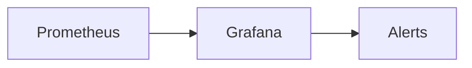

# 🚀 المراقبة

> Prometheus، Grafana — مراقبة كل شيء من الأجهزة إلى التطبيقات.

## 🎯 أهداف التعلم

بعد إكمال هذه الوحدة، ستكون قادراً على:

- [**أساسيات المراقبة**](01-monitoring-fundamentals) — Metrics و Logs
- [**Prometheus متقدم**](02-prometheus-advanced) — PromQL
- [**Grafana**](03-grafana-dashboards-alerting) — لوحات وتنبيهات

## 💡 المهارات التي ستكتسبها

Prometheus • Grafana • AlertManager • Dashboards

## 📊 معلومات الوحدة

| العنصر | القيمة |
| ------ | ------ |
| **المستوى** | متوسط |
| **الوقت المقدر** | 5 ساعات |
| **المتطلبات** | Kubernetes |
| **الشهادات** | AZ-104 |

## 🏛️ مهمة CloudNova

> نظام CloudNova تحت الهجوم! اكتشف المشكلة قبل أن يلاحظها العملاء.

## 🗺️ خريطة الوحدة

## 📖 الدروس

- [**أساسيات المراقبة**](01-monitoring-fundamentals) — Metrics و Logs
- [**Prometheus متقدم**](02-prometheus-advanced) — PromQL
- [**Grafana**](03-grafana-dashboards-alerting) — لوحات وتنبيهات

## 🚀 ابدأ التعلم

[▶️ ابدأ الدرس الأول](01-monitoring-fundamentals)
