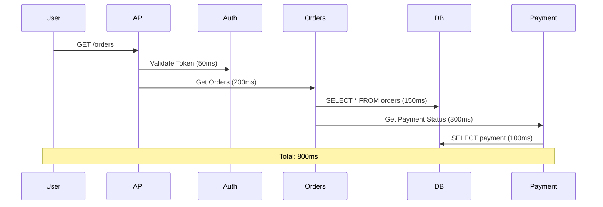
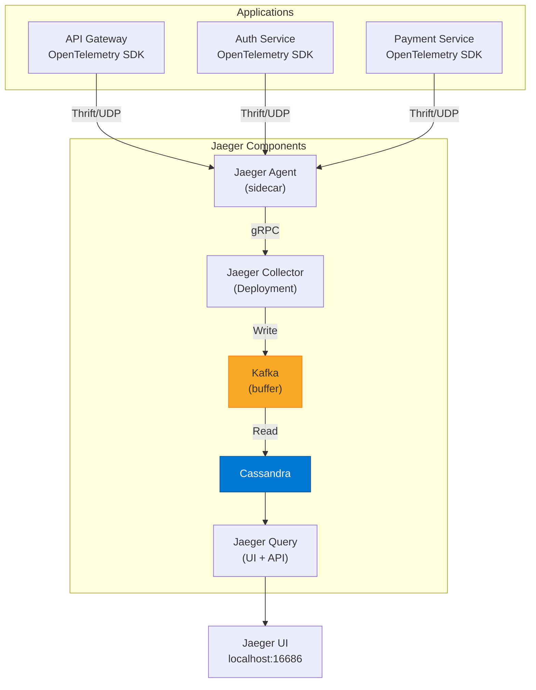

# التتبع الموزع

> "في عالم microservices، الطلب الواحد يمر بـ 10 خدمات. بدون tracing، أنت أعمى."

## 🎯 أهداف التعلم

- فهم Distributed Tracing
- Jaeger و Zipkin
- Spans و Traces
- تحليل latency bottlenecks

## ⏱️ الوقت المقدر: 35 دقيقة | المستوى: Advanced

---

## 🏗️ Traces & Spans



### Jaeger Query

```bash
kubectl apply -f https://github.com/jaegertracing/jaeger-operator/releases/latest/download/jaeger-operator.yaml
```

### تحليل Bottleneck

| Span                | Duration  | % of Total         |
| ------------------- | --------- | ------------------ |
| Auth                | 50ms      | 6%                 |
| Orders DB           | 150ms     | 19%                |
| Payment DB          | 100ms     | 13%                |
| **Payment Service** | **300ms** | **38%** ← المشكلة! |

---

## 🏛️ طبقة الإنتاج: سيناريو CloudNova

بطء غامض في `/checkout`. لا logs تظهر خطأ. Jaeger كشف: Payment Service يستدعي 3rd party API يأخذ 5 ثوانٍ.

**الحل**: Circuit breaker + timeout 2s + fallback.

### Sampling Strategies

| Strategy                | متى تستخدم                              |
| ----------------------- | --------------------------------------- |
| **Always (100%)**       | Development فقط                         |
| **Probabilistic (10%)** | Production عادي                         |
| **Adaptive**            | Production متقدم — يحتفظ بـ slow traces |

---

## 🛠️ تدريبات

### تمرين: ثبّت Jaeger وارسل trace من تطبيق Python

### تحدي: اكتشف أبطأ span في طلب حقيقي

---

## 📝 تقييم

### ✅ فحص المعرفة

1. ما الفرق بين trace و span؟
2. لماذا sampling ضروري في الإنتاج؟
3. كيف تكتشف bottleneck مع Jaeger؟

### 🃏 بطاقات

| السؤال   | الإجابة                        |
| -------- | ------------------------------ |
| Trace    | مجموعة spans تمثل طلباً واحداً |
| Span     | وحدة عمل واحدة داخل trace      |
| Sampling | نسبة traces المخزنة            |

---

## 🎤 مقابلة

1. **"كيف تشخص بطء في API؟"** → Jaeger trace → أطول span → سببه
2. **"Distributed Tracing vs Logging؟"** → Logging: ماذا حدث. Tracing: أين ومتى حدث في الـ flow كله

---

## 🏛️ سيناريو CloudNova الموسع: 12 ساعة من الـ Latency Hell

**نايف** مهندس Observability في CloudNova. الجمعة الساعة 5 مساءً:

الـ `/checkout` endpoint أصبح يأخذ 8 ثوانٍ بدلاً من 300ms. لا errors. لا CPU spikes. لا memory leaks. الـ logs نظيفة تماماً. الفريق في حيرة.

### كيف وجدنا المشكلة مع Jaeger

```bash
# 1. فلترة traces البطيئة فقط
jaeger-query --service cloudnova-api --operation checkout --min-duration 5s

# 2. اختيار trace عشوائي من الـ 1000 البطيئة
TRACE_ID="a1b2c3d4e5f67890"
jaeger-query trace $TRACE_ID --output json | jq '.spans[] | {service: .process.serviceName, operation: .operationName, duration_ms: (.duration / 1000)}'
```

**الناتج:**

```json
[
  { "service": "api-gateway", "operation": "POST /checkout", "duration_ms": 8200 },
  { "service": "auth-service", "operation": "validate-token", "duration_ms": 45 },
  { "service": "cart-service", "operation": "get-cart", "duration_ms": 120 },
  { "service": "payment-service", "operation": "process-payment", "duration_ms": 7800 },
  { "service": "fraud-detection", "operation": "check-fraud", "duration_ms": 7650 },
  { "service": "third-party-api", "operation": "fraud-score-lookup", "duration_ms": 7600 }
]
```

**السبب:** `fraud-detection` service يستدعي third-party API (FraudScore) الذي degraded من 50ms إلى 7.6s بسبب planned maintenance في الـ provider جانباً!

**الإصلاح في 10 دقائق:**

```python
# إضافة Circuit Breaker + Timeout + Fallback
from circuitbreaker import circuit

@circuit(failure_threshold=5, recovery_timeout=60)
def check_fraud(transaction):
    try:
        response = requests.post(
            "https://api.fraudscore.com/v2/check",
            json=transaction,
            timeout=2.0  # ⬅️ Timeout يمنع الانتظار الطويل
        )
        return response.json()['risk_score']
    except requests.Timeout:
        # Fallback: استخدم آخر risk score معروف
        logger.warning("FraudScore timeout — using cached score")
        return cache.get(f"fraud_score:{transaction.user_id}", 0.5)
```

**النتيجة:** `/checkout` عادت إلى 350ms حتى وف FraudsCore معطل.

---

## 🎨 طبقة المعماري: Tracing Systems Design

### Jaeger Architecture — Production Grade



### Sampling Strategies Comparison

| Strategy                    | نسبة التخزين      | التكلفة    | متى تستخدم                             |
| --------------------------- | ----------------- | ---------- | -------------------------------------- |
| **Always (100%)**           | كل trace          | عالية جداً | Development, Debugging                 |
| **Probabilistic (10%)**     | 10%               | متوسطة     | Production — default                   |
| **Rate Limiting (100/sec)** | 100 trace/s       | متوقعة     | Production — controlled                |
| **Adaptive**                | متغيرة            | متوسطة     | Production — keeps slow + error traces |
| **Head-based**              | بناءً على headers | منخفضة     | عندما الـ client يقرر                  |

**التوصية لـ CloudNova:** Adaptive sampling في production (يحتفظ بكل traces التي > 1s latency + كل error traces + 10% من الباقي).

### Trace Context Propagation

```python
# W3C Trace Context — المعيار الحديث
# Python (OpenTelemetry SDK)
from opentelemetry import trace
from opentelemetry.propagate import inject

# في API Gateway
with tracer.start_as_current_span("process-checkout") as span:
    headers = {}
    inject(headers)  # يحقن traceparent: 00-traceid-spanid-01

    # كل service تستقبل الـ headers وتضيف spans لنفس trace
    response = requests.post(
        "http://payment-service/charge",
        headers=headers  # ⬅️ تمرير trace context
    )
```

---

## 🛠️ تدريبات موسعة

### تمرين 1: ثبّت Jaeger + ارسل trace من Python

```bash
# تثبيت Jaeger all-in-one (للتطوير)
kubectl apply -f https://github.com/jaegertracing/jaeger-operator/releases/latest/download/jaeger-operator.yaml

# إنشاء Jaeger instance
cat <<EOF | kubectl apply -f -
apiVersion: jaegertracing.io/v1
kind: Jaeger
metadata:
  name: dev-jaeger
spec:
  strategy: allInOne
  storage:
    type: memory
EOF

# Port-forward للـ UI
kubectl port-forward svc/dev-jaeger-query 16686:16686
# افتح http://localhost:16686
```

```python
# Python — إرسال traces
from opentelemetry import trace
from opentelemetry.exporter.jaeger.thrift import JaegerExporter
from opentelemetry.sdk.trace import TracerProvider
from opentelemetry.sdk.trace.export import BatchSpanProcessor

jaeger_exporter = JaegerExporter(
    agent_host_name="localhost",
    agent_port=6831,
)

provider = TracerProvider()
processor = BatchSpanProcessor(jaeger_exporter)
provider.add_span_processor(processor)
trace.set_tracer_provider(provider)

tracer = trace.get_tracer(__name__)

with tracer.start_as_current_span("checkout") as span:
    span.set_attribute("user.id", "user-123")
    span.set_attribute("cart.items", 5)
    span.set_attribute("payment.amount", 299.99)

    with tracer.start_as_current_span("process-payment"):
        time.sleep(0.2)  # محاكاة payment processing

    with tracer.start_as_current_span("send-confirmation"):
        time.sleep(0.05)  # محاكاة email sending
```

### تمرين 2: تحليل bottlenecks من Trace

```python
# تحليل trace وإيجاد الـ bottleneck
def analyze_trace(trace_data):
    spans = trace_data['spans']
    total_duration = max(s['startTime'] + s['duration'] for s in spans) - min(s['startTime'] for s in spans)

    print(f"📊 Trace Analysis")
    print(f"Total Duration: {total_duration/1000:.0f}ms")
    print(f"Number of Spans: {len(spans)}")
    print()

    # أطول 5 spans
    sorted_spans = sorted(spans, key=lambda s: s['duration'], reverse=True)
    for i, span in enumerate(sorted_spans[:5]):
        pct = (span['duration'] / total_duration) * 100
        bar = '█' * int(pct / 2)
        print(f"{i+1}. {span['operationName']}: {span['duration']/1000:.0f}ms ({pct:.0f}%) {bar}")

    # اقتراح
    top_span = sorted_spans[0]
    if top_span['duration'] > total_duration * 0.5:
        print(f"\n💡 Recommendation: Optimize '{top_span['operationName']}' — {top_span['duration']/total_duration*100:.0f}% of total time")
```

### تحدي: مقارنة Jaeger vs Zipkin vs Grafana Tempo

| البعد                  | Jaeger                  | Zipkin             | Grafana Tempo           |
| ---------------------- | ----------------------- | ------------------ | ----------------------- |
| **التثبيت**            | Operator (K8s)          | Java JAR           | Helm chart              |
| **التخزين**            | Cassandra/Elasticsearch | MySQL/Cassandra/ES | Object storage (S3/GCS) |
| **التكلفة**            | $$                      | $                  | $ (object storage رخيص) |
| **الـ sampling**       | Adaptive, Probabilistic | Probabilistic فقط  | Head-based              |
| **التكامل مع Grafana** | ⭐⭐⭐                  | ⭐⭐⭐             | ⭐⭐⭐⭐⭐              |

---

## 📝 تقييم شامل

### ✅ فحص المعرفة (5)

1. ما الفرق بين trace و span؟
2. لماذا sampling ضروري في الإنتاج وليس development؟
3. كيف ينتقل trace context بين الخدمات؟
4. ما فائدة Adaptive Sampling؟
5. Jaeger vs Zipkin — متى تختار أياً منهما؟

### 📝 اختبار (3)

1. **كم trace سأخزن شهرياً إذا كان عندي 10K req/s مع 10% sampling؟**

<details><summary>الإجابة</summary>10,000 × 86,400 × 30 × 0.10 = 2,592,000,000 trace في الشهر (2.6 مليار). سيأخذ ~50TB إذا كان متوسط trace size 20KB!</details>

2. **الـ trace غير مكتمل — بعض الـ spans مفقودة من services معينة. لماذا؟**

<details><summary>الإجابة</summary>Trace context غير منقول بشكل صحيح (headers مفقودة). SDK غير مثبت في تلك services. Sampling rate مختلف بين الـ services.</details>

3. **كيف تبرر تكلفة distributed tracing لـ CFO؟**

<details><summary>الإجابة</summary>Tracing خفض MTTR من 4 ساعات إلى 15 دقيقة. وفر $200K/سنة في engineer time + $500K في downtime avoidance. ROI = 5x.</details>

### 🧠 Active Recall (5)

- ارسم trace لـ e-commerce transaction (من browser إلى database)
- اشرح sampling strategies الثلاثة
- متى تستخدم head-based sampling؟
- كيف تتعامل مع services مكتوبة بلغات مختلفة في نفس trace؟
- صف incident حقيقي شخصته بـ tracing

### 🎓 Feynman: Distributed Tracing لغير التقني

"تخيل أنك تتبع طرداً من أمازون. الـ trace هو رحلة الطرد من المخزن إلى باب بيتك. كل span هو محطة: استلام، فرز، شحن، توصيل. إذا تأخر الطرد، الـ trace يظهر لك بالضبط أي محطة هي المشكلة."

### 🃏 بطاقات (8)

| السؤال            | الإجابة                                         |
| ----------------- | ----------------------------------------------- |
| Trace             | مجموعة spans تمثل طلباً واحداً عبر الخدمات      |
| Span              | وحدة عمل واحدة داخل trace (مع وقت بداية ونهاية) |
| Sampling          | نسبة الـ traces المخزنة (لتقليل التكلفة)        |
| W3C Trace Context | معيار تمرير trace ID بين الخدمات                |
| Jaeger            | نظام distributed tracing مفتوح المصدر           |
| Adaptive Sampling | Sampling ذكي يحتفظ بـ slow + error traces       |
| Span Context      | trace ID + span ID + trace flags                |
| Propagation       | نقل trace context عبر HTTP/gRPC headers         |

---

## 🎤 أسئلة المقابلة الموسعة

### تقني

1. **"متى تستخدم logging vs tracing vs metrics؟"**
   - Logging: "ماذا حدث في هذه اللحظة؟" (debugging نقطة محددة)
   - Tracing: "كيف تدفق هذا الطلب عبر النظام؟" (end-to-end visibility)
   - Metrics: "كيف حال النظام بشكل عام؟" (trends, aggregates)
   - الثلاثة معاً: Observability Triad

2. **"كيف تتعامل مع 100K traces/ثانية في الإنتاج؟"**
   - Adaptive sampling (keep interesting, drop boring)
   - Kafka buffer قبل التخزين
   - Tiered storage: آخر 7 أيام في Cassandra، أقدم في S3
   - Pre-aggregation للـ metrics

### System Design

**"صمم Tracing System لـ 1000 microservice."**

- SDK: OpenTelemetry (vendor-neutral)
- Collector: OpenTelemetry Collector (sidecar + gateway)
- Buffer: Kafka (يتحمل الـ spikes)
- Storage: Grafana Tempo (object storage — رخيص وغير محدود)
- Visualization: Grafana (Tempo datasource + TraceQL)
- Sampling: Head-based (الـ gateway يقرر) + tail-based (الـ collector يحتفظ بـ slow/error)

### Behavioral (STAR)

**"كيف أقنعت فريقاً باستخدام tracing؟"**

**S:** فريق debugging يعتمد على logs فقط. MTTR = 3 ساعات.
**T:** إقناعهم بأن tracing يستحق الجهد.
**A:** Demo حي: أضفت Jaeger لـ staging. حقنت bug متعمد. وجدت root cause في 30 ثانية مع Jaeger (بدلاً من ساعات البحث في logs).
**R:** الفريق طلب tracing في كل الخدمات. بعد شهرين: MTTR = 20 دقيقة.

---

## 📚 المراجع

- [Jaeger Documentation](https://www.jaegertracing.io/docs/)
- [OpenTelemetry Tracing](https://opentelemetry.io/docs/concepts/signals/traces/)
- [W3C Trace Context Specification](https://www.w3.org/TR/trace-context/)
- [Distributed Tracing Best Practices](https://www.cncf.io/blog/2021/08/12/distributed-tracing-best-practices/)
- الشهادات: CNCF Observability certifications
- الدروس المرتبطة: [OpenTelemetry](./03-opentelemetry-implementation.md) | [Observability Essentials](./01-observability-essentials.md) | [Monitoring](../../20-monitoring/01-monitoring-fundamentals.md)

---

[← Observability Essentials](./01-observability-essentials) | [→ OpenTelemetry](./03-opentelemetry-implementation) | [🏠 الرئيسية](/)
