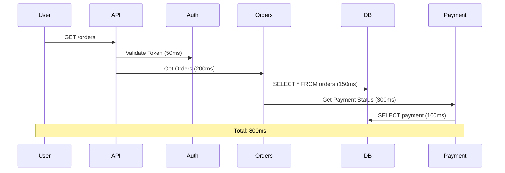

# التتبع الموزع

> "في عالم microservices، الطلب الواحد يمر بـ 10 خدمات. بدون tracing، أنت أعمى."

## 🎯 أهداف التعلم

- فهم Distributed Tracing
- Jaeger و Zipkin
- Spans و Traces
- تحليل latency bottlenecks

## ⏱️ الوقت المقدر: 35 دقيقة | المستوى: Advanced

---

## 🏗️ Traces & Spans



### Jaeger Query

```bash
# نشر Jaeger
kubectl apply -f https://github.com/jaegertracing/jaeger-operator/releases/latest/download/jaeger-operator.yaml

# البحث عن traces بطيئة
# في Jaeger UI:
# Service: api-gateway
# Operation: GET /orders
# Min Duration: 500ms
```

### تحليل Bottleneck

| Span | Duration | % of Total |
|------|----------|------------|
| Auth | 50ms | 6% |
| Orders DB | 150ms | 19% |
| Payment DB | 100ms | 13% |
| **Payment Service** | **300ms** | **38%** ← المشكلة هنا! |

---

## 🛠️ تدريب

1. ثبّت Jaeger على Kubernetes
2. أضف tracing إلى تطبيق Python مع OpenTelemetry
3. اكتشف أبطأ span في طلب معين

---

[← Observability Essentials](./01-observability-essentials) | [→ OpenTelemetry](./03-opentelemetry-implementation) | [🏠 الرئيسية](/)
