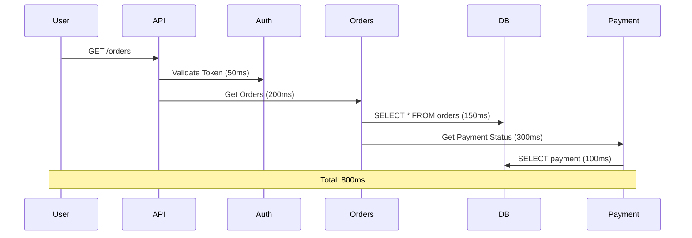

# التتبع الموزع

> "في عالم microservices، الطلب الواحد يمر بـ 10 خدمات. بدون tracing، أنت أعمى."

## 🎯 أهداف التعلم

- فهم Distributed Tracing
- Jaeger و Zipkin
- Spans و Traces
- تحليل latency bottlenecks

## ⏱️ الوقت المقدر: 35 دقيقة | المستوى: Advanced

---

## 🏗️ Traces & Spans



### Jaeger Query

```bash
kubectl apply -f https://github.com/jaegertracing/jaeger-operator/releases/latest/download/jaeger-operator.yaml
```

### تحليل Bottleneck

| Span | Duration | % of Total |
|------|----------|------------|
| Auth | 50ms | 6% |
| Orders DB | 150ms | 19% |
| Payment DB | 100ms | 13% |
| **Payment Service** | **300ms** | **38%** ← المشكلة! |

---

## 🏛️ طبقة الإنتاج: سيناريو CloudNova

بطء غامض في `/checkout`. لا logs تظهر خطأ. Jaeger كشف: Payment Service يستدعي 3rd party API يأخذ 5 ثوانٍ.

**الحل**: Circuit breaker + timeout 2s + fallback.

### Sampling Strategies

| Strategy | متى تستخدم |
|----------|-----------|
| **Always (100%)** | Development فقط |
| **Probabilistic (10%)** | Production عادي |
| **Adaptive** | Production متقدم — يحتفظ بـ slow traces |

---

## 🛠️ تدريبات

### تمرين: ثبّت Jaeger وارسل trace من تطبيق Python
### تحدي: اكتشف أبطأ span في طلب حقيقي

---

## 📝 تقييم

### ✅ فحص المعرفة
1. ما الفرق بين trace و span؟
2. لماذا sampling ضروري في الإنتاج؟
3. كيف تكتشف bottleneck مع Jaeger؟

### 🃏 بطاقات
| السؤال | الإجابة |
|--------|---------|
| Trace | مجموعة spans تمثل طلباً واحداً |
| Span | وحدة عمل واحدة داخل trace |
| Sampling | نسبة traces المخزنة |

---

## 🎤 مقابلة
1. **"كيف تشخص بطء في API؟"** → Jaeger trace → أطول span → سببه
2. **"Distributed Tracing vs Logging؟"** → Logging: ماذا حدث. Tracing: أين ومتى حدث في الـ flow كله

---

[← Observability Essentials](./01-observability-essentials) | [→ OpenTelemetry](./03-opentelemetry-implementation) | [🏠 الرئيسية](/)
