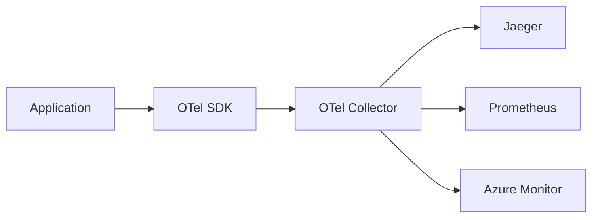

# OpenTelemetry

> "OpenTelemetry هو USB-C للمراقبة. معيار واحد، كل الأدوات."

## 🎯 أهداف التعلم

- فهم OpenTelemetry architecture
- تثبيت OTel Collector
- Auto-instrumentation
- تصدير إلى Jaeger, Prometheus, Azure Monitor

## ⏱️ الوقت المقدر: 35 دقيقة | المستوى: Advanced

---

## 🏗️ OpenTelemetry Architecture



### OTel Collector

```yaml
apiVersion: opentelemetry.io/v1alpha1
kind: OpenTelemetryCollector
metadata:
  name: otel
spec:
  config: |
    receivers:
      otlp:
        protocols:
          grpc:
    processors:
      batch:
    exporters:
      jaeger:
        endpoint: jaeger-collector:14250
      prometheus:
        endpoint: 0.0.0.0:8889
    service:
      pipelines:
        traces:
          receivers: [otlp]
          processors: [batch]
          exporters: [jaeger]
        metrics:
          receivers: [otlp]
          processors: [batch]
          exporters: [prometheus]
```

### Auto-Instrumentation (Python)

```bash
pip install opentelemetry-distro opentelemetry-exporter-otlp
opentelemetry-bootstrap -a install
opentelemetry-instrument python app.py
```

---

## 🏛️ طبقة الإنتاج: سيناريو CloudNova

قبل OTel: 3 مكتبات مختلفة (Jaeger, Prometheus, Azure SDK). بعد OTel: مكتبة واحدة + Collector واحد يوزع لكل وجهة.

### OTel vs Vendor Lock-in

| قبل OTel | بعد OTel |
|---------|----------|
| Jaeger SDK في الكود | OTel SDK فقط |
| تبديل إلى Zipkin = إعادة كتابة | تغيير exporter فقط |

---

## 🛠️ تدريبات

### تمرين: ثبت OTel Collector على Kubernetes
### تحدي: أضف instrumentation يدوي لـ metric مخصصة

---

## 📝 تقييم

### ✅ فحص المعرفة
1. لماذا OTel أفضل من SDKs المباشرة؟
2. ما دور الـ Collector؟
3. كيف تغير وجهة الـ traces بدون تغيير الكود؟

### 🃏 بطاقات
| السؤال | الإجابة |
|--------|---------|
| OTel | OpenTelemetry — معيار مفتوح للمراقبة |
| Collector | وسيط يستقبل ويعالج ويصدر البيانات |
| Auto-instrumentation | مراقبة بدون تغيير الكود |

---

## 🎤 مقابلة
1. **"لماذا تختار OpenTelemetry؟"** → معيار واحد، لا vendor lock-in، مجتمع ضخم
2. **"كيف تهاجر من Jaeger SDK إلى OTel؟"** → استبدل SDK + اضبط exporter إلى Jaeger

---

[← Distributed Tracing](./02-distributed-tracing) | [→ FinOps](../../22-finops/01-finops-fundamentals) | [🏠 الرئيسية](/)
