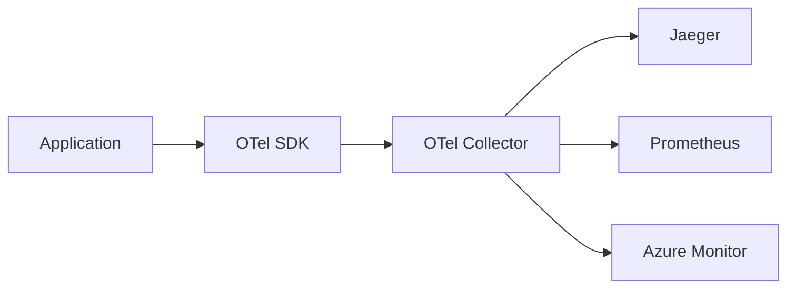
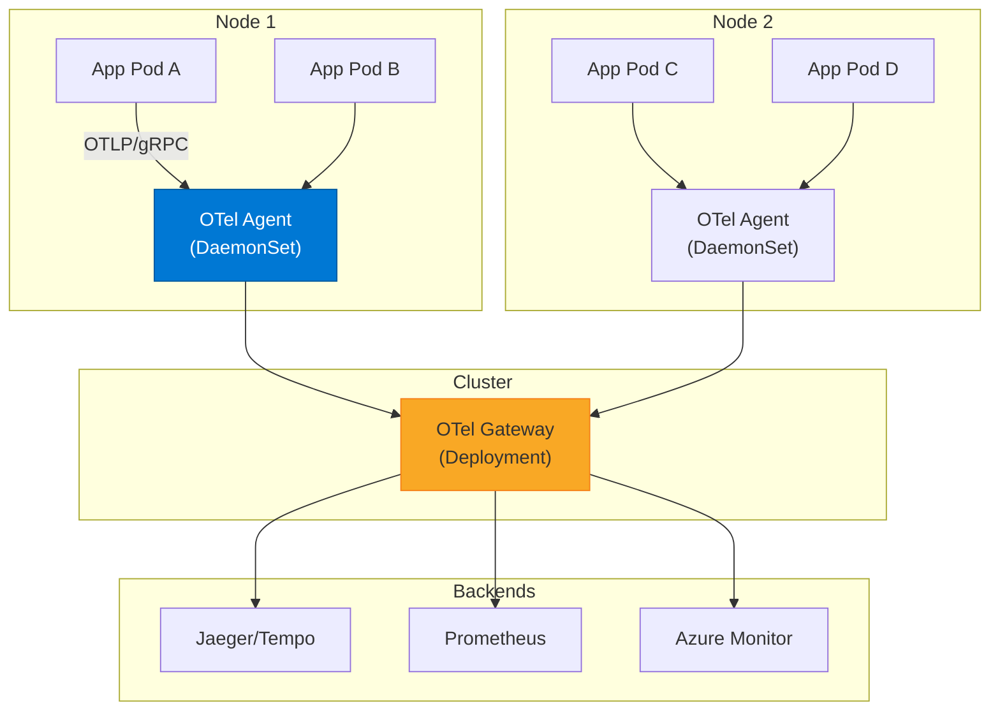

# OpenTelemetry

> "OpenTelemetry هو USB-C للمراقبة. معيار واحد، كل الأدوات."

## 🎯 أهداف التعلم

- فهم OpenTelemetry architecture
- تثبيت OTel Collector
- Auto-instrumentation
- تصدير إلى Jaeger, Prometheus, Azure Monitor

## ⏱️ الوقت المقدر: 35 دقيقة | المستوى: Advanced

---

## 🏗️ OpenTelemetry Architecture



### OTel Collector

```yaml
apiVersion: opentelemetry.io/v1alpha1
kind: OpenTelemetryCollector
metadata:
  name: otel
spec:
  config: |
    receivers:
      otlp:
        protocols:
          grpc:
    processors:
      batch:
    exporters:
      jaeger:
        endpoint: jaeger-collector:14250
      prometheus:
        endpoint: 0.0.0.0:8889
    service:
      pipelines:
        traces:
          receivers: [otlp]
          processors: [batch]
          exporters: [jaeger]
        metrics:
          receivers: [otlp]
          processors: [batch]
          exporters: [prometheus]
```

### Auto-Instrumentation (Python)

```bash
pip install opentelemetry-distro opentelemetry-exporter-otlp
opentelemetry-bootstrap -a install
opentelemetry-instrument python app.py
```

---

## 🏛️ طبقة الإنتاج: سيناريو CloudNova

قبل OTel: 3 مكتبات مختلفة (Jaeger, Prometheus, Azure SDK). بعد OTel: مكتبة واحدة + Collector واحد يوزع لكل وجهة.

### OTel vs Vendor Lock-in

| قبل OTel                       | بعد OTel           |
| ------------------------------ | ------------------ |
| Jaeger SDK في الكود            | OTel SDK فقط       |
| تبديل إلى Zipkin = إعادة كتابة | تغيير exporter فقط |

---

## 🛠️ تدريبات

### تمرين: ثبت OTel Collector على Kubernetes

### تحدي: أضف instrumentation يدوي لـ metric مخصصة

---

## 📝 تقييم

### ✅ فحص المعرفة

1. لماذا OTel أفضل من SDKs المباشرة؟
2. ما دور الـ Collector؟
3. كيف تغير وجهة الـ traces بدون تغيير الكود؟

### 🃏 بطاقات

| السؤال               | الإجابة                              |
| -------------------- | ------------------------------------ |
| OTel                 | OpenTelemetry — معيار مفتوح للمراقبة |
| Collector            | وسيط يستقبل ويعالج ويصدر البيانات    |
| Auto-instrumentation | مراقبة بدون تغيير الكود              |

---

## 🎤 مقابلة

1. **"لماذا تختار OpenTelemetry؟"** → معيار واحد، لا vendor lock-in، مجتمع ضخم
2. **"كيف تهاجر من Jaeger SDK إلى OTel؟"** → استبدل SDK + اضبط exporter إلى Jaeger

---

## 🏛️ سيناريو CloudNova: كابوس الـ Vendor Lock-in

**سامر** SRE في CloudNova. 3 سنوات من بناء observability stack:

- **2023:** Jaeger SDK للتتبع
- **2024:** Prometheus client library للمقاييس
- **2025:** Azure Monitor SDK للتسجيل

الآن CTO يريد التبديل من Jaeger إلى Grafana Tempo (لتوفير 60% من تكلفة التخزين). المشكلة: 200,000 سطر من الكود فيها Jaeger SDK!

**لو كانوا استخدموا OpenTelemetry من البداية:**

```yaml
# تغيير الـ exporter فقط — بدون تغيير سطر واحد في كود التطبيق!
# config.yaml
receivers:
  otlp:
    protocols:
      grpc:
        endpoint: 0.0.0.0:4317

processors:
  batch:
    timeout: 10s
    send_batch_size: 1024
  memory_limiter:
    check_interval: 1s
    limit_mib: 512
  attributes:
    actions:
      - key: environment
        value: production
        action: upsert

exporters:
  # قبل: Jaeger
  # jaeger:
  #   endpoint: jaeger-collector:14250

  # بعد: Grafana Tempo (سطر واحد يتغير!)
  otlp/tempo:
    endpoint: tempo-distributor:4317
    tls:
      insecure: true

  prometheus:
    endpoint: 0.0.0.0:8889

  azuremonitor:
    connection_string: "InstrumentationKey=xxx"

service:
  pipelines:
    traces:
      receivers: [otlp]
      processors: [batch, memory_limiter, attributes]
      exporters: [otlp/tempo] # تغير هذا السطر فقط!
    metrics:
      receivers: [otlp]
      processors: [batch]
      exporters: [prometheus, azuremonitor]
    logs:
      receivers: [otlp]
      processors: [batch]
      exporters: [azuremonitor]
```

**الدرس:** OpenTeleometry = حرية تبديل أي backend بدون تغيير الكود.

---

## 🎨 طبقة المعماري: OTel Collector Deep Dive

### Collector Deployment Patterns



### Custom Metric مع OTel SDK

```python
from opentelemetry import metrics
from opentelemetry.sdk.metrics import MeterProvider
from opentelemetry.sdk.metrics.export import PeriodicExportingMetricReader

# إنشاء metric مخصصة
meter = metrics.get_meter("cloudnova.api")

# Counter: عدد طلبات checkout
checkout_counter = meter.create_counter(
    name="checkout_requests_total",
    description="Total checkout requests",
    unit="1"
)

# Histogram: زمن checkout
checkout_duration = meter.create_histogram(
    name="checkout_duration_ms",
    description="Checkout latency",
    unit="ms"
)

# استخدام
@tracer.start_as_current_span("checkout")
def checkout(cart):
    start = time.time()

    checkout_counter.add(1, {"status": "success"})

    result = process_payment(cart)

    checkout_duration.record(
        (time.time() - start) * 1000,
        {"payment_method": cart.payment_method}
    )

    return result
```

### مصفوفة: OTel vs Traditional SDKs

| البعد                    | Traditional (Jaeger SDK)    | OpenTelemetry                     |
| ------------------------ | --------------------------- | --------------------------------- |
| **تبديل الـ backend**    | إعادة كتابة الكود           | تغيير exporter فقط                |
| **إضافة backend جديد**   | SDK جديدة + instrumentation | إضافة exporter في collector       |
| **تعدد الـ signals**     | مكتبة لكل signal            | SDK واحدة لـ traces+metrics+logs  |
| **Auto-instrumentation** | محدود                       | ✅ ممتاز (Java, Python, .NET, JS) |
| **Vendor neutrality**    | ❌                          | ✅ CNCF incubating                |

---

## 🛠️ تدريبات موسعة

### تمرين 1: Deploy OTel Collector على K8s

```bash
# Helm install
helm repo add open-telemetry https://open-telemetry.github.io/opentelemetry-helm-charts
helm install otel-collector open-telemetry/opentelemetry-collector \
  --set mode=deployment \
  --set config.receivers.otlp.protocols.grpc.endpoint=0.0.0.0:4317 \
  --set config.exporters.prometheus.endpoint=0.0.0.0:8889 \
  --set config.service.pipelines.traces.exporters[0]=jaeger \
  --set config.service.pipelines.metrics.exporters[0]=prometheus

# تحقق
kubectl get pods -l app.kubernetes.io/name=opentelemetry-collector
```

### تمرين 2: Auto-instrument Python App

```bash
pip install opentelemetry-distro opentelemetry-exporter-otlp
opentelemetry-bootstrap -a install

# تشغيل التطبيق مع auto-instrumentation
OTEL_SERVICE_NAME=cloudnova-api \
OTEL_EXPORTER_OTLP_ENDPOINT=http://otel-collector:4317 \
opentelemetry-instrument \
  python app.py
```

### تحدي: OTel Collector مع tail sampling

```yaml
# sampling config — يحتفظ بكل error traces + 10% من الناجحة
processors:
  tail_sampling:
    decision_wait: 10s
    policies:
      - name: errors
        type: status_code
        status_code:
          status_codes: [ERROR]
      - name: latency
        type: latency
        latency:
          threshold_ms: 1000
      - name: probabilistic
        type: probabilistic
        probabilistic:
          sampling_percentage: 10
```

---

## 📝 تقييم شامل

### ✅ فحص المعرفة (5)

1. لماذا OTel أفضل من SDKs المباشرة (Jaeger, Prometheus)؟
2. ما دور OTel Collector في الـ architecture؟
3. كيف يعمل auto-instrumentation؟
4. ما الفرق بين Agent و Gateway في OTel Collector؟
5. كيف تدعم OTel الـ traces, metrics, و logs في SDK واحدة؟

### 📝 اختبار (3)

1. **لديك 3 exporters في collector. أحدهم يفشل. هل يتوقف الـ pipeline كله؟**
   <details><summary>الإجابة</summary>لا. كل exporter مستقل. لكن إذا فشل receiver واحد، كل الـ pipelines المرتبطة به تتأثر. استخدم queues + retries.</details>

2. **كيف تهاجر من Jaeger SDK إلى OTel بدون downtime؟**
   <details><summary>الإجابة</summary>1. Deploy OTel Collector مع Jaeger exporter. 2. استبدل SDK تدريجياً (canary deployment). 3. تحقق من تطابق البيانات. 4. أزل Jaeger SDK.</details>

3. **كم تكلفة OTel Collector في الإنتاج (memory, CPU)؟**
   <details><summary>الإجابة</summary>Agent (DaemonSet): 128MB memory, 100m CPU. Gateway (Deployment): 512MB-2GB memory, 500m-2 CPU حسب الـ throughput. استخدم memory_limiter processor.</details>

### 🧠 Active Recall (5)

- ارسم OTel architecture مع Collector و pipelines
- اشرح الفرق بين push و pull exporters
- كيف تتعامل مع OTel في بيئة multi-language؟
- ما الفرق بين head sampling و tail sampling؟
- صف تجربة هاجرت فيها observability stack

### 🎓 Feynman: OpenTelemetry لغير التقني

"تخيل أنك تتكلم مع أشخاص من 5 دول مختلفة. بدلاً من تعلم 5 لغات، تتعلم لغة واحدة عالمية (OTel). الـ Collector هو 'مترجم فوري' يترجم كلامك للغة كل دولة (Jaeger, Prometheus, Azure)."

### 🃏 بطاقات (8)

| السؤال              | الإجابة                                                     |
| ------------------- | ----------------------------------------------------------- |
| OpenTelemetry       | CNCF standard للـ observability (traces, metrics, logs)     |
| Collector           | وسيط يستقبل telemetry data ويعالجها ويصدرها                 |
| OTLP                | OpenTelemetry Protocol — بروتوكول النقل                     |
| Instrumentation     | إضافة كود المراقبة للتطبيق                                  |
| Exporter            | مُصدّر البيانات لـ backend معين                             |
| Tail Sampling       | Sampling بعد اكتمال الـ trace (يحتفظ بـ errors)             |
| Span Processor      | يعالج الـ spans قبل التصدير (batch, filter)                 |
| Resource Attributes | معلومات ثابتة عن مصدر الـ telemetry (service name, cluster) |

---

## 🎤 أسئلة المقابلة الموسعة

### تقني

1. **"كيف تختار بين OTel Agent و Gateway deployment؟"**
   - Agent: لكل node (DaemonSet) — يقلل latency ويجمع قبل الإرسال
   - Gateway: مركزي — processing ثقيل (tail sampling, batching)
   - الأفضل: Agent + Gateway معاً (Agent يجمع، Gateway يعالج)

2. **"OTel Collector يستهلك 4GB memory. لماذا وكيف تصلح؟"**
   - زيادة memory_limiter processor: `limit_mib: 512`
   - تقليل batch size
   - استخدام tail sampling بدلاً من تخزين كل شيء
   - Scale أفقياً: replicas: 3 مع load balancing

### System Design

**"صمم Observability stack لـ 500 microservice مع OTel."**

- Agent: DaemonSet OTel Collector (lightweight, per node)
- Gateway: 3 replicas OTel Collector (tail sampling, batching)
- Buffer: Kafka بين agent و gateway (للـ spikes)
- Backends: Tempo (traces), Mimir (metrics), Loki (logs)
- Visualization: Grafana مع كل الـ datasources
- Alerting: Alertmanager + PagerDuty

### Behavioral (STAR)

**"كيف أقنعت فريقاً بالاستثمار في OTel؟"**

**S:** فريق يستخدم Jaeger + Prometheus + Azure SDKs منفصلة.
**T:** 3 codebases للمراقبة، صعوبة في correlating signals.
**A:** Demo: OTel auto-instrumentation في 5 دقائق، dashboard واحد يجمع traces+metrics+logs. حسبت saving: 40% أقل كود مراقبة، 60% وقت أقل في debugging.
**R:** Team adopted OTel. 3 أشهر: كل الخدمات الجديدة تستخدم OTel.

---

## 📚 المراجع

- [OpenTelemetry Documentation](https://opentelemetry.io/docs/)
- [OTel Collector Configuration](https://opentelemetry.io/docs/collector/configuration/)
- [CNCF OpenTelemetry](https://www.cncf.io/projects/opentelemetry/)
- [OTel Demo App](https://github.com/open-telemetry/opentelemetry-demo)
- الدروس المرتبطة: [Distributed Tracing](./02-distributed-tracing.md) | [Observability](./01-observability-essentials.md) | [Monitoring](../../20-monitoring/01-monitoring-fundamentals.md)

---

[← Distributed Tracing](./02-distributed-tracing) | [→ FinOps](../../22-finops/01-finops-fundamentals) | [🏠 الرئيسية](/)
