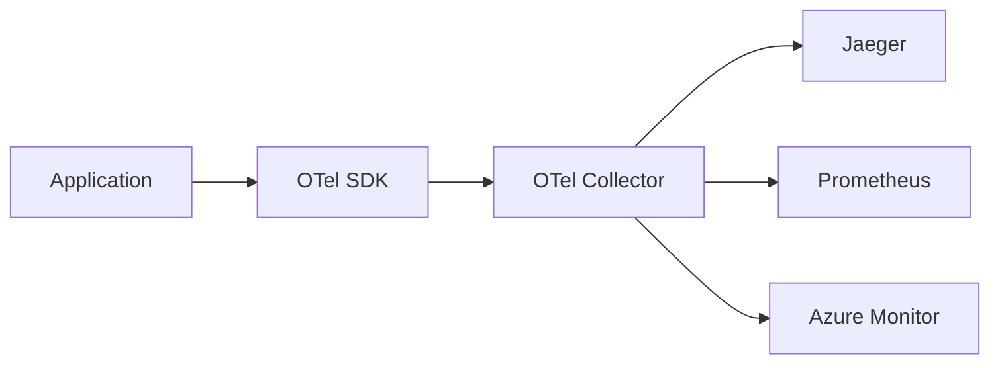

# OpenTelemetry

> "OpenTelemetry هو USB-C للمراقبة. معيار واحد، كل الأدوات."

## 🎯 أهداف التعلم

- فهم OpenTelemetry architecture
- تثبيت OTel Collector
- Auto-instrumentation
- تصدير إلى Jaeger, Prometheus, Azure Monitor

## ⏱️ الوقت المقدر: 35 دقيقة | المستوى: Advanced

---

## 🏗️ OpenTelemetry Architecture



### OTel Collector

```yaml
apiVersion: opentelemetry.io/v1alpha1
kind: OpenTelemetryCollector
metadata:
  name: otel
spec:
  config: |
    receivers:
      otlp:
        protocols:
          grpc:
    processors:
      batch:
    exporters:
      jaeger:
        endpoint: jaeger-collector:14250
      prometheus:
        endpoint: 0.0.0.0:8889
    service:
      pipelines:
        traces:
          receivers: [otlp]
          processors: [batch]
          exporters: [jaeger]
        metrics:
          receivers: [otlp]
          processors: [batch]
          exporters: [prometheus]
```

### Auto-Instrumentation (Python)

```bash
pip install opentelemetry-distro opentelemetry-exporter-otlp
opentelemetry-bootstrap -a install

# تشغيل التطبيق مع auto-instrumentation
opentelemetry-instrument python app.py
```

بدون تغيير كود واحد! كل الـ HTTP calls و DB queries تُراقب تلقائياً.

---

[← Distributed Tracing](./02-distributed-tracing) | [→ FinOps](../../22-finops/01-finops-fundamentals) | [🏠 الرئيسية](/)
