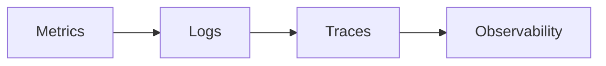

# 🚀 الملاحظة

> OpenTelemetry، Distributed Tracing — الثلاثي الذهبي: Metrics + Logs + Traces.

## 🎯 أهداف التعلم

بعد إكمال هذه الوحدة، ستكون قادراً على:

- [**أساسيات الملاحظة**](01-observability-essentials) — Metrics + Logs + Traces
- [**Distributed Tracing**](02-distributed-tracing) — تتبع موزع
- [**OpenTelemetry**](03-opentelemetry-implementation) — تطبيق عملي

## 💡 المهارات التي ستكتسبها

OpenTelemetry • Distributed Tracing • Jaeger • Observability

## 📊 معلومات الوحدة

| العنصر           | القيمة   |
| ---------------- | -------- |
| **المستوى**      | متقدم    |
| **الوقت المقدر** | 5 ساعات  |
| **المتطلبات**    | المراقبة |
| **الشهادات**     | —        |

## 🏛️ مهمة CloudNova

> 12 ساعة من latency الغامض. تتبع الطلب عبر 15 خدمة لتجد السبب.

## 🗺️ خريطة الوحدة

## 📖 الدروس

- [**أساسيات الملاحظة**](01-observability-essentials) — Metrics + Logs + Traces
- [**Distributed Tracing**](02-distributed-tracing) — تتبع موزع
- [**OpenTelemetry**](03-opentelemetry-implementation) — تطبيق عملي

## 🚀 ابدأ التعلم

[▶️ ابدأ الدرس الأول](01-observability-essentials)
