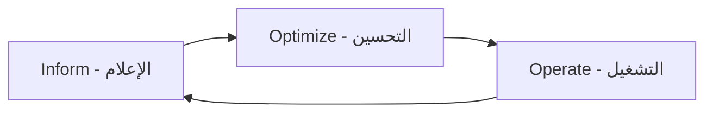

# أساسيات FinOps

> "كل دولار في السحابة يجب أن يكون له مبرر. FinOps هو فن تحقيق أقصى قيمة بأقل تكلفة."

## 🎯 أهداف التعلم

- فهم دورة FinOps: الإعلام، التحسين، التشغيل
- تحديد الهدر وإزالته من البيئة السحابية
- تطبيق Reserved Instances و Savings Plans
- بناء تقارير التكاليف والتنبيهات التلقائية
- اكتشاف anomalies بالـ KQL

---

## 📖 الطبقة الأساسية: فلسفة FinOps

### دورة FinOps



| المرحلة | السؤال | الأدوات |
|---------|--------|---------|
| **Inform** | من ينفق؟ على ماذا؟ | Cost Management, Tags |
| **Optimize** | كيف نوفر؟ | RI, Spot, Right-size |
| **Operate** | كيف نضمن الاستمرار؟ | Budgets, Policies, Automation |

---

## 🧱 الطبقة المهنية: تحليل التكاليف

### KQL لتحليل التكاليف

```kusto
// التكاليف اليومية لآخر 30 يوماً
ResourceCosts
| where TimeGenerated > ago(30d)
| summarize TotalCost = sum(Cost) by bin(TimeGenerated, 1d)
| order by TimeGenerated asc
| render timechart

// اكتشاف زيادة غير طبيعية (>20%)
ResourceCosts
| where TimeGenerated > ago(30d)
| summarize DailyCost = sum(Cost) by bin(TimeGenerated, 1d)
| serialize
| extend PrevDay = prev(DailyCost, 1)
| extend Increase = iff(PrevDay > 0, (DailyCost - PrevDay) / PrevDay * 100, 0)
| where Increase > 20
| project TimeGenerated, DailyCost, PrevDay, Increase

// التكاليف حسب الـ resource group
ResourceCosts
| where TimeGenerated between (datetime(2026-06-01) .. datetime(2026-06-30))
| summarize Total = sum(Cost) by ResourceGroup
| order by Total desc
| take 10
```

### Tags للتتبع

```bash
az group update \
  --name cloudnova-api-prod-rg \
  --set tags.CostCenter=Engineering \
         tags.Project=CloudNova \
         tags.Environment=Production \
         tags.CreatedBy=terraform
```

---

## 🏗️ الطبقة الإنتاجية: استراتيجيات التوفير

### 1. Reserved Instances vs Savings Plans

```
VM D4s v3:
├── Pay-as-you-go: $210/شهر
├── 1-year Reserved: $140/شهر (توفير 33%)
└── 3-year Reserved: $96/شهر  (توفير 54%)

Savings Plan ($10/hr commit):
├── Flexible across VM families
├── Automatic optimization
└── Best for: dynamic workloads
```

### 2. Right-Sizing الآلي

```python
# Azure Advisor recommendations via SDK
from azure.mgmt.advisor import AdvisorManagementClient

advisor = AdvisorManagementClient(credential, subscription_id)

for rec in advisor.recommendations.list():
    if "rightsize" in rec.category.lower():
        print(f"""
        ⚠️ {rec.impacted_field} {rec.impacted_value}
        التوفير المقدر: ${rec.extended_properties['savingsAmount']}/شهر
        الإجراء: {rec.short_description['problem']}
        """)
```

### 3. Anomaly Detection

```python
# اكتشاف الشذوذ في التكاليف
from azure.mgmt.costmanagement import CostManagementClient

client = CostManagementClient(credential)

# إنشاء alert
client.alerts.create_or_update(
    scope="/subscriptions/...",
    alert_name="DailyCostAnomaly",
    parameters={
        "definition": {
            "type": "Microsoft.CostManagement/alerts",
            "category": "Anomaly",
            "criteria": "Cost",
            "threshold": 20  # تنبيه عند زيادة >20%
        }
    }
)
```

---

## 🎨 الطبقة المعمارية: حوكمة التكاليف

### Azure Policy

```json
{
  "policyRule": {
    "if": {
      "field": "type",
      "equals": "Microsoft.Compute/virtualMachines"
    },
    "then": {
      "effect": "audit",
      "details": {
        "type": "Microsoft.Compute/virtualMachines",
        "existenceCondition": {
          "field": "tags[CostCenter]",
          "exists": false
        }
      }
    }
  }
}
```

### هيكل الميزانيات

```
ميزانية CloudNova: $48,000/شهر
├── Production: $35,000 (73%)
├── Staging: $8,000 (17%)
└── Development: $5,000 (10%)
    ├── Auto-shutdown 9PM-7AM
    └── Spot VMs حيث أمكن
```

---

## 🚨 سيناريو CloudNova: أزمة تكاليف

> **الموقف:** التكاليف قفزت من $42K إلى $78K في شهر واحد!

```bash
# ١. تحليل KQL
ResourceCosts | where TimeGenerated > ago(30d)
| summarize Total = sum(Cost) by Service
| order by Total desc

# النتيجة:
# Microsoft.Compute: +$22,500 (GPU VMs!)
# Microsoft.Insights: +$3,000 (logs)
# Microsoft.Network: +$48 (unused IPs)

# ٢. الإجراءات:
# ✅ Spot VMs للـ AI workloads (توفير 80%)
# ✅ Logs retention: 90d → 30d
# ✅ حذف IPs غير المستخدمة
# ✅ Budget alerts عند 50%, 80%, 100%

# النتيجة: التكاليف عادت لـ $45K
```

---

## 🧠 التذكّر النشط

1. ما الفرق بين Reserved Instance و Savings Plan؟
2. كيف تكتشف anomaly في التكاليف قبل نهاية الشهر؟
3. لماذا Tags ضرورية لـ FinOps؟
4. ما هي أكبر 3 مصادر للهدر السحابي؟
5. كيف تقنع المطورين بتقليل استهلاك الموارد؟

## ✍️ تمرين Feynman

"FinOps مثل إدارة ميزانية البيت. تعرف كم تنفق (Inform)، تبحث عن طرق للتوفير (Optimize)، وتضع قواعد للاستمرار (Operate)."

## 🎤 أسئلة المقابلة

1. **"كيف تخفض فاتورة Azure 30% في 3 أشهر؟"**
   - RI/Savings Plans للـ production (توفير 30-50%)
   - Auto-shutdown للـ dev environments
   - Right-sizing: تقليل 40% من الـ oversized VMs
   - Spot VMs للـ batch/ML workloads
   - Lifecycle policies للـ storage

2. **"كيف تتعامل مع Shadow IT؟"**
   - Azure Policy لمنع الموارد غير المصرحة
   - تقارير شهرية للإدارة
   - بوابة Self-service كبديل

---

[← العودة إلى الموديول](../index.md) | [🏠 الرئيسية](/)
