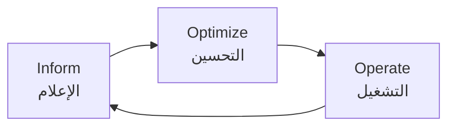

# أساسيات FinOps

> "كل دولار في السحابة يجب أن يكون له مبرر. FinOps هو فن تحقيق أقصى قيمة بأقل تكلفة."

## 🎯 أهداف التعلم

- فهم دورة FinOps: الإعلام، التحسين، التشغيل
- تحديد الهدر وإزالته من البيئة السحابية
- تطبيق Reserved Instances و Savings Plans
- بناء تقارير التكاليف والتنبيهات التلقائية
- اكتشاف anomalies بالـ KQL

---

## 📖 الطبقة الأساسية: فلسفة FinOps

### دورة FinOps



| المرحلة      | السؤال الأساسي          | الأدوات                               |
| ------------ | ----------------------- | ------------------------------------- |
| **Inform**   | من ينفق؟ على ماذا؟ متى؟ | Cost Management + Tags                |
| **Optimize** | كيف نوفر؟ أين الهدر؟    | RI, Spot, Right-size, Lifecycle       |
| **Operate**  | كيف نضمن الاستمرار؟     | Budgets, Alerts, Policies, Automation |

---

## 🧱 الطبقة المهنية: تحليل التكاليف

### KQL لتحليل التكاليف

```kusto
// ١. التكاليف اليومية لآخر 30 يوماً — رسم بياني
ResourceCosts
| where TimeGenerated > ago(30d)
| summarize TotalCost = sum(Cost) by bin(TimeGenerated, 1d)
| order by TimeGenerated asc
| render timechart

// ٢. اكتشاف زيادة غير طبيعية (>20% عن اليوم السابق)
ResourceCosts
| where TimeGenerated > ago(30d)
| summarize DailyCost = sum(Cost) by bin(TimeGenerated, 1d)
| serialize
| extend PrevDay = prev(DailyCost, 1)
| extend IncreasePercent = iff(PrevDay > 0,
    round((DailyCost - PrevDay) / PrevDay * 100, 2), 0)
| where IncreasePercent > 20
| project TimeGenerated, DailyCost, PrevDay, IncreasePercent
| order by IncreasePercent desc

// ٣. التكاليف حسب الـ subscription
ResourceCosts
| where TimeGenerated between (datetime(2026-06-01) .. datetime(2026-06-30))
| summarize Total = sum(Cost) by SubscriptionName
| order by Total desc

// ٤. التكاليف حسب الـ resource group
ResourceCosts
| where TimeGenerated between (datetime(2026-06-01) .. datetime(2026-06-30))
| summarize Total = sum(Cost) by ResourceGroup
| order by Total desc
| take 10

// ٥. التكاليف حسب الـ service
ResourceCosts
| where TimeGenerated > ago(30d)
| summarize Total = sum(Cost) by ServiceName
| order by Total desc
| project ServiceName, Total,
    PercentOfTotal = round(Total / toscalar(
        ResourceCosts | where TimeGenerated > ago(30d) | summarize sum(Cost)
    ) * 100, 2)
```

### Tags — أساس FinOps

```bash
# Tags = الطريقة الوحيدة لمعرفة "من" ينفق "لماذا"

# عند إنشاء الموارد
az group create \
  --name cloudnova-api-prod-rg \
  --location eastus \
  --tags \
    CostCenter=Engineering \
    Project=CloudNova \
    Environment=Production \
    Service=API \
    Team=platform-engineering \
    ManagedBy=terraform

# فرض tags عبر Azure Policy
az policy definition create \
  --name "require-costcenter-tag" \
  --display-name "Require CostCenter tag on all resources" \
  --rules '{
    "if": {
      "field": "tags[CostCenter]",
      "exists": "false"
    },
    "then": {
      "effect": "deny"
    }
  }'

# تقرير: موارد بدون CostCenter
az graph query -q "
  Resources
  | where isempty(tags['CostCenter'])
  | project name, type, resourceGroup, location
  | order by type
"
```

---

## 🏗️ الطبقة الإنتاجية: استراتيجيات التوفير

### 1. Reserved Instances vs Savings Plans

```
مقارنة حقيقية — VM D4s v3 (4 vCPU, 16GB RAM):

| الخيار | التكلفة/ساعة | التكلفة/شهر | توفير |
|--------|------------|-----------|-------|
| Pay-as-you-go | $0.288 | $210 | 0% |
| 1-year Reserved | $0.185 | $135 | 36% |
| 3-year Reserved | $0.132 | $96 | 54% |
| Spot VM | $0.058 | $42 | 80% |

متى تستخدم كل خيار:
├── Production (مستقر 24/7): 3-year Reserved (توفير 54%)
├── Production (متغير): 1-year Reserved + Pay-as-you-go
├── Staging: Spot VMs (توفير 80% — لكن قد تُفصل فجأة!)
├── Dev/Test: Auto-shutdown ليلاً وعطل نهاية الأسبوع
└── Batch/ML Training: Spot VMs + Container Instances

Savings Plan ($10/hr commit):
├── أكثر مرونة من RI
├── يغطي أي VM family
└── لا يمكن إلغاؤه أو بيعه
```

### 2. Right-Sizing الآلي

```python
# Azure Advisor — توصيات آلية للتوفير
from azure.mgmt.advisor import AdvisorManagementClient
from azure.mgmt.compute import ComputeManagementClient

advisor = AdvisorManagementClient(credential, subscription_id)
compute = ComputeManagementClient(credential, subscription_id)

print("=== توصيات التوفير ===\n")

for rec in advisor.recommendations.list():
    if "cost" in rec.category.lower() or "rightsize" in rec.category.lower():
        savings = rec.extended_properties.get("savingsAmount", "N/A")
        problem = rec.short_description.get("problem", "N/A")

        print(f"""
        ⚠️ {rec.impacted_field}: {rec.impacted_value}
        ├── التوفير المقدر: ${savings}/شهر
        ├── المشكلة: {problem}
        └── الإجراء: {rec.short_description.get('solution', 'N/A')}
        """)

# مثال تطبيقي: اكتشاف VMs خاملة
for vm in compute.virtual_machines.list_all():
    # تحليل CPU usage لآخر 14 يوماً
    metrics = get_vm_metrics(vm.name, days=14)
    avg_cpu = metrics["average_cpu_percent"]

    if avg_cpu < 5:  # أقل من 5% CPU!
        print(f"🟢 {vm.name}: CPU avg {avg_cpu:.2f}% — مرشح للتخفيض")
        # اقترح: الانتقال من D8s_v3 → D4s_v3
        # التوفير: ~$108/شهر

    elif avg_cpu < 15:
        print(f"🟡 {vm.name}: CPU avg {avg_cpu:.2f}% — راقب")

    elif avg_cpu > 80:
        print(f"🔴 {vm.name}: CPU avg {avg_cpu:.2f}% — يحتاج زيادة!")
```

### 3. Auto-shutdown للبيئات غير الإنتاجية

```bash
# Azure Policy: إغلاق تلقائي 9PM - 7AM
az policy definition create \
  --name "auto-shutdown-dev-vms" \
  --display-name "Auto-shutdown Dev/Test VMs at 9PM" \
  --rules '{
    "if": {
      "allOf": [
        { "field": "type", "equals": "Microsoft.Compute/virtualMachines" },
        { "field": "tags[Environment]", "in": ["Development", "Test", "Staging"] }
      ]
    },
    "then": {
      "effect": "deployIfNotExists",
      "details": {
        "type": "Microsoft.DevTestLab/schedules",
        "existenceCondition": {
          "field": "Microsoft.DevTestLab/schedules/status",
          "equals": "Enabled"
        },
        "deployment": {
          "properties": {
            "mode": "incremental",
            "template": {
              "resources": [{
                "type": "Microsoft.DevTestLab/schedules",
                "properties": {
                  "status": "Enabled",
                  "time": "2100",
                  "timeZoneId": "Eastern Standard Time",
                  "dailyRecurrence": { "time": "2100" }
                }
              }]
            }
          }
        }
      }
    }
  }'

# التوفير: VM يعمل 24/7 $210/شهر
# بعد auto-shutdown: يعمل 12 ساعة $105/شهر (توفير 50%)
```

---

## 🎨 الطبقة المعمارية: حوكمة التكاليف

### هيكل الميزانيات

```bash
# إنشاء ميزانية شهرية مع تنبيهات متعددة
az consumption budget create \
  --budget-name "cloudnova-monthly" \
  --amount 48000 \
  --time-grain Monthly \
  --start-date 2026-07-01 \
  --end-date 2027-06-30 \
  --category Cost \
  --notifications '{
    "50_Percent": {
      "enabled": true,
      "operator": "GreaterThan",
      "threshold": 50,
      "contactEmails": ["finops@cloudnova.com"],
      "contactGroups": ["/subscriptions/.../providers/Microsoft.Insights/actionGroups/finops"]
    },
    "80_Percent": {
      "enabled": true,
      "operator": "GreaterThan",
      "threshold": 80,
      "contactEmails": ["finops@cloudnova.com", "manager@cloudnova.com"]
    },
    "100_Percent": {
      "enabled": true,
      "operator": "GreaterThan",
      "threshold": 100,
      "contactEmails": ["finops@cloudnova.com", "manager@cloudnova.com"],
      "contactGroups": ["/subscriptions/.../providers/Microsoft.Insights/actionGroups/urgent"]
    }
  }'

# هيكل ميزانية CloudNova:
# ميزانية CloudNova: $48,000/شهر
# ├── Production:    $25,000 (52%)
# │   ├── Compute (AKS):  $12,500
# │   ├── Databases:       $7,500
# │   └── Networking:      $5,000
# ├── Staging:        $4,000 (8%)
# │   └── Auto-shutdown 9PM-7AM ✓
# ├── Development:    $3,000 (6%)
# │   └── Spot VMs + Auto-shutdown ✓
# ├── AI/ML:         $12,000 (25%)
# │   ├── Reserved GPU capacity
# │   └── Spot for non-urgent training
# └── Security/Mgmt:  $4,000 (8%)
#     ├── Sentinel, Defender
#     └── Key Vault, Monitoring
```

### Cost Optimization Dashboard

```python
# تقرير توفير تلقائي أسبوعي
def weekly_savings_report():
    """توليد تقرير التوفير الأسبوعي"""

    savings = {
        "Reserved Instances": 3450,   # 3-year RI vs PAYG
        "Spot VMs": 2800,             # GPU training on Spot
        "Auto-shutdown": 1200,        # Dev/Test off 12h/day
        "Right-sizing": 850,          # Downsized 12 VMs
        "Storage Lifecycle": 450,     # Cool tier for old data
        "Deleted Unused IPs": 35,     # Small but easy win
    }

    total_savings = sum(savings.values())

    print(f"""
    ╔══════════════════════════════════════╗
    ║   تقرير التوفير الأسبوعي — CloudNova  ║
    ╠══════════════════════════════════════╣
    """)
    for category, amount in savings.items():
        bar = "█" * int(amount / 100)
        print(f"    {category:.<25} ${amount:>6,}/شهر {bar}")

    print(f"""
    ╠══════════════════════════════════════╣
    ║   إجمالي التوفير الشهري:  ${total_savings:>8,}/شهر  ║
    ║   التوفير السنوي:        ${total_savings*12:>8,}/سنة  ║
    ╚══════════════════════════════════════╝
    """)

    return total_savings
```

---

## 🚨 سيناريو CloudNova: أزمة تكاليف

> **الموقف:** 15 الشهر. CFO يتصل: "فاتورة Azure لشهر يوليو: $78,200!! الميزانية $48,000! أوقفوا كل شيء!"

```
التحقيق:

الساعة 9 صباحاً:
├── فتح Cost Management dashboard
├── التكاليف: $78,200 (زيادة 63% عن الشهر الماضي!)
└── بدء التحقيق فوراً

التحليل:

10:00 — KQL query:
ResourceCosts
| where TimeGenerated > ago(30d)
| summarize Total = sum(Cost) by ServiceName
| order by Total desc

النتيجة:
├── Microsoft.Compute: +$22,500 (GPU VMs؟!)
├── Microsoft.Insights: +$3,000 (logs explosion)
├── Microsoft.Storage: +$2,800 (old backups)
├── Microsoft.Network: +$1,500 (unused resources)
└── Microsoft.ContainerService: +$450 (idle cluster)

10:30 — تعمق في Compute:
├── 3x NC96ads_A100_v4 GPU VMs: $18,000/شهر
│   └── فريق AI نسي إيقافها بعد training! 🤦
├── 12x D8s_v3 VMs بمتوسط CPU 4%
│   └── مرشحة لـ right-sizing
└── 5 VMs بدون CostCenter tag
    └── لا أحد يعرف من أنشأها!

11:00 — خطة الإصلاح:

الإجراءات الفورية (نفس اليوم):
├── ✅ إيقاف GPU VMs → توفير $18,000 فوراً
├── ✅ حذف 5 VMs مجهولة → توفير $1,500
├── ✅ Logs retention: 90d → 30d → توفير $2,000
└── ✅ حذف 8 IPs غير مستخدمة → توفير $280

الإجراءات الأسبوعية:
├── Right-sizing: D8 → D4 لكل الـ dev
├── Spot VMs لفريق AI للتدريب
├── Lifecycle policy للـ storage
└── Azure Policy: require CostCenter tag

الإجراءات الدائمة:
├── Budget alerts: 50%, 80%, 100%
├── Anomaly detection آلي
├── تقرير أسبوعي للـ Engineering leadership
└── FinOps Champion في كل فريق

النتيجة النهائية:
├── 15 يوليو: $78,200 (أزمة!)
├── 16 يوليو: $58,200 (بعد الإجراءات الفورية)
├── 31 يوليو: $45,500 (ضمن الميزانية!)
└── مستمر: $46,000/شهر (توفير دائم 41%)
```

---

## 💡 نصائح FinOps ذهبية

```
1. "أنت تدفع ثمن ما تنساه"
   ├── كل IP غير مستخدم = $3.60/شهر
   ├── كل Disk غير متصل = $5-50/شهر
   └── كل Snapshot قديم = $0.05/GB

2. "Tags أو موت"
   ├── بدون tags = أموال بلا هوية
   ├── Azure Policy: امنع إنشاء موارد بدون CostCenter
   └── تقرير شهري لكل CostCenter

3. "Right-size كل 3 أشهر"
   ├── استخدم Azure Advisor recommendations
   ├── 40% من الـ VMs أكبر من الحاجة
   └── التوفير المتوسط: 30-50%

4. "اجعل التكاليف مرئية للجميع"
   ├── Dashboard في الـ README
   ├── Slack bot: "فاتورة اليوم: $1,580"
   └── المسؤولية = الوعي

5. "FinOps ثقافة، وليس أداة"
   ├── كل مهندس يعرف تكلفة موارده
   ├── "كم يكلف هذا الـ deployment؟"
   └── التوفير = مكافآت للفريق!
```

---

## 🧠 التذكّر النشط

1. ما هي دورة FinOps الثلاثية؟
2. كيف تكتشف anomaly في التكاليف قبل نهاية الشهر؟
3. لماذا Tags ضرورية لـ FinOps؟
4. ما الفرق بين Reserved Instance و Savings Plan؟
5. متى تستخدم Spot VMs ومتى تتجنبها؟
6. ما هي أكبر 5 مصادر للهدر السحابي؟
7. كيف تبني budget alerts تمنع المفاجآت؟
8. كيف تقنع المطورين بتقليل استهلاك الموارد؟

## ✍️ تمرين Feynman

"FinOps مثل إدارة ميزانية البيت. تعرف كم تنفق وعلى ماذا (Inform)، تبحث عن طرق للتوفير بدون التضحية بالجودة (Optimize)، وتضع قواعد تضمن عدم العودة للإنفاق الزائد (Operate)."

## 🎤 أسئلة المقابلة

1. **"كيف تخفض فاتورة Azure 30% في 3 أشهر؟"**
   - RI/Savings Plans للـ production: توفير 30-54%
   - Auto-shutdown للـ dev/staging: توفير 50%
   - Right-sizing: 40% من الـ VMs أكبر من اللازم
   - Spot VMs للـ batch/ML: توفير 80%
   - Lifecycle policies للـ storage
   - حذف الموارد غير المستخدمة (IPs, Disks, Snapshots)

2. **"كيف تتعامل مع Shadow IT في السحابة؟"**
   - Azure Policy: فرض tags + منع الموارد غير المصرحة
   - تقارير شهرية للإدارة (كل CostCenter مسؤول)
   - بوابة Self-service للمطورين (بديل آمن)
   - Sentinel: تنبيه عند إنشاء موارد غير معتادة

3. **"كيف تبرر زيادة ميزانية السحابة للإدارة؟"**
   - اعرض القيمة، ليس التكلفة: "هذه الـ $10K تدعم 50K مستخدم"
   - Unit economics: "التكلفة لكل مستخدم $0.20/شهر"
   - ROI: "هذه الـ VMs خفضت latency 60% ← زيادة تحويلات 15%"
   - Alternatives: "المقارنة مع on-premises أو منافسين"

---

## 🏛️ طبقة الإنتاج: ثقافة FinOps

### FinOps Champions

- كل فريق = FinOps Champion واحد
- تقرير شهري للتكاليف لكل CostCenter

### 🚨 CloudNova: أزمة $78,200

> GPU VMs منسية + logs explosion. إصلاح: إيقاف فوري → توفير $32,700/شهر.

---

## 🛠️ تدريبات

**تمرين ١:** KQL cost analysis. **تمرين ٢:** Budget alerts.

### 📝 تقييم

**س١:** FinOps cycle؟ → Inform → Optimize → Operate.
**س٢:** RI vs Savings Plan؟ → RI: VM محدد. SP: مرونة أكثر.
**س٣:** Spot VMs متى؟ → Non-critical workloads.

### 🎤 مقابلة

**"كيف توفر 50% من تكلفة السحابة؟"** → RI + Right-sizing + Auto-shutdown + Spot + Cleanup.

---

[← العودة للموديول](./01-finops-fundamentals) | [🏠 الرئيسية](/)
