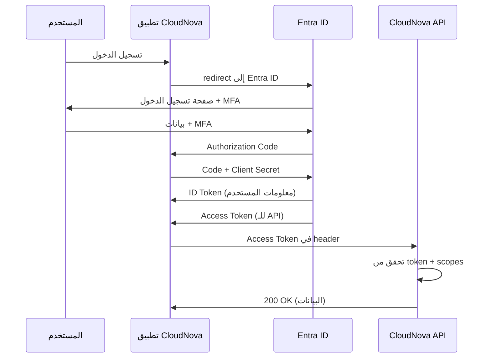

# إدارة الهوية المتقدمة (Identity)

> "الهوية هي المحيط الأمني الجديد. عندما تسقط الهوية، يسقط كل شيء."

## 🎯 أهداف التعلم

- إتقان Microsoft Entra ID و OAuth 2.0/OIDC
- تطبيق Conditional Access و PIM
- التحول لـ Passwordless (FIDO2/Passkeys)
- إدارة الهويات للخدمات (Managed Identities + Workload Identity)
- بناء استراتيجية Zero Trust للهوية

---

## 📖 الطبقة الأساسية: الهوية في السحابة

### Authentication vs Authorization

```
AuthN (Authentication) = "من أنت؟"
├── شيء تعرفه: Password, PIN
├── شيء تملكه: Phone (MFA), Security Key
└── شيء تكونه: Fingerprint, Face ID

AuthZ (Authorization) = "ماذا تستطيع أن تفعل؟"
├── RBAC: Roles (Reader, Contributor, Owner)
├── ABAC: Attributes (department=Engineering, clearance=3)
├── Claims-based: JWT tokens مع permissions
└── المبدأ: Least Privilege دائماً وأبداً
```

### OAuth 2.0 + OpenID Connect (OIDC)



---

## 🧱 الطبقة المهنية: Conditional Access

### سياسات Conditional Access

```
"إذا تحققت هذه الشروط → اطلب هذا الإجراء"

مثال 1: حماية المسؤولين
إذا:
├── المستخدم: Global Administrator
├── الموقع: خارج شبكة المكتب
└── الجهاز: غير مسجل في Intune

إذن:
├── MFA مطلوب ✓
├── جلسة محدودة بـ 4 ساعات ✓
└── لا يمكن تحميل ملفات ✓

مثال 2: حظر الدول عالية المخاطر
إذا:
├── الموقع: دول غير مصرح بها
└── أي مستخدم

إذن:
└── 🚫 Block access تماماً

مثال 3: BYOD (جهاز شخصي)
إذا:
├── الجهاز: غير منضم لـ Entra
└── التطبيق: Office 365

إذن:
├── MFA مطلوب ✓
├── لا يمكن تحميل للمحلي ✓
└── جلسة محدودة بـ 8 ساعات ✓
```

### تنفيذ Conditional Access بالـ CLI

```bash
# إنشاء سياسة: منع الدخول من خارج الدول المسموحة
az rest --method POST \
  --url "https://graph.microsoft.com/v1.0/identity/conditionalAccess/policies" \
  --headers "Content-Type=application/json" \
  --body '{
    "displayName": "Block access from high-risk countries",
    "state": "enabled",
    "conditions": {
      "locations": {
        "includeLocations": ["US", "UK", "DE", "AE", "SA"],
        "excludeLocations": []
      },
      "applications": {"includeApplications": ["All"]},
      "users": {"includeUsers": ["All"]}
    },
    "grantControls": {
      "operator": "OR",
      "builtInControls": ["block"]
    }
  }'
```

---

## 🏗️ الطبقة الإنتاجية: PIM — صلاحيات مؤقتة

### لماذا PIM بدلاً من Admin دائم؟

```
خطر Admin الدائم:
├── حساب admin مخترق = كارثة كاملة
├── صلاحيات زائدة 99% من الوقت
├── لا trace لمن استخدم الصلاحية ولماذا
└── انتهاك Least Privilege

PIM (Privileged Identity Management):
├── Eligible (مؤهل) ≠ Active (نشط)
├── الصلاحية تُفعَّل فقط عند الحاجة
├── لمدة محدودة: 1-8 ساعات
├── يتطلب: MFA + مبرر + موافقة
└── كل activation مُسجَّل ومراقَب
```

### تنفيذ PIM

```bash
# ١. جعل مستخدم "مؤهلاً" لدور Contributor (وليس دائماً)
az role assignment create \
  --assignee "ahmed@cloudnova.com" \
  --role "Contributor" \
  --scope "/subscriptions/prod-subscription-id" \
  --assignee-principal-type "User"

# ٢. في Portal: Azure AD PIM → Azure Resources → Add Assignment
#    Member: ahmed@cloudnova.com
#    Role: Contributor
#    Type: Eligible
#    Settings:
#      - Maximum activation: 4 hours
#      - Require MFA: Yes
#      - Require justification: Yes
#      - Require approval: Yes (for critical roles)

# ٣. Activation workflow:
#    User → My roles → Activate → MFA → Justification 
#    → Approver notified → Approve/Deny → Activated for N hours
```

### Access Reviews — المراجعة الدورية

```bash
# إنشاء Access Review ربع سنوي لكل صلاحيات الإنتاج
az rest --method POST \
  --url "https://graph.microsoft.com/v1.0/identityGovernance/accessReviews/definitions" \
  --body '{
    "displayName": "مراجعة صلاحيات الإنتاج - ربع سنوية",
    "descriptionForAdmins": "راجع كل صلاحيات الـ production subscription",
    "scope": {
      "query": "/subscriptions/prod-subscription-id",
      "queryType": "MicrosoftGraph"
    },
    "reviewers": [
      {
        "query": "/groups/platform-engineering-team",
        "queryType": "MicrosoftGraph"
      }
    ],
    "settings": {
      "mailNotificationsEnabled": true,
      "reminderNotificationsEnabled": true,
      "justificationRequiredOnApproval": true,
      "autoReviewEnabled": true,
      "autoApplyDecisionsEnabled": true,
      "recurrence": {
        "pattern": {
          "type": "absoluteMonthly",
          "interval": 3,
          "dayOfMonth": 1
        },
        "range": {
          "type": "noEnd",
          "startDate": "2026-07-01"
        }
      },
      "defaultDecision": "Deny",
      "defaultDecisionEnabled": true
    }
  }'

# النتيجة: كل 3 أشهر، كل الصلاحيات تُراجَع
# إذا لم يُراجَع في 30 يوماً → تلقائياً تُرفَض (auto-deny)
```

---

## 🎨 الطبقة المعمارية: Passwordless

### لماذا Passwordless؟

```
مشاكل كلمات السر:
├── 81% من الاختراقات تبدأ بكلمة سر مسروقة
├── Phishing يخدع حتى المهندسين
├── Password reuse عبر الخدمات
├── MFA fatigue: المستخدم ينقر "Approve" بدون تفكير
└── تكلفة إعادة تعيين كلمة السر: $70 للمؤسسة

FIDO2/Passkeys — كيف تعمل:
├── زوج مفاتيح cryptographic (public + private)
├── Public key: يُخزَّن في Entra ID
├── Private key: على جهاز المستخدم فقط — لا يغادر أبداً!
├── تسجيل الدخول = توقيع cryptographic challenge
└── لا كلمة سر! لا phishing! لا MFA fatigue!

المقارنة:

| الطريقة | أمان | سهولة | ضد Phishing |
|---------|------|-------|------------|
| Password only | ⭐ | ⭐⭐⭐ | ❌ |
| Password + SMS MFA | ⭐⭐ | ⭐⭐ | ❌ (SIM swap) |
| Password + App MFA | ⭐⭐⭐ | ⭐⭐ | ❌ (MFA fatigue) |
| FIDO2 Security Key | ⭐⭐⭐⭐⭐ | ⭐⭐⭐ | ✅ |
| Passkeys | ⭐⭐⭐⭐⭐ | ⭐⭐⭐⭐⭐ | ✅ |
```

### تنفيذ Passwordless في Entra ID

```bash
# ١. تفعيل FIDO2 في الـ tenant
az rest --method PATCH \
  --url "https://graph.microsoft.com/v1.0/policies/authenticationMethodsPolicy" \
  --body '{
    "authenticationMethodConfigurations": [
      {
        "@odata.type": "#microsoft.graph.fido2AuthenticationMethodConfiguration",
        "id": "Fido2",
        "state": "enabled",
        "isSelfServiceRegistrationAllowed": true
      }
    ]
  }'

# ٢. المستخدم يسجل مفتاح الأمان:
#    myaccount.microsoft.com → Security Info → Add method → Security Key
#    USB-C أو NFC أو Bluetooth

# ٣. إزالة كلمة السر نهائياً من الحساب
az ad user update \
  --id "ahmed@cloudnova.com" \
  --password-enabled false
```

---

## ⚡ الطبقة المعمارية: هويات الخدمات

### Managed Identity (Azure)

```python
from azure.identity import DefaultAzureCredential
from azure.keyvault.secrets import SecretClient
from azure.storage.blob import BlobServiceClient

# DefaultAzureCredential: يحاول تلقائياً
# 1. Environment variables (AZURE_CLIENT_ID, etc.)
# 2. Managed Identity (في Azure)
# 3. Azure CLI (محلياً)
# 4. Visual Studio Code
credential = DefaultAzureCredential()

# Key Vault — بدون أي secrets!
secret_client = SecretClient(
    vault_url="https://cloudnova-kv.vault.azure.net",
    credential=credential
)
db_password = secret_client.get_secret("database-password")

# Blob Storage — بدون connection string!
blob_client = BlobServiceClient(
    account_url="https://cloudnovastorage.blob.core.windows.net",
    credential=credential
)
```

### Workload Identity (Kubernetes)

```yaml
# ١. إنشاء User-Assigned Managed Identity
# az identity create --name cloudnova-api-identity --resource-group prod-rg

# ٢. ربط الـ Managed Identity بـ Key Vault
# az keyvault set-policy --name cloudnova-kv --object-id <identity-principal-id> --secret-permissions get

# ٣. Service Account في Kubernetes
apiVersion: v1
kind: ServiceAccount
metadata:
  name: cloudnova-api-sa
  namespace: production
  annotations:
    azure.workload.identity/client-id: "12345678-1234-1234-1234-123456789abc"
    azure.workload.identity/tenant-id: "87654321-4321-4321-4321-cba987654321"

---
# ٤. الـ Pod يستخدم الـ Service Account
apiVersion: v1
kind: Pod
metadata:
  name: cloudnova-api
  namespace: production
  labels:
    azure.workload.identity/use: "true"
spec:
  serviceAccountName: cloudnova-api-sa
  containers:
  - name: api
    image: cloudnova/api:v3.2.0
    env:
    # لا secrets! الـ SDK يستخدم workload identity تلقائياً
    - name: KEY_VAULT_URL
      value: "https://cloudnova-kv.vault.azure.net"
```

### Zero Trust للهوية

```
المبادئ:

1️⃣ "لا تثق بأحد افتراضياً"
   ├── كل طلب = verify explicitly
   └── لا "trusted network" أو "internal traffic"

2️⃣ Least Privilege Access
   ├── Just-in-Time (PIM)
   ├── Just-Enough-Access (RBAC محدود)
   └── Session-based (تنتهي الصلاحية)

3️⃣ Assume Breach
   ├── كل حساب قد يكون مخترقاً
   ├── Segment networks (micro-segmentation)
   ├── Encrypt everywhere (in transit + at rest)
   └── Monitor + audit continuously

التطبيق في CloudNova:
├── كل المستخدمين → Conditional Access
├── كل المسؤولين → PIM (لا صلاحيات دائمة)
├── كل الخدمات → Managed Identity أو Workload Identity
├── كل الـ APIs → OAuth2 مع token validation
├── كل الـ secrets → Key Vault (لا secrets في الكود)
└── كل شيء → Audit logs إلى Sentinel
```

---

## 🚨 سيناريو CloudNova: اختراق حساب

> **الموقف:** 2:17 AM — تنبيه: "sarah@cloudnova.com tries to access from Moscow, Russia"

```
استجابة Conditional Access التلقائية:
├── ✅ الموقع: Russia (غير مصرح به)
├── ✅ User Risk: High (تسجيل دخول غير طبيعي)
├── ✅ MFA مطلوب
├── ❌ المستخدم فشل في MFA
└── 🚫 Access blocked automatically

الجدول الزمني للتحقيق (Incident Response):

02:17 — تنبيه Sentinel
02:18 — on-call engineer (أنت!) يتلقى PagerDuty
02:20 — فتح قناة #security-incident في Slack
02:22 — مراجعة logs: آخر 10 تسجيلات دخول
        ├── 9 من New York (طبيعي)
        └── 1 من Moscow (غير طبيعي) ← المؤشر
02:25 — تأكيد: هذه ليست Sarah
        ├── الجهاز: Windows (هي تستخدم Mac دائماً)
        └── الوقت: 2AM (خارج ساعات عملها)
02:27 — الإجراءات الفورية:
        ├── Disable account: az ad user update --id sarah@cloudnova.com --account-enabled false
        ├── Revoke all tokens: revokeSignInSessions
        ├── Force password reset
        └── إخطار Sarah عبر هاتفها
02:45 — مراجعة الأضرار: لا وصول لأي مورد (Conditional Access منع!)
03:00 — تقرير أولي للإدارة
09:00 — Sarah تؤكد: "ضغطت على رابط phishing في بريد إلكتروني"
10:00 — Postmortem + توصيات:
        ├── تسريع Passwordless لكل المهندسين
        ├── تدريب anti-phishing إجباري
        └── Phishing simulation شهرياً

الدرس: Conditional Access + PIM أنقذا الموقف.
لو كان لـ Sarah صلاحيات Admin دائمة بدون Conditional Access،
لكانت كارثة كاملة.
```

---

## 🧠 التذكّر النشط

1. ما الفرق بين OAuth 2.0 و OpenID Connect؟ متى تستخدم كلاً منهما؟
2. كيف يعمل PIM؟ لماذا هو أفضل من admin الدائم؟
3. كيف يمنع FIDO2 هجمات phishing تقنياً؟
4. متى تستخدم System-assigned vs User-assigned Managed Identity؟
5. كيف يختلف Workload Identity عن Managed Identity؟
6. ما هي مبادئ Zero Trust الثلاثة؟
7. كيف تبني Conditional Access policy تمنع تسرب البيانات؟
8. اشرح سير اختراق حساب وكيف تمنعه الـ architecture

## ✍️ تمرين Feynman

"Managed Identity مثل بطاقة موظف ذكية. بدلاً من كتابة كلمة السر على ورقة ولصقها في كل مكان، الخدمة 'تظهر بطاقتها' و Azure يتحقق منها تلقائياً. لو سرق أحد البطاقة؟ تنتهي تلقائياً كل 24 ساعة وتتجدد."

## 🎤 أسئلة المقابلة

1. **"OAuth 2.0 vs SAML: أيهما تختار ولماذا؟"**
   - OAuth 2.0/OIDC: حديث، JSON/JWT، أبسط، للتطبيقات الحديثة والـ SPAs
   - SAML: قديم، XML، معقد، للتطبيقات المؤسسية القديمة
   - القاعدة: OIDC افتراضياً، SAML فقط إذا كان التطبيق القديم لا يدعم OIDC

2. **"كيف تؤمّن API في Kubernetes بدون secrets؟"**
   - Workload Identity + Managed Identity (Azure)
   - OAuth2 Proxy أمام الـ API
   - mTLS بين الخدمات (Istio/Linkerd)
   - Network Policies للعزل
   - External Secrets Operator → Key Vault

3. **"ماذا تفعل إذا اكتشفت أن مفتاح Service Principal نُشر على GitHub؟"**
   - فوراً: حذف الـ secret من Entra ID → إنشاء جديد
   - فوراً: حذف الـ commit من Git history
   - فوراً: مراجعة logs لأي misuse
   - وقاية: Secret scanning في GitHub + pre-commit hooks
   - وقاية: Workload Identity Federation (لا secrets أبداً!)

---

[🏠 العودة للرئيسية](/) | [📚 جميع الدروس](/docs/lessons)
