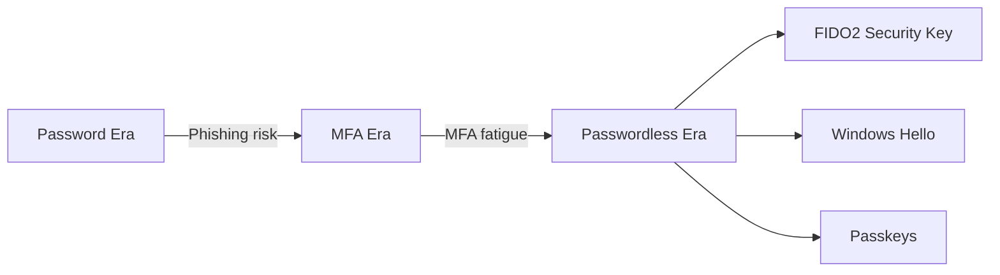

# إدارة الهوية المتقدمة (Identity)

> "الهوية هي المحيط الأمني الجديد. عندما تسقط الهوية، يسقط كل شيء."

## 🎯 أهداف التعلم

- إتقان Microsoft Entra ID و OAuth 2.0/OIDC
- تطبيق Conditional Access و PIM
- التحول لـ Passwordless (FIDO2/Passkeys)
- إدارة الهويات للخدمات (Managed Identities + Workload Identity)
- بناء استراتيجية Zero Trust للهوية

---

## 📖 الطبقة الأساسية: الهوية في السحابة

### Authentication vs Authorization

```
AuthN (Authentication) = "من أنت؟"
├── Password | MFA | FIDO2 | Certificate
└── شيء تعرفه + شيء تملكه + شيء تكونه

AuthZ (Authorization) = "ماذا تستطيع؟"
├── RBAC | ABAC | Claims | Scopes
└── Least Privilege دائماً
```

---

## 🧱 الطبقة المهنية: PIM — صلاحيات مؤقتة

```bash
# PIM: بدلاً من Admin دائم، الصلاحية تُفعّل عند الحاجة فقط
az role assignment create \
  --assignee "ahmed@cloudnova.com" \
  --role "Contributor" \
  --scope "/subscriptions/..." \
  --eligibility "PIM"  # الصلاحية مؤهلة — تحتاج activation

# Activation يتطلب:
# ✅ MFA
# ✅ مبرر (ticket number)
# ✅ موافقة مدير (للأدوار الحساسة)
# ✅ مدة محدودة (1-4 ساعات)
```

### Access Reviews

```bash
# مراجعة دورية للصلاحيات
az rest --method POST \
  --url "https://graph.microsoft.com/v1.0/identityGovernance/accessReviews/definitions" \
  --body '{
    "displayName": "مراجعة صلاحيات الإنتاج ربع سنوية",
    "scope": {"resourceId": "prod-subscription"},
    "reviewers": [{"query": "/groups/platform-team"}],
    "settings": {
      "recurrence": {"pattern": {"type": "absoluteMonthly", "interval": 3}},
      "autoApplyDecisionsEnabled": true
    }
  }'
```

---

## 🏗️ الطبقة الإنتاجية: Passwordless



```
FIDO2 = cryptographic key pair:
├── Private key: على جهاز المستخدم (لا يغادر أبداً)
├── Public key: في Entra ID
└── لا كلمة سر تُسرق! لا phishing!
```

---

## 🎨 الطبقة المعمارية: هويات الخدمات

### Managed Identity (Azure)

```python
from azure.identity import DefaultAzureCredential
from azure.keyvault.secrets import SecretClient

# بدون أي كلمة سر! Azure يتحقق تلقائياً
credential = DefaultAzureCredential()
secret_client = SecretClient(
    vault_url="https://cloudnova-kv.vault.azure.net",
    credential=credential
)
secret = secret_client.get_secret("database-password")
```

### Workload Identity (Kubernetes)

```yaml
apiVersion: v1
kind: ServiceAccount
metadata:
  name: cloudnova-api
  annotations:
    azure.workload.identity/client-id: "1234-5678-abcd"
# الـ Pod يستخدم هذا الـ ServiceAccount → يحصل على token من Azure → يتصل بـ Key Vault بدون secrets!
```

---

## 🚨 سيناريو CloudNova: اختراق حساب

> **الموقف:** تنبيه: sarah@cloudnova.com تدخل من Russia الساعة 2AM!

```
استجابة Conditional Access التلقائية:
├── ✅ User Risk: High → MFA مطلوب
├── ❌ فشل MFA
└── 🚫 Access blocked + تنبيه أمني

التحقيق:
├── 02:05: فريق الأمن يراجع
├── 02:10: تأكيد اختراق كلمة السر
├── 02:12: تعطيل الحساب + إلغاء جميع tokens
└── 02:30: تقرير للإدارة

الدرس: Passwordless يمنع هذا كلياً —
لا كلمة سر = لا شيء يُسرق!
```

---

## 🧠 التذكّر النشط

1. ما الفرق بين OAuth 2.0 و OpenID Connect؟
2. كيف يعمل PIM؟ لماذا هو أفضل من admin الدائم؟
3. كيف يمنع FIDO2 هجمات phishing؟
4. متى تستخدم System-assigned vs User-assigned Managed Identity؟
5. كيف تطبق Zero Trust عملياً؟

## ✍️ تمرين Feynman

"Managed Identity مثل بطاقة موظف للخدمة. بدلاً من كتابة كلمة السر في كل مكان، الخدمة 'تظهر بطاقتها' و Azure يثق بها."

## 🎤 أسئلة المقابلة

1. **"ما الفرق بين OAuth و SAML؟"**
   - OAuth 2.0/OIDC: حديث، JSON/JWT، للتطبيقات الحديثة
   - SAML: قديم، XML، للتطبيقات المؤسسية. OIDC أبسط وأسرع

2. **"كيف تؤمّن API في Kubernetes بدون secrets؟"**
   - Workload Identity + Managed Identity
   - OAuth2 Proxy أمام الـ API
   - mTLS بين الخدمات
   - Network Policies للعزل

---

[← العودة إلى الموديول](../index.md) | [🏠 الرئيسية](/)
