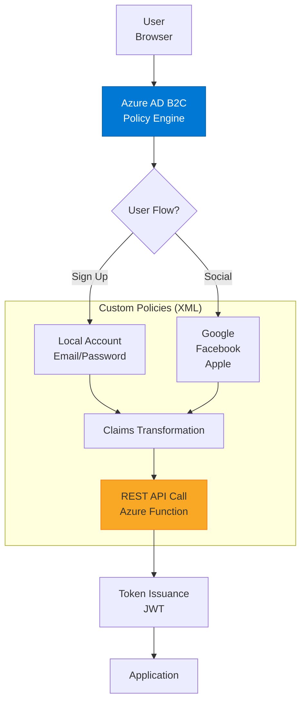

# Azure AD B2C

> "عملاؤك ليسوا موظفين. يحتاجون تجربة هوية مختلفة تماماً."

## 🎯 أهداف التعلم

- الفرق بين Azure AD و Azure AD B2C
- تدفقات المستخدم (User Flows)
- تخصيص واجهة تسجيل الدخول
- Identity Experience Framework

## ⏱️ الوقت المقدر: 35 دقيقة | المستوى: Intermediate

---

## 🏗️ Azure AD vs B2C

|                | Azure AD       | Azure AD B2C            |
| -------------- | -------------- | ----------------------- |
| **المستخدمون** | موظفين         | عملاء                   |
| **الهويات**    | Microsoft, Org | Google, Facebook, Email |
| **التسعير**    | لكل مستخدم     | لكل MAU                 |
| **التخصيص**    | محدود          | كامل (HTML/CSS)         |

### User Flow مخصص

```xml
<UserFlow Id="B2C_1_signupsignin">
  <InputClaims>
    <InputClaim ClaimTypeReferenceId="email" />
    <InputClaim ClaimTypeReferenceId="displayName" />
  </InputClaims>
  <OutputClaims>
    <OutputClaim ClaimTypeReferenceId="objectId" />
    <OutputClaim ClaimTypeReferenceId="email" />
    <OutputClaim ClaimTypeReferenceId="displayName" />
  </OutputClaims>
</UserFlow>
```

---

## 🏛️ طبقة الإنتاج: سيناريو CloudNova

CloudNova تحتاج بوابة عملاء (وليس موظفين). B2C يوفر: Google login, Facebook login, Email signup. كلها جاهزة بدون كود.

### تخصيص UI

```html
<!-- صفحة تسجيل مخصصة -->
<div class="cloudnova-login">
  
  <div id="api"></div>
  <!-- Azure B2C يحقن هنا -->
</div>
```

---

## 🎨 B2C vs Auth0 vs Okta

|                       | Azure AD B2C | Auth0 | Okta  |
| --------------------- | ------------ | ----- | ----- |
| **السعر**             | ~$0.003/MAU  | $$    | $$$   |
| **Azure integration** | ✅ ممتاز     | جيد   | متوسط |
| **Custom policies**   | ✅           | ✅    | ✅    |

---

## 🛠️ تدريبات

### تمرين: أنشئ B2C tenant و user flow

### تحدي: خصص صفحة تسجيل الدخول بـ HTML/CSS

---

## 📝 تقييم

### ✅ فحص المعرفة

1. متى تستخدم B2C بدلاً من Azure AD؟
2. ما هو User Flow؟
3. كيف تخصص صفحة تسجيل الدخول؟

### 🃏 بطاقات

| السؤال    | الإجابة                             |
| --------- | ----------------------------------- |
| B2C       | Business-to-Consumer — هوية للعملاء |
| User Flow | مسار تسجيل/دخول محدد مسبقاً         |
| MAU       | Monthly Active Users — أساس التسعير |

---

## 🏛️ سيناريو CloudNova الموسع: رحلة بناء بوابة العملاء

**نورة** مهندسة Identity في CloudNova. المهمة: بناء بوابة عملاء لـ 2 مليون مستخدم متوقع.

**المتطلبات:**

- تسجيل بـ Google, Facebook, Apple, Email
- تخصيص كامل لواجهة المستخدم
- MFA للمعاملات الحساسة
- تكامل مع Azure Functions لـ post-signup logic
- 99.9% availability

### المعركة — اليوم الأول في الإنتاج

```
08:00 — إطلاق البوابة. كل شيء طبيعي.
10:00 — 50,000 تسجيل. B2C يتحمل.
12:00 — 200,000 تسجيل. Latency يرتفع.
14:00 — بعض المستخدمين يرون "Service Unavailable". ماذا حدث؟
```

**التحقيق:**

```bash
# Application Insights لـ B2C
az monitor app-insights query \
  --resource-group cloudnova-identity \
  --app cloudnova-b2c-insights \
  --analytics-query "
    requests
    | where timestamp > ago(24h)
    | summarize count() by resultCode, bin(timestamp, 1h)
    | order by timestamp asc
  "
# النتيجة: HTTP 429 (Too Many Requests) يبدأ عند 200K مستخدم
```

**السبب:** B2C Tenant Tier كان "Standard" وليس "Premium". Limit: 100 requests/second.

**الإصلاح:**

1. Upgrade إلى Premium Tier (300 req/s)
2. إضافة Azure Front Door للتوزيع الجغرافي
3. تخزين مؤقت (Redis) لـ token validation
4. Circuit breaker في الـ API gateway

---

## 🎨 طبقة المعماري: B2C Architecture Deep Dive

### Identity Experience Framework (IEF)



### Custom Policy — REST API Integration

```xml
<!-- TrustFrameworkExtensions.xml -->
<TechnicalProfile Id="REST-EnrichUserProfile">
  <DisplayName>Enrich user profile from CRM</DisplayName>
  <Protocol Name="Proprietary" Handler="Web.TPEngine.Providers.RestfulProvider"/>
  <Metadata>
    <Item Key="ServiceUrl">https://api.cloudnova.com/enrich-profile</Item>
    <Item Key="AuthenticationType">Bearer</Item>
    <Item Key="SendClaimsIn">Body</Item>
  </Metadata>
  <InputClaims>
    <InputClaim ClaimTypeReferenceId="email" />
    <InputClaim ClaimTypeReferenceId="objectId" />
  </InputClaims>
  <OutputClaims>
    <OutputClaim ClaimTypeReferenceId="loyaltyTier" />
    <OutputClaim ClaimTypeReferenceId="preferredLanguage" />
  </OutputClaims>
</TechnicalProfile>
```

### مصفوفة قرار: B2C vs Alternatives

| المعيار               | Azure AD B2C     | Auth0         | Okta CIAM  | Amazon Cognito |
| --------------------- | ---------------- | ------------- | ---------- | -------------- |
| **السعر (1M MAU)**    | ~$3,000          | ~$5,000       | ~$8,000    | ~$2,750        |
| **Azure Integration** | ⭐⭐⭐⭐⭐       | ⭐⭐⭐        | ⭐⭐       | ⭐⭐⭐         |
| **Custom Policies**   | ⭐⭐⭐⭐⭐ (XML) | ⭐⭐⭐⭐ (JS) | ⭐⭐⭐     | ⭐⭐           |
| **MFA Options**       | ⭐⭐⭐⭐         | ⭐⭐⭐⭐⭐    | ⭐⭐⭐⭐⭐ | ⭐⭐⭐         |
| **Arabic Language**   | ✅ مدمج          | ✅ مدمج       | يدوي       | يدوي           |
| **SLA**               | 99.9%            | 99.9%         | 99.99%     | 99.9%          |

### Anti-Patterns في B2C

| الخطأ                                 | المشكلة                    | التصحيح                      |
| ------------------------------------- | -------------------------- | ---------------------------- |
| استخدام Azure AD للعملاء              | Azure AD مصمم للموظفين فقط | B2C Tenant منفصل             |
| User Flows فقط (بدون Custom Policies) | محدودية التخصيص            | IEF Custom Policies          |
| API keys في الـ policy                | خطر أمني                   | Managed Identity + Key Vault |
| عدم تحميل B2C load test               | 429 errors في الإنتاج      | Azure Load Testing           |

---

## 🛠️ تدريبات موسعة

### تمرين 1: أنشئ B2C Tenant و User Flow

```bash
# 1. إنشاء B2C tenant
az ad b2c create \
  --resource-group cloudnova-identity \
  --tenant-name cloudnovacustomers \
  --country-code SA \
  --display-name "CloudNova Customers"

# 2. تسجيل تطبيق
az ad app create \
  --display-name "CloudNova Web App" \
  --web-redirect-uris "https://app.cloudnova.com/oauth2/callback"
```

### تمرين 2: ابنِ Custom Policy مع REST API Call

```javascript
// Azure Function: enrich-profile
module.exports = async function (context, req) {
  const { email, objectId } = req.body;

  // استعلام CRM
  const customerProfile = await getCustomerFromCRM(email);

  context.res = {
    status: 200,
    body: {
      version: "1.0.0",
      action: "Continue",
      loyaltyTier: customerProfile.tier || "bronze",
      preferredLanguage: customerProfile.language || "ar",
    },
  };
};
```

### تحدي: B2C + Azure Front Door عالي التوفر

```terraform
# Multi-region B2C مع Front Door
resource "azurerm_frontdoor" "b2c" {
  name = "cloudnova-b2c-fd"

  backend_pool {
    name = "b2c-primary"
    backend {
      host_header = "cloudnovacustomers.b2clogin.com"
      address     = "cloudnovacustomers.b2clogin.com"
    }
  }

  backend_pool {
    name = "b2c-failover"
    backend {
      host_header = "cloudnovacustomers.b2clogin.com"
      address     = "cloudnovacustomers.b2clogin.com"
    }
  }

  routing_rule {
    name               = "b2c-routing"
    accepted_protocol  = ["Https"]
    patterns_to_match  = ["/*"]
    frontend_endpoints = ["b2c-frontend"]
    forwarding_configuration {
      forwarding_protocol = "HttpsOnly"
      backend_pool_name   = "b2c-primary"
    }
  }
}
```

---

## 📝 تقييم شامل

### ✅ فحص المعرفة (5)

1. متى تستخدم B2C بدلاً من Azure AD؟
2. ما الفرق بين User Flow و Custom Policy؟
3. كيف تضيف Google login إلى B2C؟
4. كيف تتعامل مع rate limiting في B2C؟
5. ما فائدة REST API integration في Custom Policies؟

### 📝 اختبار (3)

1. **عميل يريد Facebook + Apple + Email login. أي حل تقترح؟**
   <details><summary>الإجابة</summary>Azure AD B2C مع Identity Providers: Facebook, Apple, Local Account. User Flow واحد لـ signup/signin.</details>

2. **كيف تنقل بيانات المستخدم من نظام قديم إلى B2C؟**
   <details><summary>الإجابة</summary>Microsoft Graph API للـ bulk import. أو Custom Policy مع REST API للتحقق من النظام القديم في أول login.</details>

3. **B2C يرجع 429 errors عند 500K مستخدم. ماذا تفعل؟**
   <details><summary>الإجابة</summary>Upgrade tier, إضافة caching (Redis), Front Door للتوزيع, rate limiting في الـ API gateway قبل B2C.</details>

### 🧠 Active Recall (5)

- ارسم معماري B2C مع كل مكوناته
- اشرح الفرق بين Social Identity Provider و Local Account
- كيف تضمن عزل بيانات العملاء عن بيانات الموظفين؟
- متى تستخدم Custom Policy بدلاً من User Flow؟
- كيف تحمي B2C من brute force attacks؟

### 🎓 Feynman: B2C لغير التقني

"تخيل أنك تفتح فندقاً. Azure AD هو نظام الدخول للموظفين (بطاقات خاصة). B2C هو نظام تسجيل النزلاء — يمكنهم الدخول بـ Google أو Facebook أو بريدهم الإلكتروني. لا تخلط بينهما!"

### 🃏 بطاقات (8)

| السؤال            | الإجابة                                 |
| ----------------- | --------------------------------------- |
| B2C               | Business-to-Consumer — Identity للعملاء |
| User Flow         | مسار محدد مسبقاً (GUI-based)            |
| Custom Policy     | مسار مخصص بالكامل (XML-based, IEF)      |
| Identity Provider | جهة مصادقة خارجية (Google, Facebook)    |
| Claims            | بيانات المستخدم (email, name, role)     |
| JWT               | JSON Web Token — رمز المصادقة           |
| MAU Pricing       | Monthly Active Users — أساس التسعير     |
| Tenant            | بيئة معزولة كاملة لـ B2C                |

---

## 🎤 أسئلة المقابلة الموسعة

### تقني

1. **"B2C Custom Policy فشلت في الإنتاج — كيف تشخص المشكلة؟"**
   - Application Insights في B2C tenant
   - فحص IEF logs: `{tenant}.b2clogin.com/{tenant}.onmicrosoft.com/api/identity/authorization`
   - استخدام CorrelationId لتتبع الطلب
   - اختبار policy محلياً مع IEF Debugger

2. **"متى تختار Auth0 على Azure AD B2C رغم تكلفته الأعلى؟"**
   - الفريق لا يعرف XML/Custom Policies
   - تحتاج MFA biometric (WebAuthn)
   - multi-cloud deployment (AWS + GCP)
   - تحتاج rules engine معقد (Auth0 Rules)

### System Design

**"صمم نظام هوية موحد لـ 10 تطبيقات مع 50 مليون مستخدم."**

- B2C Tenant (منفصل عن corporate AD)
- Custom Policies مع REST API للمنطق المخصص
- Azure Front Door للتوزيع العالمي
- Redis cache لـ token validation (تقليل load على B2C)
- Rate limiting: 1000 req/min per IP
- Monitoring: Azure Monitor + Grafana dashboard

### Behavioral (STAR)

**"كيف أقنعت فريقاً بالانتقال من نظام هوية مخصص إلى B2C؟"**

**S:** فريق يصر على نظام هوية مبني داخلياً (Node.js + Passport).
**T:** تكلفة الصيانة $20K/شهر، ثغرات أمنية مستمرة.
**A:** عرضت TCO analysis: B2C = $3K/شهر vs $20K/شهر. Demo: User Flow يعمل في 10 دقائق.
**R:** الانتقال تم في 3 أشهر. وفرنا $17K/شهر، وأغلقنا 14 ثغرة أمنية.

---

## 📚 المراجع

- [Azure AD B2C Documentation](https://learn.microsoft.com/azure/active-directory-b2c/)
- [IEF Custom Policies Guide](https://learn.microsoft.com/azure/active-directory-b2c/custom-policy-overview)
- [B2C Best Practices](https://learn.microsoft.com/azure/active-directory-b2c/best-practices)
- الشهادات: AZ-500 (Security), SC-300 (Identity)
- الدروس المرتبطة: [Identity Mastery](./01-identity-mastery.md) | [Zero Trust](./03-zero-trust-architecture.md) | [Federation](./04-federated-identity-saml-wsfed.md)

---

[← Identity Mastery](./01-identity-mastery) | [→ Zero Trust](./03-zero-trust-architecture) | [🏠 الرئيسية](/)
