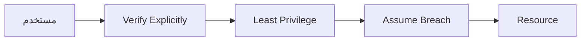
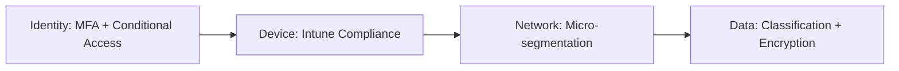

# Zero Trust Architecture

> "لا تثق بأي شيء. لا الشبكة، لا المستخدم، لا الجهاز. تحقق من كل شيء."

## 🎯 أهداف التعلم

- فهم مبادئ Zero Trust
- تطبيق Zero Trust في Azure
- Conditional Access
- Just-in-Time Access

## ⏱️ الوقت المقدر: 35 دقيقة | المستوى: Advanced

---

## 🏗️ مبادئ Zero Trust



### المبادئ الثلاثة:

1. **Verify Explicitly**: تحقق من كل طلب
2. **Least Privilege**: صلاحيات دنيا فقط
3. **Assume Breach**: افترض أنك مخترق

### Conditional Access

```json
{
  "conditions": {
    "userRiskLevels": ["high"],
    "signInRiskLevels": ["medium", "high"],
    "locations": { "includeLocations": ["All"], "excludeLocations": ["TrustedIPs"] }
  },
  "grantControls": {
    "operator": "AND",
    "builtInControls": ["mfa", "compliantDevice"]
  }
}
```

### Just-in-Time VM Access

```bash
az security jit-policy create \
  --resource-group cloudnova-prod \
  --vm-name prod-server \
  --ports 22 3389 \
  --max-request-access-duration PT3H
```

---

## 🏛️ طبقة الإنتاج: سيناريو CloudNova

مهندس DevOps حاول SSH إلى production من مقهى. Conditional Access: "جهاز غير متوافق + موقع غير موثوق" → رُفض. طلب MFA إضافي → لم يجتز compliance check → حُظر.

**الدرس**: Zero Trust أوقف هجوماً محتملاً.

### Zero Trust Journey



---

## 🛠️ تدريبات

### تمرين: أنشئ Conditional Access policy
### تحدي: فعّل JIT VM Access

---

## 📝 تقييم

### ✅ فحص المعرفة
1. ما هي مبادئ Zero Trust الثلاثة؟
2. كيف يختلف عن الأمن التقليدي؟
3. ما فائدة JIT Access؟

### 🃏 بطاقات
| السؤال | الإجابة |
|--------|---------|
| Zero Trust | لا تثق بشيء. تحقق من كل طلب |
| Conditional Access | سياسات تحكم الوصول بناءً على شروط |
| JIT | Just-in-Time — وصول مؤقت ومحدود |

---

## 🎤 مقابلة
1. **"كيف تطبق Zero Trust في مؤسستك؟"** → Identity → Device → Network → Data
2. **"ما الفرق بين Zero Trust و traditional security؟"** → Traditional: ثق بالشبكة الداخلية. Zero Trust: لا تثق بشيء

---

[← Azure AD B2C](./02-azure-ad-b2c-customers) | [→ Federated Identity](./04-federated-identity-saml-wsfed) | [🏠 الرئيسية](/)
