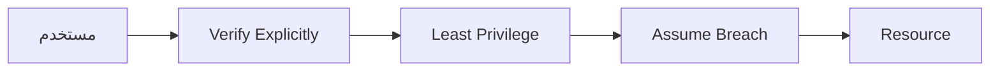

# Zero Trust Architecture

> "لا تثق بأي شيء. لا الشبكة، لا المستخدم، لا الجهاز. تحقق من كل شيء."

## 🎯 أهداف التعلم

- فهم مبادئ Zero Trust
- تطبيق Zero Trust في Azure
- Conditional Access
- Just-in-Time Access

## ⏱️ الوقت المقدر: 35 دقيقة | المستوى: Advanced

---

## 🏗️ مبادئ Zero Trust



### المبادئ الثلاثة:

1. **Verify Explicitly**: تحقق من كل طلب (من، من أين، إلى أين، متى)
2. **Least Privilege**: أعطِ الصلاحيات الدنيا المطلوبة فقط
3. **Assume Breach**: افترض أنك مخترق وصمم دفاعاتك بناءً على ذلك

### Conditional Access

```json
{
  "conditions": {
    "userRiskLevels": ["high"],
    "signInRiskLevels": ["medium", "high"],
    "clientAppTypes": ["all"],
    "locations": {
      "includeLocations": ["All"],
      "excludeLocations": ["TrustedIPs"]
    }
  },
  "grantControls": {
    "operator": "AND",
    "builtInControls": ["mfa", "compliantDevice"]
  },
  "sessionControls": {
    "signInFrequency": {
      "value": 4,
      "type": "hours"
    }
  }
}
```

### Just-in-Time VM Access

```bash
az security jit-policy create \
  --resource-group cloudnova-prod \
  --vm-name prod-server \
  --ports 22 3389 \
  --max-request-access-duration PT3H
```

الآن SSH غير متاح إلا بعد طلب صريح، ويُغلق تلقائياً بعد 3 ساعات.

---

[← Azure AD B2C](./02-azure-ad-b2c-customers) | [→ Federated Identity](./04-federated-identity-saml-wsfed) | [🏠 الرئيسية](/)
