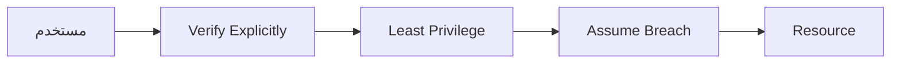
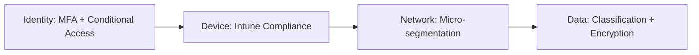

# Zero Trust Architecture

> "لا تثق بأي شيء. لا الشبكة، لا المستخدم، لا الجهاز. تحقق من كل شيء."

## 🎯 أهداف التعلم

- فهم مبادئ Zero Trust
- تطبيق Zero Trust في Azure
- Conditional Access
- Just-in-Time Access

## ⏱️ الوقت المقدر: 35 دقيقة | المستوى: Advanced

---

## 🏗️ مبادئ Zero Trust



### المبادئ الثلاثة:

1. **Verify Explicitly**: تحقق من كل طلب
2. **Least Privilege**: صلاحيات دنيا فقط
3. **Assume Breach**: افترض أنك مخترق

### Conditional Access

```json
{
  "conditions": {
    "userRiskLevels": ["high"],
    "signInRiskLevels": ["medium", "high"],
    "locations": { "includeLocations": ["All"], "excludeLocations": ["TrustedIPs"] }
  },
  "grantControls": {
    "operator": "AND",
    "builtInControls": ["mfa", "compliantDevice"]
  }
}
```

### Just-in-Time VM Access

```bash
az security jit-policy create \
  --resource-group cloudnova-prod \
  --vm-name prod-server \
  --ports 22 3389 \
  --max-request-access-duration PT3H
```

---

## 🏛️ طبقة الإنتاج: سيناريو CloudNova

مهندس DevOps حاول SSH إلى production من مقهى. Conditional Access: "جهاز غير متوافق + موقع غير موثوق" → رُفض. طلب MFA إضافي → لم يجتز compliance check → حُظر.

**الدرس**: Zero Trust أوقف هجوماً محتملاً.

### Zero Trust Journey



---

## 🛠️ تدريبات

### تمرين: أنشئ Conditional Access policy
### تحدي: فعّل JIT VM Access

---

## 📝 تقييم

### ✅ فحص المعرفة
1. ما هي مبادئ Zero Trust الثلاثة؟
2. كيف يختلف عن الأمن التقليدي؟
3. ما فائدة JIT Access؟

### 🃏 بطاقات
| السؤال | الإجابة |
|--------|---------|
| Zero Trust | لا تثق بشيء. تحقق من كل طلب |
| Conditional Access | سياسات تحكم الوصول بناءً على شروط |
| JIT | Just-in-Time — وصول مؤقت ومحدود |

---

## 🎤 مقابلة
1. **"كيف تطبق Zero Trust في مؤسستك؟"** → Identity → Device → Network → Data
2. **"ما الفرق بين Zero Trust و traditional security؟"** → Traditional: ثق بالشبكة الداخلية. Zero Trust: لا تثق بشيء

---

## 🏛️ سيناريو CloudNova: محاولة اختراق من الداخل

**طارق** مهندس أمن في CloudNova. إنذار في Microsoft Sentinel: محاولة SSH إلى production من جهاز غير معروف.

**التحقيق:**

```kql
// KQL query في Sentinel
SigninLogs
| where TimeGenerated > ago(1h)
| where ResultType == "53003"  // Access blocked by Conditional Access
| where DeviceDetail.isCompliant == false
| project TimeGenerated, UserPrincipalName, IPAddress, Location, DeviceDetail
```

**النتيجة:** حساب مهندس DevOps (مُخترق!) يحاول SSH من مقهى إنترنت في بلد آخر. Conditional Access أوقفه في 3 طبقات:
1. **Identity:** MFA required (فشل لأن الـ hacker لا يملك الهاتف)
2. **Device:** غير compliant (بدون Intune enrollment)
3. **Network:** IP خارج trusted locations

**Zero Trust أنقذ CloudNova من Ransomware attack.**

---

## 🎨 طبقة المعماري: Zero Trust Maturity Model

### CISA Zero Trust Maturity Model

| العمود | Traditional | Initial | Advanced | Optimal |
|--------|-----------|---------|----------|--------|
| **Identity** | Password only | MFA for admins | MFA all users | Passwordless + Risk-based |
| **Device** | Unmanaged | MDM enrolled | Compliance enforced | Real-time risk assessment |
| **Network** | Flat network | VLAN segmentation | Micro-segmentation | Software-defined perimeter |
| **Data** | Unclassified | Manual labeling | Auto-classification | DLP + Encryption everywhere |
| **Apps** | On-prem only | SSO for SaaS | Cloud-native + API security | Continuous authorization |

### مصفوفة Conditional Access Policies

```json
[
  {
    "name": "Block Legacy Auth",
    "condition": {"clientAppTypes": ["ExchangeActiveSync", "Other"]},
    "grant": "block",
    "rationale": "Legacy protocols don't support MFA"
  },
  {
    "name": "Require MFA for Admins",
    "condition": {"directoryRoles": ["Global Admin", "Privileged Role Admin"]},
    "grant": "mfa",
    "rationale": "Admins have keys to the kingdom"
  },
  {
    "name": "Block High-Risk Sign-ins",
    "condition": {"signInRiskLevels": ["high"]},
    "grant": "block",
    "rationale": "Impossible travel, leaked credentials, etc."
  },
  {
    "name": "Require Compliant Device",
    "condition": {"applications": ["Office 365", "Azure Portal"]},
    "grant": "compliantDevice + mfa",
    "rationale": "Ensure corporate data stays on managed devices"
  }
]
```

### Anti-Patterns

| الخطأ | المشكلة | التصحيح |
|-------|---------|---------|
| Zero Trust = منتج واحد | Zero Trust استراتيجية، ليس منتجاً | طبقات: Identity, Device, Network, Data, Apps |
| Conditional Access معطل في report-only | أمان وهمي | بدّل إلى enforce mode تدريجياً |
| JIT بلا expiration | وصول دائم بحجة JIT | max 3 hours for JIT, auto-revoke |
| Micro-segmentation بلا monitoring | لا تعرف إن كان يعمل فعلاً | NSG flow logs + Sentinel analytics |

---

## 🛠️ تدريبات موسعة

### تمرين 1: أنشئ Conditional Access Policy

```bash
# سياسة: فرض MFA لكل المستخدمين
az rest --method POST \
  --uri "https://graph.microsoft.com/v1.0/identity/conditionalAccess/policies" \
  --body '{
    "displayName": "Require MFA for all users",
    "state": "enabled",
    "conditions": {
      "clientAppTypes": ["all"],
      "applications": {"includeApplications": ["All"]},
      "users": {"includeUsers": ["All"]}
    },
    "grantControls": {
      "operator": "AND",
      "builtInControls": ["mfa"]
    }
  }'
```

### تمرين 2: Just-in-Time VM Access

```bash
# تفعيل JIT على production VM
az security jit-policy create \
  --resource-group cloudnova-prod \
  --location westeurope \
  --vm-name prod-app-01 \
  --ports 22 3389 \
  --max-request-access-duration PT3H

# طلب وصول JIT
az security jit-vm initiate \
  --resource-group cloudnova-prod \
  --vm-name prod-app-01 \
  --ports 22 \
  --duration PT1H
```

### تحدي: Micro-Segmentation مع Azure Firewall

```terraform
# Network Security Group مع Zero Trust
resource "azurerm_network_security_group" "zero_trust" {
  name = "zero-trust-nsg"
  
  security_rule {
    name                       = "AllowFromBastion"
    priority                   = 100
    direction                  = "Inbound"
    access                     = "Allow"
    protocol                   = "Tcp"
    source_address_prefixes    = ["10.0.1.0/28"]  # Bastion subnet فقط!
    destination_port_range     = "22"
    source_port_range          = "*"
    destination_address_prefix = "*"
  }
  
  security_rule {
    name                       = "DenyAllInbound"
    priority                   = 4096
    direction                  = "Inbound"
    access                     = "Deny"
    protocol                   = "*"
    source_address_prefix      = "*"
    destination_port_range     = "*"
  }
}
```

---

## 📝 تقييم شامل

### ✅ فحص المعرفة (5)
1. ما هي مبادئ Zero Trust الثلاثة؟
2. كيف يختلف Zero Trust عن الأمن التقليدي (perimeter-based)؟
3. ما فائدة Conditional Access في Zero Trust؟
4. كيف يعمل Just-in-Time VM Access؟
5. لماذا micro-segmentation أهم من network perimeter؟

### 📝 اختبار (3)
1. **موظف يسافر لبلد جديد ويريد الوصول لـ Azure Portal. كيف يتعامل Conditional Access؟**
   <details><summary>الإجابة</summary>Risk-based: impossible travel detection → risk level high → block or require MFA + compliant device. Azure AD Identity Protection يتعامل مع هذا تلقائياً.</details>

2. **كيف تطبق Zero Trust في مؤسسة تستخدم legacy apps لا تدعم MFA؟**
   <details><summary>الإجابة</summary>Azure AD Application Proxy + Azure AD Conditional Access أمام الـ legacy app. أو استخدام Hardware MFA tokens (FIDO2) إذا كانت التطبيقات قديمة جداً.</details>

3. **ما الفرق بين Zero Trust Architecture (ZTA) و Zero Trust Network Access (ZTNA)؟**
   <details><summary>الإجابة</summary>ZTA: إطار عمل شامل (Identity, Device, Network, Data, Apps). ZTNA: تطبيق Zero Trust على network access فقط (مثل VPN البديل).</details>

### 🧠 Active Recall (5)
- ارسم Zero Trust Maturity Model من الذاكرة
- اشرح كيف يختلف Zero Trust عن "trust but verify"
- صف 3 Conditional Access policies أساسية
- كيف تربط Zero Trust مع SRE/SLOs؟
- متى يكون Zero Trust عبئاً وليس حماية؟

### 🎓 Feynman: Zero Trust لغير التقني
"تخيل أنك تدخل مبنى حكومي. الأمن التقليدي = تفحص هويتك عند البوابة فقط، ثم تتجول بحرية. Zero Trust = تفحص هويتك عند كل باب، كل مكتب، وكل درج. حتى لو دخلت، لا تثق بك."

### 🃏 بطاقات (8)
| السؤال | الإجابة |
|--------|---------|
| Zero Trust | Never trust, always verify — تحقق من كل طلب |
| Conditional Access | سياسات تحكم بالوصول بناءً على signals (user, device, location, risk) |
| JIT Access | Just-in-Time — وصول مؤقت ينتهي تلقائياً |
| Micro-segmentation | تقسيم الشبكة لقطع صغيرة معزولة (east-west traffic control) |
| PIM | Privileged Identity Management — صلاحيات مؤقتة للمسؤولين |
| Passwordless | مصادقة بدون كلمة مرور (FIDO2, Windows Hello) |
| Risk-based CA | Conditional Access يتكيف مع مستوى المخاطرة |
| Assume Breach | افترض أنك مخترق — صمم دفاعاتك بناءً على ذلك |

---

## 🎤 أسئلة المقابلة الموسعة

### تقني
1. **"صمم Zero Trust Architecture لشركة لديها 5000 موظف و 200 تطبيق."**
   - Identity: Azure AD + MFA + Passwordless
   - Device: Intune enrollment + compliance policies
   - Network: Micro-segmentation, Azure Firewall, Private Link
   - Data: Azure Information Protection + DLP
   - Apps: Conditional Access per app sensitivity
   - Monitoring: Sentinel + Defender for Cloud

2. **"كيف تتعامل مع Shadow IT في Zero Trust؟"**
   - Defender for Cloud Apps (MCAS) لاكتشاف Shadow IT
   - Conditional Access: block unsanctioned apps
   - Session controls: read-only access for unmanaged devices

### System Design
**"صمم نظام مصادقة مقاوم للـ phishing."**
- Passwordless: FIDO2 security keys + Windows Hello for Business
- Conditional Access: require phishing-resistant MFA
- Continuous Access Evaluation: revoke tokens فوراً عند تغير risk
- Identity Protection: auto-remediate risky users

### Behavioral (STAR)
**"كيف أقنعت leadership بتبني Zero Trust؟"**

**S:** Leadership يرى Zero Trust كتكلفة إضافية بدون عائد.
**T:** إثبات أن perimeter security لم يعد كافياً.
**A:** عرضت 3 حوادث حقيقية في industry. حسبت تكلفة breach محتملة ($2M+). قدمت خطة تدريجية (18 شهراً) بمراحل Identity → Device → Network → Data.
**R:** موافقة على phase 1 (Identity). بعد 6 أشهر، Conditional Access أوقف 3 هجمات حقيقية.

---

## 📚 المراجع

- [Microsoft Zero Trust Model](https://learn.microsoft.com/security/zero-trust/)
- [CISA Zero Trust Maturity Model](https://www.cisa.gov/zero-trust-maturity-model)
- [NIST SP 800-207 — Zero Trust Architecture](https://csrc.nist.gov/publications/detail/sp/800-207/final)
- الشهادات: SC-300, AZ-500, SC-100
- الدروس المرتبطة: [Azure AD B2C](./02-azure-ad-b2c-customers.md) | [Federation](./04-federated-identity-saml-wsfed.md) | [Security Pipeline](../../17-devsecops/01-security-pipeline.md)

---

[← Azure AD B2C](./02-azure-ad-b2c-customers) | [→ Federated Identity](./04-federated-identity-saml-wsfed) | [🏠 الرئيسية](/)
