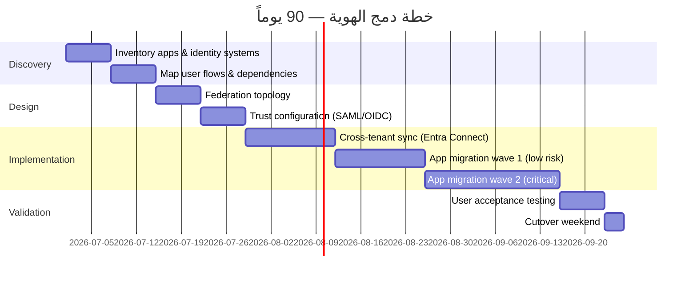
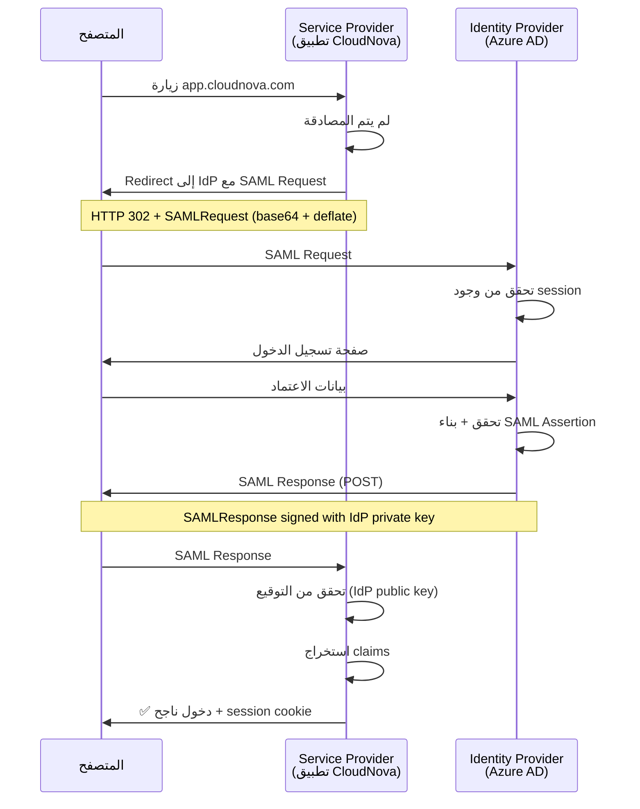
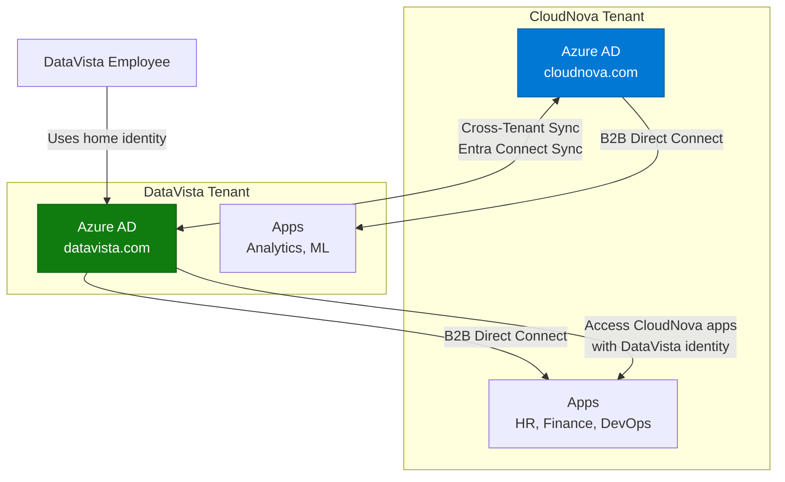

# الهوية الموحدة (Federation)

> "لا تجعل المستخدمين يتذكرون كلمة مرور أخرى. وحّد هوياتهم."

## 🎯 أهداف التعلم

- فهم Federation protocols (SAML, OIDC, WS-Fed)
- تكوين Azure AD B2B
- Cross-tenant access
- المصادقة بين المؤسسات

## ⏱️ الوقت المقدر: 30 دقيقة | المستوى: Advanced

---

## 🏗️ SAML vs OIDC vs WS-Fed

| | SAML 2.0 | OpenID Connect | WS-Federation |
|---|---------|---------------|--------------|
| **التنسيق** | XML | JSON | XML |
| **الاستخدام** | Enterprise SSO | Modern Apps | Legacy Microsoft |
| **التعقيد** | عالي | منخفض | عالي |

### Azure AD B2B

```bash
az ad user invite \
  --invited-user-email partner@othercompany.com \
  --invited-user-display-name "Partner User" \
  --send-invitation-message true
```

### Cross-Tenant Access

```json
{
  "Inbound": {
    "B2BCollaboration": {
      "applications": {
        "allApplications": { "accessStatus": "allowed" }
      }
    }
  }
}
```

---

## 🏛️ طبقة الإنتاج: سيناريو CloudNova

CloudNova تتعاقد مع شركة استشارية. بدلاً من إنشاء 50 حساب جديد في Azure AD، B2B يسمح للمستشارين باستخدام حسابات شركتهم.

### OIDC vs SAML: متى تستخدم ماذا؟

| السيناريو | البروتوكول |
|-----------|-----------|
| تطبيق ويب حديث (SPA) | OIDC |
| تطبيق Enterprise قديم | SAML |
| تكامل مع AD FS | WS-Fed |
| Google/Facebook login | OIDC |

---

## 🛠️ تدريبات

### تمرين: ادعُ مستخدم خارجي عبر B2B
### تحدي: كوّن Cross-Tenant Access بين tenantين

---

## 📝 تقييم

### ✅ فحص المعرفة
1. متى تستخدم SAML بدلاً من OIDC؟
2. ما فائدة Azure AD B2B؟
3. كيف تدير وصول شركاء خارجيين؟

### 🃏 بطاقات
| السؤال | الإجابة |
|--------|---------|
| SAML | بروتوكول SSO قديم (XML-based) |
| OIDC | بروتوكول حديث (JSON, JWT) |
| B2B | Business-to-Business — وصول شركاء |

---

## 🎤 مقابلة
1. **"كيف تمنح شركة خارجية وصولاً لموارد Azure؟"** → Azure AD B2B + Cross-Tenant Access
2. **"SAML vs OIDC؟"** → SAML: قديم، Enterprise. OIDC: حديث، Mobile/SPA

---

## 🏛️ سيناريو CloudNova الموسع: اندماج شركتين

**فهد** مهندس Identity Architect في CloudNova. الخبر: CloudNova تستحوذ على شركة DataVista (500 موظف، Azure AD خاص بهم، 200 تطبيق).

**المهمة:** دمج الهويتين في 90 يوماً دون تعطيل أي فريق.



### المعركة — يوم القطع (Cutover)

```
الجمعة 8 مساءً: بدء cutover.
الجمعة 9 مساءً: Federation يعمل. 80% من التطبيقات تعمل.
الجمعة 11 مساءً: تطبيق payroll القديم (SAML 1.1!) يرفض المصادقة.
السبت 1 صباحاً: اكتشفنا أن التطبيق يستخدم SHA-1 للتوقيع.
السبت 3 صباحاً: ترقية IdP proxy لدعم SHA-256.
السبت 5 صباحاً: كل التطبيقات تعمل. ✅
```

**الدروس:**
1. افحص كل تطبيق قبل الـ cutover (ليس عينة فقط)
2. التطبيقات القديمة دائماً تخفي مفاجآت
3. IdP Proxy أنقذنا — federate القديم مع الجديد

---

## 🎨 طبقة المعماري: Federation Protocols Masterclass

### تدفق SAML 2.0 بالتفصيل



### OIDC vs SAML: متى تختار ماذا؟

```python
# شجرة قرار البروتوكول
def choose_protocol(app_type, client_type, existing_infra):
    if app_type == "modern_spa":
        return "OIDC + PKCE"  # SPA لا تستطيع حفظ secret
    elif app_type == "mobile_app":
        return "OIDC + PKCE"
    elif app_type == "legacy_enterprise" and client_type == "browser":
        return "SAML 2.0"     # التطبيقات القديمة لا تفهم OIDC
    elif existing_infra == "adfs":
        return "WS-Federation"  # Microsoft legacy
    elif existing_infra == "azure_ad":
        return "OIDC"          # الأفضل دائماً في Azure
    else:
        return "OIDC"          # الافتراضي الحديث

# مثال
print(choose_protocol("modern_spa", "react", "azure_ad"))
# OIDC + PKCE
print(choose_protocol("legacy_enterprise", "browser", "adfs"))
# WS-Federation
```

### Cross-Tenant Access Architecture



### مصفوفة قرار: B2B vs Cross-Tenant Sync

| السيناريو | الحل | لماذا |
|-----------|------|-------|
| شريك خارجي يحتاج وصولاً مؤقتاً | B2B Guest Invitation | بسيط، مؤقت |
| شركة شقيقة (نفس المجموعة) | Cross-Tenant Sync | مزامنة تلقائية |
| استحواذ/دمج | Cross-Tenant Sync + eventual migration | انتقال تدريجي |
| مورد دائم | B2B + Access Reviews | تدقيق دوري |
| تعاون بحثي | B2B Direct Connect | وصول محدود لتطبيقات محددة |

### Anti-Patterns في Federation

| الخطأ | المشكلة | التصحيح |
|-------|---------|---------|
| استخدام SAML لتطبيق SPA | SAML ثقيل للمتصفحات الحديثة | OIDC + PKCE |
| عدم تجديد شهادات IdP | انقطاع مفاجئ لكل التطبيقات | Auto-rotation + monitoring |
| كل التطبيقات في IdP واحد | SPOF (نقطة فشل واحدة) | IdP ثانوي احتياطي |
| تجاهل logout (SLO) | جلسات مفتوحة بعد logout | Single Logout (SAML) أو RP-Initiated Logout (OIDC) |

---

## 🛠️ تدريبات موسعة

### تمرين 1: كوّن SAML Federation بين Tenantين

```bash
# 1. إعداد SAML IdP في Azure AD
az ad app federation create \
  --id "https://app.cloudnova.com/saml2" \
  --identifier-uris "https://cloudnova.onmicrosoft.com/saml-app" \
  --saml-metadata-url "https://partner.com/FederationMetadata.xml"

# 2. اختبار SAML flow
curl -v "https://login.microsoftonline.com/cloudnova.onmicrosoft.com/saml2?SAMLRequest=..."
# يجب أن ترى HTTP 302 redirect إلى IdP الشريك
```

### تمرين 2: OIDC Federation مع PKCE

```javascript
// React SPA — OIDC + PKCE
import { PublicClientApplication } from "@azure/msal-browser";

const msalConfig = {
  auth: {
    clientId: "cloudnova-spa-app",
    authority: "https://login.microsoftonline.com/cloudnova.onmicrosoft.com",
    redirectUri: "https://app.cloudnova.com/callback",
  },
};

const msalInstance = new PublicClientApplication(msalConfig);

// PKCE تلقائي في MSAL.js 2.x
const loginRequest = {
  scopes: ["api://cloudnova-api/access_as_user"],
  prompt: "select_account",
};

msalInstance.loginRedirect(loginRequest);
```

### تحدي: ابنِ IdP Proxy للتطبيقات القديمة

```python
# IdP Proxy: يحول SAML 1.1 → SAML 2.0
from flask import Flask, request, redirect
from saml2 import Binding
from saml2.client import Saml2Client

app = Flask(__name__)

@app.route('/saml/proxy')
def saml_proxy():
    # استقبل SAML 1.1 من التطبيق القديم
    saml_request = request.args.get('SAMLRequest')
    
    # حول إلى SAML 2.0
    client = Saml2Client(config_file='saml2_config.py')
    req_id, info = client.prepare_for_authenticate(
        entityid='https://azure-ad/saml2',
        binding=Binding.HTTP_REDIRECT
    )
    
    return redirect(info['headers'][0][1])
```

---

## 📝 تقييم شامل

### ✅ فحص المعرفة (5)
1. ما الفرق بين SAML 2.0 و OIDC؟
2. متى تستخدم Azure AD B2B vs Cross-Tenant Sync؟
3. كيف تمنع انقطاع كل التطبيقات عند فشل IdP؟
4. ما فائدة PKCE في OIDC؟
5. كيف تهاجر من SAML إلى OIDC تدريجياً؟

### 📝 اختبار (3)
1. **تطبيق قديم يستخدم SAML 1.1. Azure AD يدعم SAML 2.0 فقط. الحل؟**
   <details><summary>الإجابة</summary>IdP Proxy (مثل Shibboleth أو custom proxy) يحول SAML 1.1 إلى SAML 2.0.</details>

2. **موظف من شركة شقيقة يحتاج وصولاً دائماً لتطبيقين فقط. الحل؟**
   <details><summary>الإجابة</summary>B2B Direct Connect مع Cross-Tenant Access Settings — يحدد التطبيقين فقط.</details>

3. **كيف تخطط لانقطاع IdP المخطط (planned maintenance)؟**
   <details><summary>الإجابة</summary>IdP ثانوي احتياطي، إشعار المستخدمين قبل أسبوع، نافذة صيانة في أقل وقت استخدام، اختبار failover قبل الصيانة.</details>

### 🧠 Active Recall (5)
- ارسم تدفق SAML 2.0 كاملاً من الذاكرة
- قارن بين B2B و Cross-Tenant Sync في 3 جمل
- متى يكون WS-Federation الخيار الوحيد؟
- كيف تحمي Federation من replay attacks؟
- اشرح OIDC PKCE لزميل junior

### 🎓 Feynman: Federation لغير التقني
"تخيل أنك موظف في فندقين تابعين لنفس الشركة. Federation يعني أن بطاقة دخولك للمبنى تعمل في كلا الفندقين — لا تحتاج بطاقتين مختلفتين. هويتك واحدة، والأنظمة تثق ببعضها."

### 🃏 بطاقات (8)
| السؤال | الإجابة |
|--------|---------|
| SAML 2.0 | بروتوكول SSO قديم (XML, SOAP) — Enterprise |
| OIDC | OpenID Connect — بروتوكول حديث (JSON, REST) |
| WS-Federation | بروتوكول Microsoft قديم — AD FS integration |
| PKCE | Proof Key for Code Exchange — أمان OIDC للـ SPAs |
| B2B | Business-to-Business — وصول ضيوف خارجيين |
| Cross-Tenant Sync | مزامنة تلقائية للمستخدمين بين tenantين |
| IdP | Identity Provider — جهة المصادقة |
| SP | Service Provider — التطبيق الذي يثق بـ IdP |

---

## 🎤 أسئلة المقابلة الموسعة

### تقني
1. **"كيف تصمم Federation بين 5 شركات مختلفة (M&A scenario)؟"**
   - Central IdP (Azure AD) كـ hub
   - كل شركة كـ spoke (SAML/OIDC trust)
   - Cross-Tenant Sync للمستخدمين (bidirectional)
   - App migration على مراحل (3 waves)
   - Decommission old IdPs بعد التحقق الكامل

2. **"SAML assertion تم التلاعب به — كيف؟"**
   - SAML Response بدون توقيع = يمكن تغيير claims
   - الحل: التحقق من التوقيع (IdP public key) دائماً
   - استخدام HTTPS حصرياً
   - NotBefore/NotOnOrAfter للصلاحية الزمنية
   - InResponseTo لمنع replay attacks

### System Design
**"صمم نظام SSO لـ 200 تطبيق (قديم + حديث)."**
- IdP مركزي: Azure AD
- التطبيقات الحديثة: OIDC + PKCE
- التطبيقات القديمة: SAML 2.0 عبر IdP proxy
- AD FS (WS-Fed) للتطبيقات المعتمدة عليه حصراً
- Azure AD App Proxy للتطبيقات on-premises
- Monitoring: Azure Monitor + Grafana لصحة كل IdP

### Behavioral (STAR)
**"احكِ لي عن وقت فشل فيه integration معقد."**

**S:** دمج هوية شركة مستحوذ عليها. 50 تطبيقاً، بعضها من 2005.
**T:** كل التطبيقات يجب أن تعمل بنفس الهوية بعد 90 يوماً.
**A:** اكتشفت أن 3 تطبيقات تستخدم NTLM (وليس Kerberos). بنيت IdP proxy مخصص للتحويل من OIDC إلى NTLM مؤقتاً.
**R:** نجح cutover في الموعد. 3 تطبيقات NTLM هُجّرت لاحقاً في 6 أشهر.

---

## 📚 المراجع

- [Azure AD B2B Documentation](https://learn.microsoft.com/azure/active-directory/external-identities/)
- [Cross-Tenant Access Settings](https://learn.microsoft.com/azure/active-directory/external-identities/cross-tenant-access-overview)
- [SAML 2.0 Technical Overview](https://docs.oasis-open.org/security/saml/Post2.0/sstc-saml-tech-overview-2.0.html)
- [OIDC Specification](https://openid.net/specs/openid-connect-core-1_0.html)
- الشهادات: SC-300 (Identity), AZ-500 (Security)
- الدروس المرتبطة: [Azure AD B2C](./02-azure-ad-b2c-customers.md) | [Zero Trust](./03-zero-trust-architecture.md) | [Security Pipeline](../../17-devsecops/01-security-pipeline.md)

---

[← Zero Trust](./03-zero-trust-architecture) | [→ Azure AI Services](../../24-azure-ai/01-azure-ai-services) | [🏠 الرئيسية](/)
