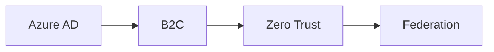

# 🚀 الهوية

> Azure AD، B2C، Zero Trust، Federated Identity — الهوية هي المحيط الجديد.

## 🎯 أهداف التعلم

بعد إكمال هذه الوحدة، ستكون قادراً على:

- [**إتقان الهوية**](01-identity-mastery) — Azure AD Mastery
- [**Azure AD B2C**](02-azure-ad-b2c-customers) — هوية العملاء
- [**Zero Trust**](03-zero-trust-architecture) — لا تثق بأحد
- [**الهوية الموحدة**](04-federated-identity-saml-wsfed) — SAML و WS-Fed

## 💡 المهارات التي ستكتسبها

Azure AD • B2C • Zero Trust • SAML • WS-Fed • Federation

## 📊 معلومات الوحدة

| العنصر           | القيمة  |
| ---------------- | ------- |
| **المستوى**      | متقدم   |
| **الوقت المقدر** | 7 ساعات |
| **المتطلبات**    | الأمن   |
| **الشهادات**     | SC-300  |

## 🏛️ مهمة CloudNova

> صمم نظام هوية لـ 2 مليون مستخدم في CloudNova. أمان من الدرجة الأولى.

## 🗺️ خريطة الوحدة

## 📖 الدروس

- [**إتقان الهوية**](01-identity-mastery) — Azure AD Mastery
- [**Azure AD B2C**](02-azure-ad-b2c-customers) — هوية العملاء
- [**Zero Trust**](03-zero-trust-architecture) — لا تثق بأحد
- [**الهوية الموحدة**](04-federated-identity-saml-wsfed) — SAML و WS-Fed

## 🚀 ابدأ التعلم

[▶️ ابدأ الدرس الأول](01-identity-mastery)
