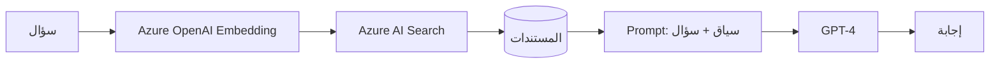

# الذكاء الاصطناعي على Azure

> **"Azure ليس مجرد بنية تحتية للذكاء الاصطناعي. إنه منصة متكاملة: نماذج، تدريب، نشر، وأمان."**

## محفظة Azure AI

| الخدمة | الفئة | الوصف |
|---|---|---|
| **Azure OpenAI** | نماذج لغوية | GPT-4, GPT-4o, DALL-E, Whisper |
| **AI Search** | بحث ذكي | بحث دلالي + RAG + فهرسة |
| **Azure ML** | منصة ML | تدريب، نشر، MLOps |
| **Cognitive Services** | ذكاء جاهز | رؤية، نطق، لغة، قرار |

## Azure OpenAI — إعداد آمن

```python
from openai import AzureOpenAI
import os

# أبداً لا تضع المفتاح في الكود!
client = AzureOpenAI(
    azure_endpoint=os.environ["AZURE_OPENAI_ENDPOINT"],
    api_key=os.environ["AZURE_OPENAI_KEY"],
    api_version="2024-02-01"
)

# استخدم Content Safety
response = client.chat.completions.create(
    model="gpt-4",
    messages=[
        {"role": "system", "content": "أنت مساعد تقني خبير. أجب بدقة وباللغة العربية."},
        {"role": "user", "content": "اشرح الفرق بين Docker و Kubernetes"}
    ],
    max_tokens=500,
    temperature=0.7
)
```

## RAG على Azure



## سيناريو CloudNova: دعم فني ذكي

> **الموقف:** ٥٠٠ تذكرة دعم يومياً. المهندسون غارقون.

**الحل:**
1. Bot يقرأ التذكرة ويصنفها (شبكة، قاعدة بيانات، صلاحيات)
2. يبحث في Azure AI Search عن حلول سابقة
3. يقترح حلاً للمهندس (أو يحل تلقائياً للحالات البسيطة)
4. النتيجة: ٤٠٪ من التذاكر تُحل تلقائياً

---

[← العودة للوحدة](index.md) | [🏠 الرئيسية](/)
