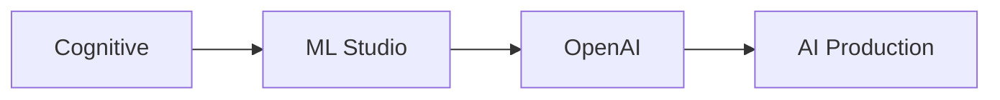

# 🚀 Azure AI

> Cognitive Services، Azure ML، Azure OpenAI — الذكاء الاصطناعي على Azure.

## 🎯 أهداف التعلم

بعد إكمال هذه الوحدة، ستكون قادراً على:

- [**خدمات Azure AI**](01-azure-ai-services) — نظرة عامة
- [**Cognitive Services**](02-cognitive-services-vision-speech) — رؤية وكلام
- [**Azure ML Studio**](03-azure-machine-learning-studio) — تدريب النماذج
- [**Azure OpenAI**](04-azure-openai-production) — GPT في الإنتاج

## 💡 المهارات التي ستكتسبها

Cognitive Services • Azure ML • Azure OpenAI • Vision • Speech

## 📊 معلومات الوحدة

| العنصر | القيمة |
| ------ | ------ |
| **المستوى** | متوسط |
| **الوقت المقدر** | 7 ساعات |
| **المتطلبات** | Azure Core |
| **الشهادات** | AI-102, AI-900 |

## 🏛️ مهمة CloudNova

> أطلق مساعد AI لعملاء CloudNova. Azure OpenAI هو محرك الذكاء.

## 🗺️ خريطة الوحدة

## 📖 الدروس

- [**خدمات Azure AI**](01-azure-ai-services) — نظرة عامة
- [**Cognitive Services**](02-cognitive-services-vision-speech) — رؤية وكلام
- [**Azure ML Studio**](03-azure-machine-learning-studio) — تدريب النماذج
- [**Azure OpenAI**](04-azure-openai-production) — GPT في الإنتاج

## 🚀 ابدأ التعلم

[▶️ ابدأ الدرس الأول](01-azure-ai-services)
