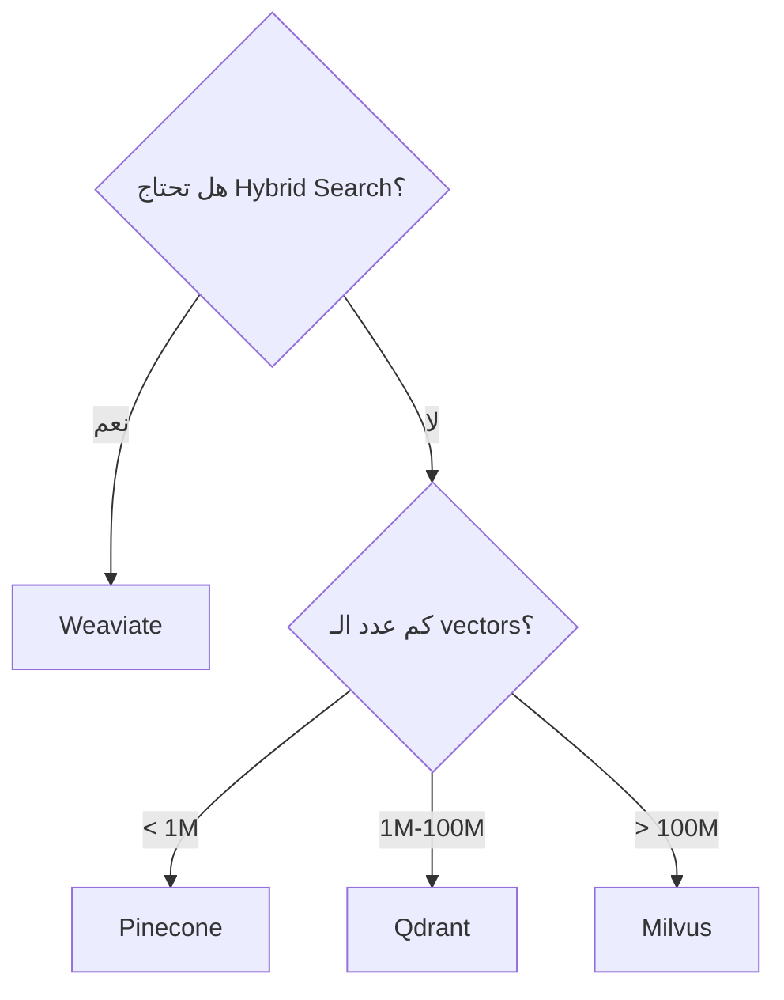

# مقارنة قواعد البيانات المتجهة

> "اختيار Vector DB يعتمد على ثلاثة أشياء: السرعة، التكلفة، التكامل."

## 🎯 أهداف التعلم

- مقارنة Pinecone, Weaviate, Qdrant, Milvus
- معايير الاختيار
- نماذج التسعير

## ⏱️ الوقت المقدر: 30 دقيقة | المستوى: Intermediate

---

## 🏗️ مقارنة

| | Pinecone | Weaviate | Qdrant | Milvus |
|---|---------|----------|--------|--------|
| **Managed** | ✅ فقط | ✅ Cloud + Self | ✅ Cloud + Self | ✅ Zilliz |
| **Open Source** | ❌ | ✅ | ✅ | ✅ |
| **Hybrid Search** | ❌ | ✅ | ❌ | ✅ |
| **التسعير** | $$$ | $$ | $ | مجاني |
| **الأفضل لـ** | سهولة البدء | Hybrid search | أداء عالي | حجم كبير |

### شجرة القرار

---

## 🏛️ طبقة الإنتاج: سيناريو CloudNova

بدأنا مع Pinecone (سهل، سريع). بعد 6 أشهر: 5M vectors = فاتورة $800/شهر. انتقلنا إلى Qdrant self-hosted: فاتورة $100/شهر.

**الدرس**: ابدأ بسيطاً. حسّن عند الحاجة.

---

## 🛠️ تدريبات

### تمرين: قارن بين اثنين من الـ vector DBs
### تحدي: ثبت Qdrant محلياً وجرب البحث

---

## 📝 تقييم

### ✅ فحص المعرفة
1. متى تختار Pinecone؟
2. ما فائدة Hybrid Search؟
3. لماذا Milvus للحجوم الكبيرة؟

### 🃏 بطاقات
| السؤال | الإجابة |
|--------|---------|
| Vector DB | قاعدة بيانات للبحث بالتشابه الدلالي |
| Hybrid Search | دمج keyword + vector search |
| Milvus | Vector DB مفتوح المصدر للحجوم الكبيرة |

---

## 🎤 مقابلة
1. **"أي Vector DB تختار لـ RAG؟"** → يعتمد على الحجم والميزانية. Weaviate خيار متوازن.
2. **"كيف تخفض تكلفة Pinecone؟"** → انتقل إلى self-hosted (Qdrant/Milvus)

---

[← Vector Databases](./01-vector-databases) | [→ Hybrid Search](./03-hybrid-search-patterns) | [🏠 الرئيسية](/)
