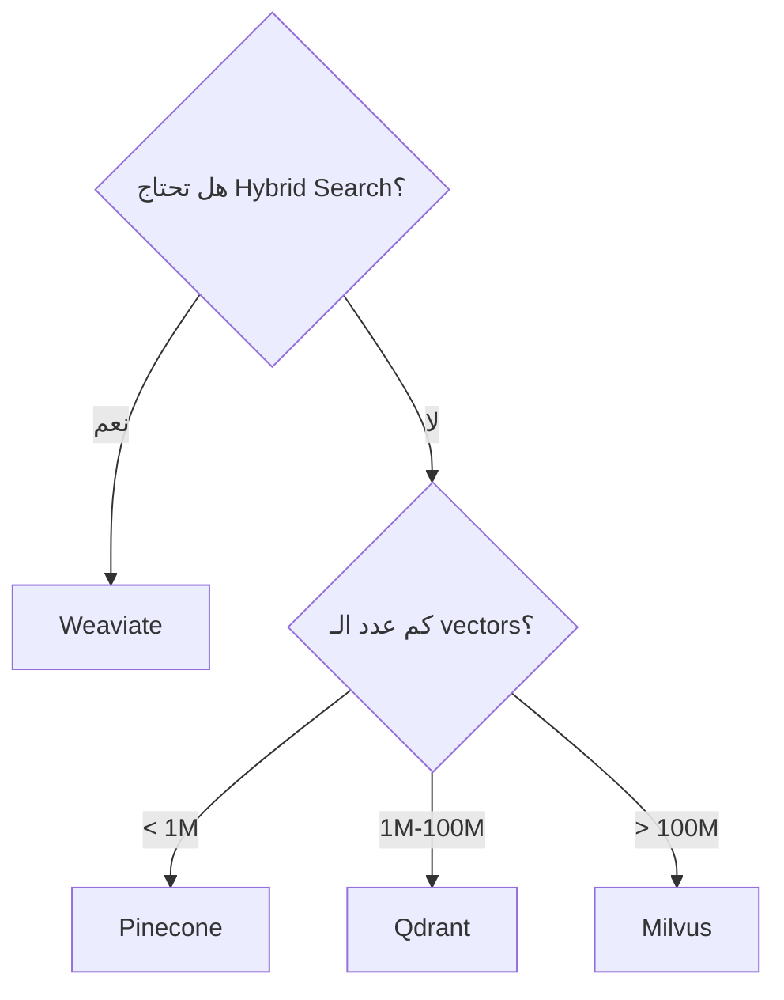
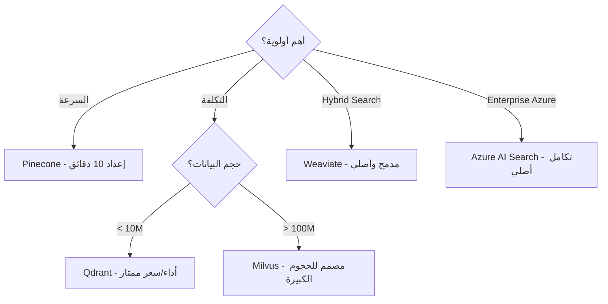

# مقارنة قواعد البيانات المتجهة

> "اختيار Vector DB يعتمد على ثلاثة أشياء: السرعة، التكلفة، التكامل."

## 🎯 أهداف التعلم

- مقارنة Pinecone, Weaviate, Qdrant, Milvus
- معايير الاختيار
- نماذج التسعير

## ⏱️ الوقت المقدر: 30 دقيقة | المستوى: Intermediate

---

## 🏗️ مقارنة

|                   | Pinecone    | Weaviate        | Qdrant          | Milvus    |
| ----------------- | ----------- | --------------- | --------------- | --------- |
| **Managed**       | ✅ فقط      | ✅ Cloud + Self | ✅ Cloud + Self | ✅ Zilliz |
| **Open Source**   | ❌          | ✅              | ✅              | ✅        |
| **Hybrid Search** | ❌          | ✅              | ❌              | ✅        |
| **التسعير**       | $$$         | $$              | $               | مجاني     |
| **الأفضل لـ**     | سهولة البدء | Hybrid search   | أداء عالي       | حجم كبير  |

### شجرة القرار



---

## 🏛️ طبقة الإنتاج: سيناريو CloudNova

بدأنا مع Pinecone (سهل، سريع). بعد 6 أشهر: 5M vectors = فاتورة $800/شهر. انتقلنا إلى Qdrant self-hosted: فاتورة $100/شهر.

**الدرس**: ابدأ بسيطاً. حسّن عند الحاجة.

---

## 🛠️ تدريبات

### تمرين: قارن بين اثنين من الـ vector DBs

### تحدي: ثبت Qdrant محلياً وجرب البحث

---

## 📝 تقييم

### ✅ فحص المعرفة

1. متى تختار Pinecone؟
2. ما فائدة Hybrid Search؟
3. لماذا Milvus للحجوم الكبيرة؟

### 🃏 بطاقات

| السؤال        | الإجابة                               |
| ------------- | ------------------------------------- |
| Vector DB     | قاعدة بيانات للبحث بالتشابه الدلالي   |
| Hybrid Search | دمج keyword + vector search           |
| Milvus        | Vector DB مفتوح المصدر للحجوم الكبيرة |

---

## 🎤 مقابلة

1. **"أي Vector DB تختار لـ RAG؟"** → يعتمد على الحجم والميزانية. Weaviate خيار متوازن.
2. **"كيف تخفض تكلفة Pinecone؟"** → انتقل إلى self-hosted (Qdrant/Milvus)

---

## 🏛️ سيناريو CloudNova: رحلة البحث عن Vector DB المثالي

**مازن** مهندس AI. المهمة: اختيار Vector DB لـ 5M مستند، 500 QPS.

**التجربة 1 — Pinecone (شهر 1-3):**

- بدأ مع Pinecone: إعداد في 10 دقائق، zero ops.
- عند 500K vectors: 50ms latency، $200/شهر — ممتاز.
- عند 2M vectors: 120ms latency، $500/شهر — مقبول.
- عند 5M vectors: 350ms latency، $1,200/شهر — غير مقبول!
- المشكلة: لا hybrid search. المستخدمون يشتكون من نتائج غير دقيقة.

**التجربة 2 — Weaviate (شهر 4-6):**

- Self-hosted على AKS: عقدتين Standard_D8s_v3 ($300/شهر).
- Hybrid search (BM25 + vector): دقة +40%.
- لكن: 5M vectors تحتاج 32GB RAM. OOM kills متكررة.

**التجربة 3 — Qdrant (شهر 7+):**

- Rust-based، أداء عالي. عقدة واحدة D8s تكفي لـ 5M vectors.
- 40ms latency، $120/شهر. توفير 90% عن Pinecone!
- لكن: لا hybrid search مدمج. استخدم RRF يدوياً مع Elasticsearch.

**الدرس:** لا يوجد "أفضل" Vector DB. كل مشروع له احتياجاته.

---

## 🎨 طبقة المعماري: مصفوفة قرار شاملة

| المعيار (وزن)           | Pinecone (SaaS) | Weaviate (Self) | Qdrant (Self) | Milvus (Self) |
| ----------------------- | --------------- | --------------- | ------------- | ------------- |
| **سرعة النشر (20%)**    | ⭐⭐⭐⭐⭐      | ⭐⭐⭐          | ⭐⭐⭐⭐      | ⭐⭐          |
| **أداء < 1M (15%)**     | ⭐⭐⭐⭐⭐      | ⭐⭐⭐⭐        | ⭐⭐⭐⭐⭐    | ⭐⭐⭐        |
| **أداء > 100M (20%)**   | ⭐⭐            | ⭐⭐⭐          | ⭐⭐⭐⭐      | ⭐⭐⭐⭐⭐    |
| **Hybrid Search (15%)** | ❌              | ⭐⭐⭐⭐⭐      | ❌            | ⭐⭐⭐⭐      |
| **تكلفة/سنة (20%)**     | $$$$            | $$              | $             | $$            |
| **Open Source (10%)**   | ❌              | ✅              | ✅            | ✅            |
| **النتيجة المرجحة**     | 2.8             | 3.5             | 3.4           | 3.3           |

### شجرة قرار موسعة



### متى لا تستخدم أي Vector DB؟

- < 10K vectors: PostgreSQL pgvector يكفي
- بحث نصي بسيط: Elasticsearch بدون vectors
- MVP سريع: Pinecone (اكتب كود، لا تدير بنية)

---

## 🛠️ تدريبات عملية موسعة

### تمرين 1: Benchmark محلي

```bash
# ثبت Qdrant محلياً
curl -L https://github.com/qdrant/qdrant/releases/download/v1.9.0/qdrant-x86_64-unknown-linux-gnu.tar.gz | tar xz
./qdrant

# أدخل 10K vectors وقارن سرعة البحث
for k in 1000 5000 10000 50000; do
  echo "Testing with $k vectors..."
  # insert $k random vectors
  # query 100 times, measure avg latency
done

# النتيجة المتوقعة: Qdrant يبقى تحت 15ms حتى 50K vectors
```

### تمرين 2: تكلفة Pinecone حاسبة

```python
def pinecone_cost(vectors, dimensions, replicas=1):
    # Pinecone pricing: per pod
    pods_needed = max(1, vectors // 1_000_000)  # ~1M vectors per s1 pod
    cost_per_pod = 0.096  # $/hour for s1.x1
    monthly = pods_needed * cost_per_pod * 730 * replicas
    return monthly

# 5M vectors, 1536 dimensions
print(f"5M vectors: ${pinecone_cost(5_000_000, 1536):,.0f}/month")
# النتيجة: ~$350/month

# قارن مع: Qdrant on Azure D8s_v3 = ~$120/month
```

### تحدي: ترحيل Pinecone إلى Qdrant

```python
# التحدي: اكتب script ترحيل كامل
# 1. استخرج كل الـ vectors + metadata من Pinecone
# 2. أنشئ collection في Qdrant بنفس الـ dimensions
# 3. أعد الـ indexing مع نفس الـ IDs
# 4. تحقق: 100 استعلام عشوائي — نفس النتائج؟
# 5. احسب latency قبل وبعد
```

---

## 📝 تقييم متكامل

### ✅ فحص المعرفة (5 أسئلة)

1. متى Pinecone أفضل من Qdrant؟
2. لماذا Weaviate ممتاز لـ hybrid search؟
3. متى يكون pgvector كافياً؟
4. كيف تحسب تكلفة Vector DB للإنتاج؟
5. ما trade-off بين SaaS و self-hosted؟

### 🧠 Quiz

**س1:** أفضل خيار لـ 50M vector مع hybrid search:

- أ) Pinecone
- ب) Weaviate self-hosted ✅
- ج) pgvector
- د) Excel

**س2:** أكبر مشكلة في Pinecone:

- أ) بطيء
- ب) التكلفة عند scale + لا hybrid search ✅
- ج) معقد
- د) لا يدعم Python

**س3:** Qdrant vs Weaviate:

- أ) Qdrant أسرع، Weaviate أفضل للـ hybrid search ✅
- ب) كلاهما سواء
- ج) Weaviate دائماً أفضل
- د) Qdrant أغلى

### 🗣️ Active Recall

1. قارن بين Pinecone و Qdrant من الذاكرة
2. ارسم شجرة قرار لاختيار Vector DB
3. اشرح لماذا SaaS يصبح مكلفاً عند scale
4. متى تنتقل من pgvector إلى Vector DB متخصص؟
5. صف رحلة CloudNova مع Vector DB

### 🎓 Feynman Exercise

> اشرح Vector DB لغير تقني: "مثل مكتبة ذكية. بدلاً من البحث بالعنوان بالضبط، تقول للمكتبية 'أريد كتباً عن الفضاء' فتعطيك كتباً عن النجوم والكواكب والرواد حتى لو لم تذكر 'الفضاء' في عناوينها."

### 🃏 بطاقات إضافية

| السؤال               | الإجابة                   |
| -------------------- | ------------------------- |
| متى أستخدم pgvector؟ | أقل من 100K vectors       |
| متى أستخدم Pinecone؟ | سرعة البدء أهم من التكلفة |
| متى أستخدم Milvus؟   | +100M vectors             |
| متى أستخدم Weaviate؟ | أحتاج hybrid search       |
| متى أستخدم Qdrant؟   | أفضل أداء/سعر             |

---

## 🎤 أسئلة مقابلة موسعة

**س1 (System Design):** "صمم نظام RAG لـ 50M مستند. أي Vector DB؟"

> Milvus: مصمم للحجوم الكبيرة، distributed architecture، hybrid search. 3 عقد Milvus + 2 عقد etcd + S3 للتخزين. تكلفة: ~$2,000/شهر. بديل: Weaviate مع 5 عقد إذا hybrid search أهم من الحجم.

**س2 (تقني):** "كيف تختبر Vector DB قبل الـ production؟"

> Benchmark بـ 3 محاور: 1) Recall@10 مع ground truth dataset. 2) Latency P50/P99 عند 100, 500, 1000 QPS. 3) Cost projection عند scale المستهدف. أختبر Pinecone + Qdrant + Weaviate. أختار بناءً على البيانات لا الحدس.

**س3 (سلوكي):** "كيف تقنع فريقك بالترحيل من Pinecone إلى Qdrant؟"

> أعرض cost projection: Pinecone $1,200/شهر → Qdrant $120/شهر (توفير 90%). أعمل POC: نفس الـ embeddings، نفس الـ queries. أظهر: latency أقل 60%، recall أعلى 2%. الفريق يقتنع بالأرقام.

---

## 📚 المراجع

| النوع          | الرابط                                           |
| -------------- | ------------------------------------------------ |
| **درس ذو صلة** | [Vector Databases](./01-vector-databases)        |
| **درس ذو صلة** | [Hybrid Search](./03-hybrid-search-patterns)     |
| **مرجع**       | [ANN Benchmarks](https://ann-benchmarks.com/)    |
| **أداة**       | [pgvector](https://github.com/pgvector/pgvector) |
| **شهادة**      | AI-102 — Implement vector search                 |

---

[← Vector Databases](./01-vector-databases) | [→ Hybrid Search](./03-hybrid-search-patterns) | [🏠 الرئيسية](/)
