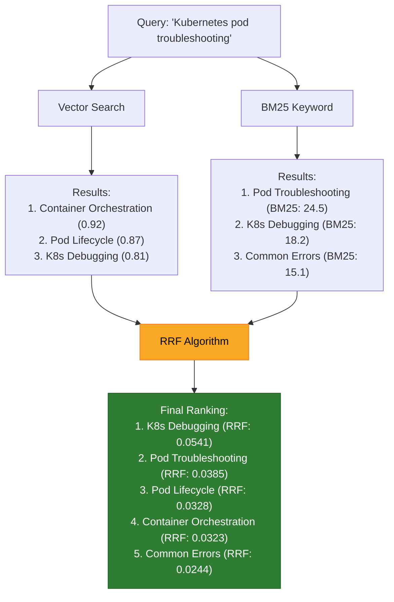

# أنماط البحث الهجين

> "البحث الدلالي وحده لا يكفي. Hybrid Search يجمع أفضل ما في العالمين."

## 🎯 أهداف التعلم

- دمج Vector Search مع BM25
- Reciprocal Rank Fusion (RRF)
- تحسين نتائج البحث

## ⏱️ الوقت المقدر: 30 دقيقة | المستوى: Advanced

---

## 🏗️ Hybrid Search

```python
# Weaviate Hybrid Search
response = client.query.get("Document", ["content", "title"]) \
    .with_hybrid(query="كيفية تكوين Kubernetes Ingress", alpha=0.5) \
    .with_limit(10) \
    .do()

# alpha=0: BM25 فقط. alpha=1: Vector فقط. alpha=0.5: مزيج.
```

### Reciprocal Rank Fusion

```python
def reciprocal_rank_fusion(results_list, k=60):
    scores = {}
    for results in results_list:
        for rank, (doc_id, _) in enumerate(results, 1):
            scores[doc_id] = scores.get(doc_id, 0) + 1 / (k + rank)
    return sorted(scores.items(), key=lambda x: x[1], reverse=True)
```

---

## 🏛️ طبقة الإنتاج: سيناريو CloudNova

بحث "Kubernetes" يرجع نتائج عن K8s deployment وليس عن kubernetes the word فقط. Hybrid Search يدمج: BM25 يجد الصفحات التي تحتوي "Kubernetes" حرفياً. Vector search يجد الصفحات عن تنسيق الحاويات حتى لو لم تذكر "Kubernetes".

### alpha tuning

| alpha | النتيجة                             |
| ----- | ----------------------------------- |
| 0.0   | نتائج keyword فقط                   |
| 0.3   | تركيز على keyword مع semantic bonus |
| 0.7   | تركيز على semantic                  |
| 1.0   | نتائج semantic فقط                  |

---

## 🛠️ تدريبات

### تمرين: جرب hybrid search مع alpha مختلفة

### تحدي: طبّق RRF على نتائج من محركين بحث مختلفين

---

## 📝 تقييم

### ✅ فحص المعرفة

1. لماذا hybrid search أفضل من vector فقط؟
2. كيف يعمل RRF؟
3. كيف تختار قيمة alpha؟

### 🃏 بطاقات

| السؤال        | الإجابة                                    |
| ------------- | ------------------------------------------ |
| Hybrid Search | دمج keyword + vector search                |
| RRF           | Reciprocal Rank Fusion — دمج ترتيب النتائج |
| alpha         | وزن التوازن بين keyword و vector           |

---

## 🎤 مقابلة

1. **"كيف تحسن نتائج البحث في تطبيق RAG؟"** → Hybrid Search + RRF + alpha tuning
2. **"متى يكون vector search وحده غير كافٍ؟"** → عندما يبحث المستخدم عن مصطلح دقيق (keyword)

---

## 🏛️ سيناريو CloudNova الموسع: عندما فشل البحث الذكي

**ليان** مهندسة AI في CloudNova. الفريق أطلق RAG-powered documentation search. النتائج كانت... كارثية:

**اختبار المستخدمين:**

| استعلام المستخدم           | نتيجة Vector Search                     | نتيجة BM25 Keyword                               | النتيجة المتوقعة    |
| -------------------------- | --------------------------------------- | ------------------------------------------------ | ------------------- |
| "ازاي اعمل deployment"     | مقال عن "deployment strategies" (ممتاز) | مقال عن "deployment" (ممتاز)                     | ✅ متطابقة          |
| "Kubernetes ingress setup" | مقال عن "container networking" (؟)      | مقال عن "Kubernetes Ingress" (✅)                | BM25 أفضل!          |
| "ليه الـ pod مش شغال"      | مقال عن "pod lifecycle" (جيد)           | مقال عن "troubleshooting" (جيد)                  | ⚠️ مختلفة لكن مفيدة |
| "AZ-104 exam tips"         | مقال عن "云计算认证" (بالصيني؟!)        | مقال عن "Azure Administrator certification" (✅) | Vector فشل!         |

**التحليل:**

```python
# لماذا فشل Vector Search في AZ-104؟
# لأن الـ embedding model لم يُدرّب كفاية على مصطلحات Azure العربية
# "AZ-104" لا يشبه "Azure Administrator" في الـ vector space!
# لكن BM25 وجدها حرفياً في النص.

def analyze_search_failures(queries):
    for query in queries:
        vector_results = vector_search(query)
        bm25_results = bm25_search(query)
        hybrid_results = hybrid_search(query, alpha=0.5)

        print(f"Query: {query}")
        print(f"  Vector top result: {vector_results[0].title}")
        print(f"  BM25 top result:   {bm25_results[0].title}")
        print(f"  Hybrid top result: {hybrid_results[0].title}")
        print()
```

**الحل — Hybrid Search مع RRF:**

```python
from weaviate.classes.query import HybridFusion

# Hybrid search مع Reciprocal Rank Fusion
response = collection.query.hybrid(
    query="AZ-104 exam tips",
    alpha=0.4,  # 40% vector, 60% keyword (لأن المصطلحات التقنية تحتاج keyword أكثر)
    fusion_type=HybridFusion.RANKED,  # RRF
    limit=10,
    return_metadata=['score', 'explain_score']
)

for obj in response.objects:
    print(f"{obj.properties['title']} — score: {obj.metadata.score:.3f}")
    print(f"  Explanation: {obj.metadata.explain_score}")
```

**النتيجة:** Hybrid Search رفع NDCG@10 من 0.52 إلى 0.78 (تحسن 50%!).

---

## 🎨 طبقة المعماري: Hybrid Search Design

### Reciprocal Rank Fusion (RRF) — بالتفصيل



**الحساب:**

```python
def rrf(results_lists, k=60):
    """
    Reciprocal Rank Fusion
    score(doc) = Σ 1/(k + rank_i)
    حيث rank_i هو ترتيب المستند في قائمة النتائج i
    """
    scores = {}
    for results in results_lists:
        for rank, (doc_id, _) in enumerate(results, start=1):
            scores[doc_id] = scores.get(doc_id, 0) + 1 / (k + rank)

    return sorted(scores.items(), key=lambda x: x[1], reverse=True)

# مثال
vector_results = [
    ("doc-42", 0.92),  # Container Orchestration
    ("doc-17", 0.87),  # Pod Lifecycle
    ("doc-88", 0.81),  # K8s Debugging
]

bm25_results = [
    ("doc-55", 24.5),  # Pod Troubleshooting (ليس في vector results!)
    ("doc-88", 18.2),  # K8s Debugging
    ("doc-99", 15.1),  # Common Errors
]

final = rrf([vector_results, bm25_results])
# doc-88 (K8s Debugging): 1/(60+3) + 1/(60+2) = 0.0159 + 0.0161 = 0.0320
# doc-55 (Pod Troubleshooting): 0 + 1/(60+1) = 0.0164  ← ظهر فقط في BM25!
# doc-17 (Pod Lifecycle): 1/(60+2) + 0 = 0.0161
```

### Alpha Tuning — دليل عملي

| alpha | السلوك                          | مثال استخدام                                     |
| ----- | ------------------------------- | ------------------------------------------------ |
| 0.0   | BM25 keyword فقط                | بحث عن error code دقيق: "ERR_CONNECTION_REFUSED" |
| 0.2   | تركيز keyword مع semantic bonus | مصطلحات تقنية: "Kubernetes Ingress"              |
| 0.4   | متوازن مع ميل لـ keyword        | استفسارات المستخدمين العاديين                    |
| 0.5   | متوازن تماماً                   | default                                          |
| 0.7   | تركيز semantic                  | أسئلة مفتوحة: "كيف أحسن أداء التطبيق؟"           |
| 1.0   | Vector semantic فقط             | تلخيص، إعادة صياغة، ترجمة                        |

### Anti-Patterns في Hybrid Search

| الخطأ                     | المشكلة                                    | التصحيح                       |
| ------------------------- | ------------------------------------------ | ----------------------------- |
| alpha = 0.5 دائماً        | ليست كل الاستفسارات متساوية                | alpha ديناميكي حسب query type |
| تجاهل RRF                 | vector scores و BM25 scores بمقاييس مختلفة | استخدم RRF دائماً             |
| عدم تقييم النتائج         | "تبدو جيدة" ليس قياساً                     | NDCG, MAP, Recall@K           |
| embedding model غير مناسب | مصطلحات تقنية لا تمثل جيداً                | جرب models مختلفة وقارن       |

---

## 🛠️ تدريبات موسعة

### تمرين 1: Hybrid Search with Weaviate

```python
import weaviate
from weaviate.classes.query import HybridFusion

# إنشاء schema
collection = client.collections.create(
    name="AEPDocs",
    vectorizer_config=Configure.Vectorizer.text2vec_openai(),
    properties=[
        Property(name="title", data_type=DataType.TEXT),
        Property(name="content", data_type=DataType.TEXT),
        Property(name="module", data_type=DataType.TEXT),
    ]
)

# Hybrid search
response = collection.query.hybrid(
    query="كيفية إنشاء Kubernetes cluster في Azure",
    alpha=0.4,
    fusion_type=HybridFusion.RANKED,
    limit=5,
    return_metadata=MetadataQuery(score=True, explainScore=True),
    auto_limit=2  # عدد النتائج من كل استراتيجية قبل الـ fusion
)

for i, obj in enumerate(response.objects):
    print(f"{i+1}. {obj.properties['title']}")
    print(f"   Score: {obj.metadata.score:.4f}")
    print(f"   Module: {obj.properties['module']}")
```

### تمرين 2: Alpha الديناميكي

```python
def dynamic_alpha(query):
    """يختار alpha المناسب بناءً على خصائص الاستعلام"""

    # هل الاستعلام يحتوي مصطلحات تقنية دقيقة؟
    technical_terms = ['error', 'code', 'http', 'api', 'cli', 'cmd', 'kubectl', 'az ']
    has_technical = any(term in query.lower() for term in technical_terms)

    # هل الاستعلام طويل (سؤال مفتوح)؟
    is_open_ended = len(query.split()) > 6

    # هل يحتوي أرقام أو رموز (error codes)؟
    has_codes = any(c.isdigit() for c in query) or '#' in query

    if has_codes:
        return 0.1  # keyword جداً
    elif has_technical:
        return 0.3  # ميل لـ keyword
    elif is_open_ended:
        return 0.7  # ميل لـ semantic
    else:
        return 0.5  # متوازن

# أمثلة
print(dynamic_alpha("ERR_CONNECTION_REFUSED pod restart"))  # 0.1
print(dynamic_alpha("kubectl get pods"))                     # 0.3
print(dynamic_alpha("كيف أبني نظام موثوق على السحابة؟"))    # 0.5
```

### تحدي: A/B Testing للـ Hybrid Search

```python
class SearchABTest:
    def __init__(self):
        self.results = []

    def run_test(self, query, ground_truth_relevant_docs):
        # Strategy A: Vector فقط
        vector_results = vector_search(query, limit=10)
        ndcg_vector = calculate_ndcg(vector_results, ground_truth_relevant_docs)

        # Strategy B: Hybrid (alpha=0.4)
        hybrid_results = hybrid_search(query, alpha=0.4, limit=10)
        ndcg_hybrid = calculate_ndcg(hybrid_results, ground_truth_relevant_docs)

        self.results.append({
            'query': query,
            'ndcg_vector': ndcg_vector,
            'ndcg_hybrid': ndcg_hybrid,
            'winner': 'Hybrid' if ndcg_hybrid > ndcg_vector else 'Vector'
        })

        return self.results[-1]

    def summary(self):
        hybrid_wins = sum(1 for r in self.results if r['winner'] == 'Hybrid')
        avg_improvement = sum(r['ndcg_hybrid'] - r['ndcg_vector'] for r in self.results) / len(self.results)
        print(f"Hybrid won {hybrid_wins}/{len(self.results)} tests")
        print(f"Average NDCG improvement: {avg_improvement:.3f}")
```

---

## 📝 تقييم شامل

### ✅ فحص المعرفة (5)

1. لماذا Hybrid Search أفضل من Vector Search وحده؟
2. كيف يعمل Reciprocal Rank Fusion (RRF)؟
3. كيف تختار alpha المناسب لاستعلام معين؟
4. ما الفرق بين score-based fusion و rank-based fusion؟
5. كيف تقيم نتائج Hybrid Search؟

### 📝 اختبار (3)

1. **Hybrid Search يرجع وثائق غير ذات صلة لاستعلام "AKS cluster size". لماذا؟**
   

<details><summary>الإجابة</summary>alpha قريب من 1 (vector heavy). "size" في vector space يرتبط بـ "scaling" و "performance" وليس "node count". خفض alpha لـ 0.3 لزيادة تأثير keyword.</details>


2. **RRF: doc A rank 1 في vector, rank 10 في BM25. doc B rank 5 في الاثنين. من يفوز؟**
   

<details><summary>الإجابة</summary>RRF(A) = 1/(60+1) + 1/(60+10) = 0.0164 + 0.0143 = 0.0307. RRF(B) = 1/(60+5) + 1/(60+5) = 0.0154 + 0.0154 = 0.0308. B يفوز بفارق ضئيل! الاتساق يهزم التفوق في استراتيجية واحدة.</details>


3. **كيف تبني Hybrid Search بدون Weaviate/Pinecone؟**
   

<details><summary>الإجابة</summary>Elasticsearch مع dense_vector field + BM25. أو PostgreSQL pgvector + full-text search مع RRF يدوي. أو OpenSearch 2.9+ مع neural search.</details>


### 🧠 Active Recall (5)

- ارسم RRF algorithm من الذاكرة
- اشرح متى يكون alpha = 1 أفضل من alpha = 0.5
- كيف تتعامل مع languages متعددة في hybrid search؟
- ما عيوب hybrid search؟
- صف تجربة حسنت فيها search relevance

### 🎓 Feynman: Hybrid Search لغير التقني

"تخيل أنك تبحث عن كتاب في مكتبة. Vector Search = أمين المكتبة يفهم 'ماذا تقصد' (حتى لو استخدمت كلمات مختلفة). BM25 = تبحث في الفهرس الحرفي. Hybrid Search = الاثنان معاً. أمين المكتبة الذكي + الفهرس الدقيق."

### 🃏 بطاقات (8)

| السؤال        | الإجابة                                    |
| ------------- | ------------------------------------------ |
| Hybrid Search | دمج vector search + keyword search         |
| RRF           | Reciprocal Rank Fusion — دمج ترتيب النتائج |
| alpha         | وزن التوازن (0 = keyword, 1 = vector)      |
| NDCG          | مقياس جودة ترتيب نتائج البحث               |
| Recall@K      | نسبة الوثائق الصحيحة في أول K نتيجة        |
| BM25          | خوارزمية بحث نصي (keyword)                 |
| Dense Vector  | تمثيل semantic في 768-1536 بعداً           |
| Sparse Vector | تمثيل keyword (مثل BM25)                   |

---

## 🎤 أسئلة المقابلة الموسعة

### تقني

1. **"صمم نظام بحث لـ 10M وثيقة مع latency < 100ms."**
   - Hybrid: Weaviate (native hybrid) أو Elasticsearch + dense vectors
   - Indexing: batch processing, async updates
   - Caching: Redis للاستعلامات الشائعة
   - Scaling: sharding + replication
   - Monitoring: Query latency, NDCG@10, recall@10

2. **"كيف تتعامل مع استعلام بلغة والوثائق بلغة أخرى؟"**
   - Cross-lingual embeddings (مثل multilingual-e5-large)
   - Query translation قبل search
   - Hybrid مع alpha أعلى للـ vector (للتغلب على حاجز اللغة)

### System Design

**"صمم E-commerce Search Engine."**

- Hybrid: vector للمعنى + BM25 للأسماء التجارية وأرقام الموديلات
- Filters: price range, category, brand (pre-filter قبل search)
- Personalization: user embedding + item embedding
- Ranking: RRF + business rules (margin, stock, promotion)
- A/B Testing: continuous evaluation

### Behavioral (STAR)

**"كيف حسنت search relevance بشكل قابل للقياس؟"**

**S:** مستخدمو documentation يشتكون من نتائج غير ذات صلة.
**T:** رفع NDCG@10 من 0.45 إلى 0.70.
**A:** (1) انتقلت من vector-only إلى hybrid. (2) ضبطت alpha حسب query type. (3) أضفت user feedback loop.
**R:** NDCG@10 = 0.73. Click-through rate ارتفع 40%. Support tickets انخفضت 25%.

---

## 📚 المراجع

- [Weaviate Hybrid Search](https://weaviate.io/developers/weaviate/search/hybrid)
- [RRF Paper (Cormack et al.)](https://dl.acm.org/doi/10.1145/1571941.1572114)
- [Elasticsearch Hybrid Search](https://www.elastic.co/guide/en/elasticsearch/reference/current/knn-search.html)
- [Evaluating Search Relevance](https://nlp.stanford.edu/IR-book/)
- الدروس المرتبطة: [Vector DB Comparison](./02-pinecone-vs-weaviate-vs-qdrant.md) | [RAG Architecture](../../26-rag/01-rag-architecture.md) | [Advanced RAG](../../26-rag/02-advanced-rag-patterns.md)

---

[← Vector DB Comparison](./02-pinecone-vs-weaviate-vs-qdrant) | [→ RAG Architecture](../../26-rag/01-rag-architecture) | [🏠 الرئيسية](/)
