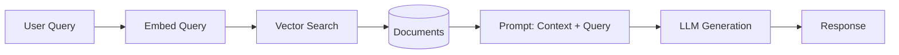

# RAG Architecture

Retrieval-Augmented Generation: chunking, embeddings, retrieval, and generation.

## What You Will Learn

This module covers key concepts, patterns, and real-world scenarios to build production-ready skills.

## RAG Pipeline

## Key RAG Decisions

| Decision          | Options                                   |
| ----------------- | ----------------------------------------- |
| Chunking          | Fixed-size, semantic, recursive           |
| Embedding model   | text-embedding-3-small, ada-002           |
| Retrieval         | Top-k, similarity threshold, hybrid       |
| Generation prompt | System prompt, few-shot, chain-of-thought |

## CloudNova Exercise

Apply what you learned to a real production scenario at CloudNova.

---

[← Back to Module](index.md) | [🏠 Home](/)
