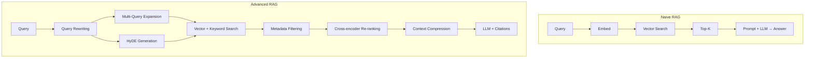

# معمارية RAG

> "RAG ليس مجرد استدعاء API. إنه هندسة كاملة من الـ chunking إلى الـ evaluation."

## 🎯 أهداف التعلم

- فهم معمارية Advanced RAG (ما بعد naive)
- إتقان Graph RAG و Multimodal RAG
- بناء وتقييم RAG Pipeline إنتاجي
- تحسين التكلفة والأداء
- تطبيق RAG في Azure Cloud

---

## 📖 الطبقة الأساسية: من Naive إلى Advanced RAG

### Naive RAG vs Advanced RAG



---

## 🧱 الطبقة المهنية: RAG Pipeline إنتاجي

```python
class ProductionRAGPipeline:
    """RAG Pipeline كامل للإنتاج"""

    def retrieve(self, query: str, filters: dict = None, top_k: int = 5):
        # ١. Query transformation
        queries = self.expand_query(query)

        # ٢. Multi-vector search
        all_results = []
        for q in queries:
            vector = self.get_embedding(q)
            results = self.search_client.search(
                vector_queries=[VectorizedQuery(
                    vector=vector,
                    fields="content_vector",
                    k_nearest_neighbors=top_k
                )],
                filter=build_filter(filters) if filters else None,
                top=top_k
            )
            all_results.extend(results)

        # ٣. Deduplicate + Re-rank
        unique = self.deduplicate(all_results)
        reranked = self.rerank(query, unique)
        return reranked[:top_k]

    def rerank(self, query: str, documents: list) -> list:
        from sentence_transformers import CrossEncoder
        model = CrossEncoder("cross-encoder/ms-marco-MiniLM-L-6-v2")
        pairs = [(query, doc["content"]) for doc in documents]
        scores = model.predict(pairs)
        scored = sorted(zip(documents, scores), key=lambda x: x[1], reverse=True)
        return [doc for doc, _ in scored]

    def generate(self, query: str, documents: list) -> dict:
        # بناء context مع citations [1], [2], [3]
        context_parts = []
        for i, doc in enumerate(documents):
            context_parts.append(
                f"[{i+1}] {doc['title']} ({doc.get('section', '')})\n{doc['content']}"
            )

        prompt = f"""أجب بناءً على المصادر فقط. استشهد بـ [1]، [2]...
إذا لم تجد الإجابة، قل: "لا توجد معلومات كافية."

المصادر:\n{chr(10).join(context_parts)}

السؤال: {query}"""

        response = self.llm.chat(prompt, temperature=0.3)
        return {
            "answer": response.content,
            "sources": [{"title": d["title"], "section": d.get("section")}
                       for d in documents],
            "tokens": response.usage.total_tokens
        }
```

---

## 🏗️ الطبقة الإنتاجية: Graph RAG

### لماذا Graph RAG؟

```
المشكلة: "كيف ترتبط Kubernetes بـ Terraform في CloudNova؟"
Vector RAG: يجد صفحات عن K8s + صفحات عن Terraform. لا يفهم العلاقة!
Graph RAG: يعرف أن K8s ← ينشر على ← AKS ← يُبنى بـ ← Terraform
```

```python
# Graph RAG مع Neo4j
from langchain.graphs import Neo4jGraph
from langchain.chains import GraphCypherQAChain

graph = Neo4jGraph(
    url="bolt://neo4j:7687",
    username="neo4j",
    password="password"
)

# إنشاء Knowledge Graph
graph.query("""
    CREATE (k8s:Technology {name: 'Kubernetes'})
    CREATE (tf:Technology {name: 'Terraform'})
    CREATE (aks:Service {name: 'AKS'})
    CREATE (k8s)-[:DEPLOYED_ON]->(aks)
    CREATE (tf)-[:PROVISIONS]->(aks)
    CREATE (k8s)-[:PROVISIONED_BY]->(tf)
""")

# استعلام Graph RAG
chain = GraphCypherQAChain.from_llm(
    llm=AzureChatOpenAI(model="gpt-4"),
    graph=graph,
    verbose=True
)

result = chain.run(
    "كيف ترتبط Kubernetes بـ Terraform في CloudNova؟"
)
# "Terraform يبني AKS cluster. Kubernetes ينشر التطبيقات عليه."
```

---

## 🎨 الطبقة المعمارية: Chunking Strategies

### مقارنة استراتيجيات التقسيم

| الاستراتيجية     | الميزة             | العيب         | متى تستخدم        |
| ---------------- | ------------------ | ------------- | ----------------- |
| **Fixed-size**   | بسيط وسريع         | يقطع الجمل    | نماذج أولية       |
| **Recursive**    | يحترم حدود الجمل   | غير متجانس    | ✅ إنتاج (الأفضل) |
| **Semantic**     | مجموعات مترابطة    | معقد وبطيء    | محتوى تقني        |
| **Hierarchical** | هيكل الوثيقة محفوظ | overhead كبير | وثائق طويلة       |

```python
# Semantic Chunking — الأفضل للإنتاج
from langchain.text_splitter import RecursiveCharacterTextSplitter

splitter = RecursiveCharacterTextSplitter(
    chunk_size=1000,
    chunk_overlap=200,
    separators=["\n\n", "\n", ". ", "! ", "? ", "، ", " ", ""]
)
chunks = splitter.split_text(document)
```

---

## ⚡ الإنتاج وما بعده: تقييم RAG

### RAGAS Framework

```python
from ragas import evaluate
from ragas.metrics import (
    faithfulness, answer_relevancy,
    context_precision, context_recall
)

def evaluate_pipeline(test_questions, ground_truth):
    results = []
    for q, truth in zip(test_questions, ground_truth):
        r = pipeline.query(q)
        results.append({
            "question": q,
            "answer": r["answer"],
            "ground_truth": truth,
            "contexts": [s["title"] for s in r["sources"]]
        })

    return evaluate(results, metrics=[
        faithfulness,       # > 0.90
        answer_relevancy,   # > 0.85
        context_precision,  # > 0.80
        context_recall      # > 0.85
    ])
```

---

## 💰 Cost Optimization

```python
# مراقبة التكاليف
class RAGCostTracker:
    def __init__(self):
        self.daily_cost = 0
        self.daily_limit = 50  # سقف يومي

    def track_query(self, tokens_used: int, model: str):
        pricing = {"gpt-4": 0.03, "gpt-3.5-turbo": 0.002}  # per 1K tokens
        cost = (tokens_used / 1000) * pricing[model]
        self.daily_cost += cost

        if self.daily_cost > self.daily_limit:
            raise BudgetExceededError()

        return cost

# استراتيجيات توفير التكاليف:
# ١. Cache answers للأسئلة المتكررة
# ٢. gpt-3.5 للأسئلة البسيطة، gpt-4 للمعقدة (router)
# ٣. Semantic cache — إذا سؤال مشابه 95% → أعد نفس الإجابة
# ٤. Batch processing: جمل embeddings ليلاً
```

---

## 🚨 سيناريو CloudNova: RAG للإنتاج

> **المشروع:** نظام أسئلة وأجوبة ذكي لدعم العملاء في CloudNova

```
المعمارية النهائية:

١. Ingestion Pipeline:
   ├── Azure Functions — معالجة الوثائق
   ├── Semantic chunking (1000 tokens, 200 overlap)
   ├── text-embedding-3-large (multilingual)
   └── Azure AI Search (HNSW + Semantic Ranker)

٢. Query Pipeline:
   ├── Query classification (عربي/إنجليزي)
   ├── Multi-query expansion (3 queries)
   ├── Hybrid search (vector + keyword)
   ├── Cross-encoder re-ranking
   └── GPT-4 generation with citations [1],[2],[3]

٣. Monitoring:
   ├── Faithfulness tracking يومي
   ├── User feedback loop (👍/👎)
   ├── Latency dashboards (p95 < 2s)
   └── Weekly RAGAS evaluation

النتيجة:
✅ Faithfulness: 0.93
✅ Latency: 1.2s
✅ User satisfaction: 4.2/5
```

---

## 🧠 التذكّر النشط

1. ما الفرق بين Vector RAG و Graph RAG؟ متى تختار أيهما؟
2. كيف توسع الاستعلام لتحسين الاسترجاع (3 طرق)؟
3. كيف تقيس جودة RAG Pipeline؟ (4 metrics)
4. كيف تخفض تكلفة RAG دون التضحية بالجودة؟
5. لماذا chunking أهم مما يظن معظم المطورين؟

## ✍️ تمرين Feynman

اشرح RAG لصديق: "RAG مثل طالب في امتحان open-book. بدلاً من أن يحفظ كل شيء (fine-tuning)، يبحث في الكتاب (retrieval)، يقرأ الصفحات المناسبة، ثم يكتب الإجابة (generation) مع ذكر رقم الصفحة (citation)."

## 🎤 أسئلة المقابلة

1. **"كيف تحسن RAG للعمل مع المستندات الطويلة؟"**
   - Hierarchical chunking (document → sections → chunks)
   - Map-reduce: لخص كل chunk، ثم أجمع
   - Graph RAG للعلاقات المعقدة

2. **"كيف تتعامل مع أسئلة خارج نطاق المعرفة؟"**
   - Similarity threshold — إذا `<=` 0.7: "لا أعرف"
   - Confidence score معروض للمستخدم
   - Guardian agent يراجع الإجابة قبل إرسالها

3. **"ما الفرق بين RAG و Fine-tuning؟ ومتى تجمعهما؟"**
   - RAG: معرفة خارجية، تحديث فوري، أرخص
   - Fine-tuning: معرفة داخلية، أداء أعلى، أغلى
   - RAFT (RAG + FT): الأفضل — fine-tune النموذج ليفهم سياق RAG

---

[← العودة للموديول](./01-rag-architecture) | [🏠 الرئيسية](/)
