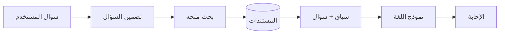

# معمارية RAG

> **"RAG — Retrieval-Augmented Generation — يعطي نماذج اللغة ذاكرة خارجية."**

## لماذا RAG؟

المشكلة: نماذج اللغة لا تعرف بياناتك الخاصة. تدربت على بيانات عامة حتى تاريخ معين.

الحل: أعطها مستنداتك. ابحث عن المستندات ذات الصلة بالسؤال. أضفها للسياق.

## خط أنابيب RAG



## القرارات الرئيسية

| القرار | الخيارات |
|---|---|
| **التقسيم Chunking** | حجم ثابت، تقسيم دلالي، تقسيم متكرر |
| **نموذج التضمين** | text-embedding-3-small, ada-002 |
| **الاسترجاع** | Top-k، عتبة تشابه، هجين |
| **التوليد** | System prompt، few-shot |

## مثال تطبيقي

```python
# ١. تضمين المستندات
docs = ["مستند ١...", "مستند ٢..."]
embeddings = [embed(doc) for doc in docs]

# ٢. تضمين السؤال
query_embedding = embed("كيف أصلح الاتصال بقاعدة البيانات؟")

# ٣. ابحث عن أقرب المستندات
results = vector_search(query_embedding, embeddings, top_k=3)

# ٤. أضف السياق واسأل النموذج
context = "\n".join(results)
answer = llm.generate(f"بناءً على:\n{context}\n\nأجب: {question}")
```

---

[← العودة للوحدة](index.md) | [🏠 الرئيسية](/)
