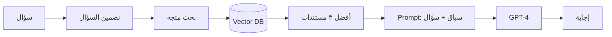

# RAG — التوليد المعزز بالاسترجاع

> **"RAG يعطي LLM ذاكرة خارجية. بدلاً من أن 'يتذكر' كل شيء — يبحث عن المعلومات ذات الصلة."**

## لماذا RAG؟

| المشكلة       | بدون RAG          | مع RAG              |
| ------------- | ----------------- | ------------------- |
| بيانات حديثة  | النموذج لا يعرفها | تُضاف للمستندات     |
| بيانات خاصة   | لا يمكن الوصول    | مستنداتك الخاصة     |
| هلوسة         | يختلق إجابات      | يستند لوثائق حقيقية |
| تحديث المعرفة | إعادة تدريب مكلف  | أضف مستنداً جديداً  |

## خط أنابيب RAG



## القرارات الرئيسية

| القرار                   | الخيارات                  | توصية                         |
| ------------------------ | ------------------------- | ----------------------------- |
| **حجم التقسيم**          | ٢٥٦-٢٠٤٨ tokens           | ٥١٢ للوثائق التقنية           |
| **نموذج التضمين**        | ada-002, text-embedding-3 | text-embedding-3-small        |
| **استراتيجية الاسترجاع** | Top-k, MMR, Hybrid        | Hybrid (متجه + كلمات مفتاحية) |
| **الـ Prompt**           | بسيط، مفصل                | أضف تعليمات واضحة + أمثلة     |

## كود RAG كامل

```python
from openai import AzureOpenAI
import numpy as np

client = AzureOpenAI(...)

# ١. تضمين المستندات
docs = load_documents("cloudnova_docs/")
embeddings = []
for doc in docs:
    emb = client.embeddings.create(model="text-embedding-3-small", input=doc)
    embeddings.append(emb.data[0].embedding)

# ٢. تضمين السؤال
query_emb = client.embeddings.create(model="text-embedding-3-small", input=question)

# ٣. بحث عن التشابه
similarities = [np.dot(query_emb, doc_emb) for doc_emb in embeddings]
top_indices = np.argsort(similarities)[-3:][::-1]

# ٤. بناء prompt
context = "\n---\n".join([docs[i] for i in top_indices])
response = client.chat.completions.create(
    model="gpt-4",
    messages=[{
        "role": "system",
        "content": f"أجب بناءً على المستندات التالية فقط:\n{context}"
    }, {
        "role": "user",
        "content": question
    }]
)
```

---

[← العودة للوحدة](index.md) | [🏠 الرئيسية](/)
