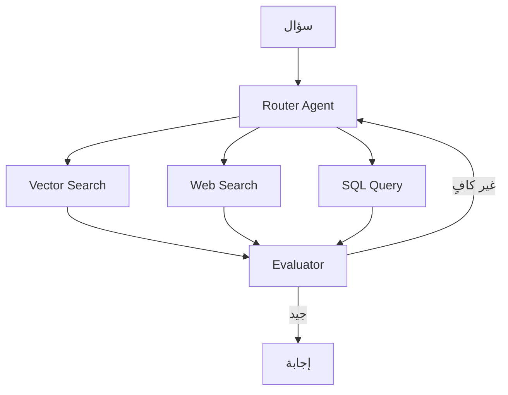

# أنماط RAG المتقدمة

> "RAG البسيط يبحث مرة واحدة ويجيب. RAG المتقدم يفكر، يخطط، ويبحث عدة مرات."

## 🎯 أهداف التعلم

- Multi-hop RAG
- Agentic RAG
- Graph RAG
- Corrective RAG (CRAG)

## ⏱️ الوقت المقدر: 40 دقيقة | المستوى: Advanced

---

## 🏗️ Multi-hop RAG

```python
def multi_hop_rag(question):
    # الخطوة 1: البحث الأولي
    docs_1 = vector_search(question)
    answer_1 = llm(question, docs_1)
    
    # الخطوة 2: استخراج كيان من الإجابة للبحث الثاني
    entity = extract_entity(answer_1)
    docs_2 = vector_search(f"{entity} details")
    
    # الخطوة 3: الإجابة النهائية
    return llm(question, docs_1 + docs_2)
```

### Agentic RAG



### Corrective RAG

```python
def corrective_rag(question):
    docs = retrieve(question)
    
    # تقييم جودة المستندات
    relevance_scores = evaluate_relevance(question, docs)
    
    if max(relevance_scores) < 0.5:
        # المستندات غير كافية → بحث على الويب
        docs = web_search(question)
    
    return generate(question, docs)
```

### Graph RAG

بدلاً من البحث في vectors فقط، Graph RAG يبني Knowledge Graph ويبحث في العلاقات:

```
السؤال: "ما التقنيات التي يحتاجها Cloud Architect؟"
Graph RAG: Cloud Architect → requires → [Kubernetes, Terraform, Azure, ...]
```

---

[← RAG Architecture](./01-rag-architecture) | [→ RAG Evaluation](./03-rag-evaluation-ragas) | [🏠 الرئيسية](/)
