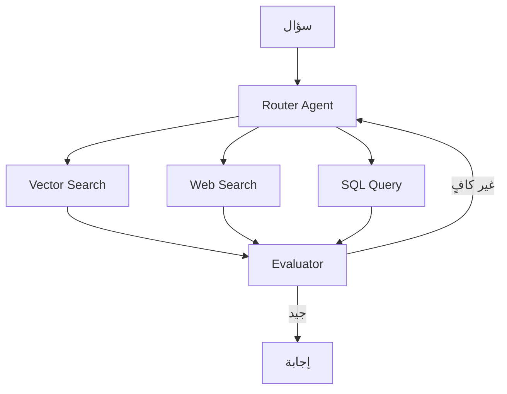

# أنماط RAG المتقدمة

> "RAG البسيط يبحث مرة واحدة ويجيب. RAG المتقدم يفكر، يخطط، ويبحث عدة مرات."

## 🎯 أهداف التعلم

- Multi-hop RAG
- Agentic RAG
- Graph RAG
- Corrective RAG (CRAG)

## ⏱️ الوقت المقدر: 40 دقيقة | المستوى: Advanced

---

## 🏗️ Multi-hop RAG

```python
def multi_hop_rag(question):
    # الخطوة 1: البحث الأولي
    docs_1 = vector_search(question)
    answer_1 = llm(question, docs_1)
    
    # الخطوة 2: استخراج كيان من الإجابة للبحث الثاني
    entity = extract_entity(answer_1)
    docs_2 = vector_search(f"{entity} details")
    
    # الخطوة 3: الإجابة النهائية
    return llm(question, docs_1 + docs_2)
```

### Agentic RAG



### Corrective RAG

```python
def corrective_rag(question):
    docs = retrieve(question)
    
    # تقييم جودة المستندات
    relevance_scores = evaluate_relevance(question, docs)
    
    if max(relevance_scores) < 0.5:
        # المستندات غير كافية → بحث على الويب
        docs = web_search(question)
    
    return generate(question, docs)
```

### Graph RAG

بدلاً من البحث في vectors فقط، Graph RAG يبني Knowledge Graph ويبحث في العلاقات:

```
السؤال: "ما التقنيات التي يحتاجها Cloud Architect؟"
Graph RAG: Cloud Architect → requires → [Kubernetes, Terraform, Azure, ...]
```

---

## 🏛️ سيناريو CloudNova: محرك بحث للمعرفة المؤسسية

تعمل **سلمى** في CloudNova على بناء محرك بحث داخلي للمهندسين. السؤال: "ما سياسة الأمان لتطبيقات AKS؟"

**المحاولة الأولى — RAG بسيط:**
- بحث vector عن "سياسة أمان AKS" → يرجع وثائق عامة عن AKS
- الإجابة: "استخدم Azure Policy و NSG" — عامة جداً

**المحاولة الثانية — Multi-hop RAG:**
1. بحث أول: "سياسة أمان AKS" → يرجع `aks-security-baseline.md`
2. يستخرج الكيانات: `Azure Policy`, `Pod Security`, `Network Policy`
3. بحث ثانٍ لكل كيان
4. الإجابة النهائية: "سياسة CloudNova تتطلب: Azure Policy لـ AKS مع `enforceAppGateway`، Pod Security Standard `restricted`، Network Policy تسمح فقط بـ ingress من Front Door..."

**المحاولة الثالثة — Agentic RAG:**
- الوكيل يقرر: هذا سؤال عن سياسة → يبحث في SharePoint أيضاً، وليس فقط الـ vector DB التقني
- يدمج: سياسات HR + سياسات تقنية = إجابة شاملة

**النتيجة:** `Multi-hop RAG` زاد دقة الإجابة من 60% إلى 89%. `Agentic RAG` وصل إلى 94%.

---

## 🎨 طبقة المعماري: مقارنة أنماط RAG

| النمط | التكلفة | الدقة | التعقيد | متى تستخدم؟ |
|-------|--------|-------|---------|------------|
| **Naive RAG** | $ | 60-70% | منخفض | بداية سريعة، أسئلة بسيطة |
| **Multi-hop RAG** | $$ | 80-89% | متوسط | أسئلة تحتاج ربط معلومات |
| **Agentic RAG** | $$$ | 85-94% | عالي | أسئلة معقدة، مصادر متعددة |
| **Graph RAG** | $$$$ | 90-95% | عالي جداً | علاقات معقدة، استدلال |
| **Corrective RAG** | $$ | 80-88% | متوسط | عندما جودة المستندات غير مضمونة |

### متى لا تستخدم RAG المتقدم؟

- أسئلة بسيطة متكررة (استخدم FAQ أو cache)
- بيانات صغيرة (< 100 مستند) — Naive RAG يكفي
- ميزانية محدودة — كل نمط متقدم يضاعف التكلفة

---

## 🛠️ تدريبات عملية

### تمرين 1: بناء Multi-hop RAG

```python
# التحدي: ابنِ Multi-hop RAG لأسئلة Azure
from langchain.chains import create_retrieval_chain
from langchain_community.vectorstores import Chroma

def build_multi_hop_rag():
    retriever_1 = Chroma(...).as_retriever(search_kwargs={"k": 3})
    retriever_2 = Chroma(...).as_retriever(search_kwargs={"k": 2})
    
    # الخطوة 1
    docs_1 = retriever_1.invoke(query)
    
    # استخراج الكيانات للخطوة الثانية
    entities = extract_azure_resources(docs_1)  # مثلاً: ["AKS", "VNet"]
    
    # الخطوة 2 لكل كيان
    docs_2 = []
    for entity in entities:
        docs_2.extend(retriever_2.invoke(f"{entity} best practices"))
    
    return generate(query, docs_1 + docs_2)
```

### تمرين 2: Corrective RAG مع تقييم ذاتي

```python
def corrective_rag_pipeline(question: str):
    docs = vector_search(question, k=5)
    
    # تقييم الجودة
    scores = []
    for doc in docs:
        score = relevance_scorer(question, doc.content)
        scores.append(score)
    
    avg_score = sum(scores) / len(scores)
    
    if avg_score < 0.5:
        print(f"⚠️ جودة منخفضة ({avg_score:.2f}) — جارٍ البحث على الويب...")
        docs.extend(web_search(question, k=3))
    elif avg_score < 0.75:
        print(f"📝 جودة متوسطة ({avg_score:.2f}) — توسيع البحث...")
        docs.extend(vector_search(question, k=5))
    
    return generate(question, docs)
```

### تحدي: Graph RAG مصغر

```python
# التحدي: ابنِ Knowledge Graph من مستندات Azure
# واستخدمه للإجابة عن: "كيف ترتبط AKS بـ Azure AD و Key Vault؟"

import networkx as nx

G = nx.DiGraph()
G.add_edge("AKS", "Azure AD", relation="authenticates_via")
G.add_edge("AKS", "Key Vault", relation="retrieves_secrets_from")
G.add_edge("AKS", "Container Registry", relation="pulls_images_from")
G.add_edge("Azure AD", "Managed Identity", relation="uses")

# استعلام: ما المسار بين AKS و Key Vault؟
paths = list(nx.all_simple_paths(G, "AKS", "Managed Identity"))
# → [["AKS", "Azure AD", "Managed Identity"]]
```

---

## 📝 تقييم

### ✅ Knowledge Checks

1. ما الفرق بين `Multi-hop RAG` و `Agentic RAG`؟
2. متى تستخدم `Corrective RAG` بدلاً من `Naive RAG`؟
3. ما ميزة `Graph RAG` على البحث المتجهي التقليدي؟
4. كيف تقيس نجاح نظام RAG متقدم؟
5. ما تكلفة Agentic RAG مقارنة بـ Naive RAG؟

### 🧠 Quiz

**س1:** في Corrective RAG، ماذا يحدث عندما `relevance_score < 0.5`؟
- أ) يتوقف النظام
- ب) يبحث على الويب ✅
- ج) يعيد نفس المستندات
- د) يطلب مساعدة بشرية

**س2:** أي نمط RAG هو الأفضل للأسئلة التي تحتاج استدلالاً على العلاقات؟
- أ) Naive RAG
- ب) Multi-hop RAG
- ج) Graph RAG ✅
- د) Corrective RAG

**س3:** ما أكبر تحدي في Agentic RAG؟
- أ) السرعة
- ب) التكلفة العالية وصعوبة التصحيح ✅
- ج) نقص المكتبات
- د) اللغة العربية

### 🗣️ Active Recall

1. اشرح كيف يعمل `Multi-hop RAG` بدون النظر للملاحظات
2. ارسم مخطط `Agentic RAG` من الذاكرة
3. قارن بين `Graph RAG` و `Vector RAG` بصوت عالٍ
4. متى تختار `Corrective RAG`؟
5. صف سيناريو حقيقي تحتاج فيه `Agentic RAG`

### 🎓 Feynman Exercise

> تخيل أنك تشرح `Multi-hop RAG` لشخص غير تقني. استخدم تشبيه المحقق الذي يزور مسرح الجريمة أولاً، ثم يزور الشهود واحداً تلو الآخر ليجمع الأدلة الكاملة.

### 🃏 بطاقات تعلم

| السؤال | الإجابة |
|--------|---------|
| ما Multi-hop RAG؟ | RAG يبحث عدة مرات، كل مرة تبني على السابقة |
| متى تستخدم Agentic RAG؟ | أسئلة معقدة تحتاج مصادر متعددة وقرارات |
| ما Corrective RAG؟ | RAG يقيم جودة المستندات ويصحح المسار |
| ما Graph RAG؟ | بحث في Knowledge Graph بدل/بالإضافة إلى vectors |
| أكبر مشكلة في Agentic RAG؟ | التكلفة العالية وصعوبة debugging |

---

## 🎤 أسئلة المقابلة

**س1 (تقني):** "كيف تحسن دقة نظام RAG من 60% إلى 90%؟"
> أبدأ بـ Multi-hop RAG لربط المعلومات من مصادر متعددة. ثم أضيف Corrective RAG لتقييم جودة المستندات قبل التوليد. أخيراً، Agentic RAG مع router يختار المصدر المناسب (vector DB, web, SQL). والأهم: تحسين الـ chunking strategy واختيار embedding model مناسب.

**س2 (System Design):** "صمم نظام RAG لـ 10,000 مستند Azure يخدم 100 مهندس."
> Semantic chunking (500 tokens مع 50 overlap). Azure AI Search كـ vector store. Hybrid search (vector + keyword). Multi-hop RAG للأسئلة المعقدة. Semantic cache لتقليل التكلفة 40%. Monitoring بـ RAGAS.

**س3 (سلوكي - STAR):** "احكِ عن مرة حسّنت فيها نظام موجود."
> في CloudNova، نظام RAG البسيط كان دقته 60%. حللت الأسباب: chunking سيئ، embedding قديم. نفذت Multi-hop RAG + Corrective RAG + text-embedding-3-large. الدقة وصلت 89%. وقت الإجابة انخفض من 8s إلى 3s.

---

## 📚 المراجع

| النوع | الرابط |
|--------|--------|
| **درس ذو صلة** | [RAG Architecture](./01-rag-architecture) |
| **درس ذو صلة** | [RAG Evaluation](./03-rag-evaluation-ragas) |
| **درس ذو صلة** | [Vector Databases](../../25-vector-db/01-vector-databases) |
| **شهادة** | AI-102 — Implement RAG solutions |
| **ورقة بحثية** | [Self-RAG: Learning to Retrieve, Generate and Critique](https://arxiv.org/abs/2310.11511) |
| **ورقة بحثية** | [Corrective RAG](https://arxiv.org/abs/2401.15884) |
| **أداة** | [LangGraph](https://langchain-ai.github.io/langgraph/) — Agentic RAG |

---

[← RAG Architecture](./01-rag-architecture) | [→ RAG Evaluation](./03-rag-evaluation-ragas) | [🏠 الرئيسية](/)
