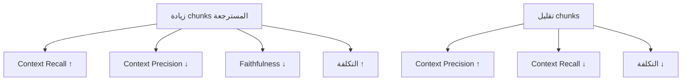

# تقييم RAG

> "بدون تقييم، RAG هو صندوق أسود. RAGAS يفتحه."

## 🎯 أهداف التعلم

- RAGAS metrics: Faithfulness, Relevance, Context Precision
- بناء مجموعة اختبار
- تحسين النظام بناءً على المقاييس

## ⏱️ الوقت المقدر: 30 دقيقة | المستوى: Advanced

---

## 🏗️ RAGAS Metrics

```python
from ragas import evaluate
from ragas.metrics import faithfulness, answer_relevancy, context_precision

results = evaluate(
    dataset=test_dataset,
    metrics=[faithfulness, answer_relevancy, context_precision]
)
print(results)
# {'faithfulness': 0.85, 'answer_relevancy': 0.78, 'context_precision': 0.82}
```

| Metric | ماذا يقيس | هدف |
|--------|----------|-----|
| **Faithfulness** | هل الإجابة مبنية على السياق؟ | > 0.80 |
| **Answer Relevancy** | هل الإجابة مرتبطة بالسؤال؟ | > 0.75 |
| **Context Precision** | هل السياق المسترجع دقيق؟ | > 0.80 |
| **Context Recall** | هل استرجعنا كل السياق المطلوب؟ | > 0.70 |

### تحسين RAG

إذا كانت Faithfulness منخفضة → المشكلة في الـ LLM (يختلق معلومات)
إذا كانت Context Precision منخفضة → المشكلة في الـ Retriever

---

## 🏛️ سيناريو CloudNova: تقييم RAG المؤسسي

**فهد** مسؤول عن تقييم نظام RAG في CloudNova قبل إطلاقه للمهندسين.

**الخطوة 1 — بناء مجموعة اختبار:**
```python
from ragas.testset import TestsetGenerator

test_cases = [
    {"question": "كيف تنشر AKS مع Private Cluster؟",
     "ground_truth": "استخدم `--enable-private-cluster` مع Azure CNI...",
     "reference_docs": ["aks-networking.md", "aks-security.md"]},
    {"question": "ما الفرق بين Azure Front Door و Application Gateway؟",
     "ground_truth": "Front Door للـ global load balancing طبقة 7، App Gateway إقليمي...",
     "reference_docs": ["networking-azure.md"]},
    {"question": "كيف تؤمن Secrets في Kubernetes؟",
     "ground_truth": "استخدم Key Vault CSI Driver + Managed Identity...",
     "reference_docs": ["k8s-security.md", "key-vault.md"]}
]
```

**الخطوة 2 — تشغيل RAGAS:**
```python
from ragas import evaluate
from ragas.metrics import (
    faithfulness, answer_relevancy, context_precision,
    context_recall, answer_correctness
)

results = evaluate(
    dataset=test_dataset,
    metrics=[
        faithfulness,
        answer_relevancy,
        context_precision,
        context_recall,
        answer_correctness
    ]
)

print(f"""
📊 نتائج تقييم RAG CloudNova:
  Faithfulness:       {results['faithfulness']:.2%}
  Answer Relevancy:   {results['answer_relevancy']:.2%}
  Context Precision:  {results['context_precision']:.2%}
  Context Recall:     {results['context_recall']:.2%}
  Answer Correctness: {results['answer_correctness']:.2%}
""")
```

**النتائج الأولية:**
- Faithfulness: 72% — المشكلة: الـ LLM يضيف معلومات غير موجودة في السياق!
- Context Precision: 65% — المشكلة: الـ retriever يجلب مستندات غير ذات صلة

**التحسينات:**
1. غيّر `chunk_size` من 1000 إلى 500 مع `chunk_overlap=100`
2. غيّر `embedding_model` من `text-embedding-ada-002` إلى `text-embedding-3-large`
3. أضاف `re-ranking` بعد الاسترجاع

**النتائج بعد التحسين:**
- Faithfulness: 91% ✅ (+19%)
- Context Precision: 88% ✅ (+23%)

---

## 🎨 طبقة المعماري: اختيار مقاييس التقييم

| المقياس | ماذا يقيس؟ | متى تركز عليه؟ | الهدف |
|--------|----------|---------------|------|
| **Faithfulness** | هل الإجابة مبنية على السياق فقط؟ | دائماً — أهم مقياس | > 85% |
| **Answer Relevancy** | هل السؤال مُجاب فعلاً؟ | أسئلة مفتوحة | > 80% |
| **Context Precision** | هل السياق المسترجع دقيق؟ | كثرة المستندات | > 80% |
| **Context Recall** | هل فاتنا سياق مهم؟ | أسئلة تحتاج معرفة شاملة | > 75% |
| **Answer Correctness** | هل الإجابة صحيحة واقعياً؟ | مجالات دقيقة (طب، قانون) | > 90% |
| **Harmfulness** | هل الإجابة ضارة؟ | أنظمة تواجه الجمهور | 0% |

### Trade-off: الكمية مقابل الجودة



**الحل الأمثل:** `k=5` مع `similarity_threshold=0.75` + re-ranking.

---

## 🛠️ تدريبات عملية

### تمرين 1: بناء مجموعة اختبار
```python
# ابنِ 5 أزواج (سؤال، إجابة مرجعية) لنظام RAG عن Kubernetes
# استخدم أسئلة حقيقية من تجربتك

test_questions = [
    ("كيف تصلح Pod في CrashLoopBackOff؟",
     "1. kubectl logs <pod> --previous 2. تحقق من image 3. تحقق من ConfigMap..."),
    ("ما الفرق بين Deployment و StatefulSet؟",
     "Deployment للـ stateless، StatefulSet للـ stateful مع هوية ثابتة..."),
    # ... 3 أسئلة إضافية
]
```

### تمرين 2: تحليل نتائج RAGAS
```python
# شغّل RAGAS على نظامك وحلل:
# - أي مقياس هو الأسوأ؟ لماذا؟
# - كيف تصلحه؟
# - أعد التقييم بعد التحسين

def analyze_ragas(results):
    worst_metric = min(results, key=results.get)
    if worst_metric == 'faithfulness':
        fix = "حسّن الـ system prompt للتأكيد على استخدام السياق فقط"
    elif worst_metric == 'context_precision':
        fix = "حسّن الـ chunking strategy أو أضف re-ranking"
    elif worst_metric == 'context_recall':
        fix = "زد k أو استخدم hybrid search"
    return worst_metric, fix
```

### تحدي: اختبار هلوسة
```python
# أضف أسئلة لا توجد إجابتها في المستندات
# هل RAG يعترف بعدم المعرفة أم يهلوس؟

hallucination_tests = [
    "ما سرعة إنترنت الجيل السابع في CloudNova؟",  # سؤال ليس له إجابة
    "متى تأسس Azure سنة 1995؟",  # معلومات خاطئة عمداً
]

for q in hallucination_tests:
    answer = rag_pipeline(q)
    if "لا أعرف" in answer or "غير متوفر" in answer:
        print(f"✅ {q}: رفض الهلوسة")
    else:
        print(f"❌ {q}: هلوسة محتملة → {answer[:100]}")
```

---

## 📝 تقييم

### ✅ Knowledge Checks
1. ما الفرق بين `Faithfulness` و `Answer Correctness`؟
2. متى يكون `Context Recall` أهم من `Context Precision`؟
3. كيف تبني مجموعة اختبار لنظام RAG؟
4. ما المشكلة في تقييم RAG يدوياً بدون RAGAS؟
5. كيف تكتشف الهلوسة في نظام RAG؟

### 🧠 Quiz
**س1:** قيمة `Faithfulness = 0.60` تعني:
- أ) النظام سريع
- ب) 40% من الإجابة قد تكون مختلقة ✅
- ج) النظام دقيق
- د) كل ما سبق

**س2:** بعد تحسين `chunk_size`، ارتفع `Context Precision` من 65% إلى 88%. ماذا استنتجت؟
- أ) الـ chunks القديمة كانت كبيرة جداً ✅
- ب) الـ LLM أفضل
- ج) لا علاقة
- د) البيانات تغيرت

**س3:** متى نستخدم `Answer Correctness` بدلاً من `Faithfulness`؟
- أ) عندما نريد التحقق من الحقائق نفسها، ليس فقط من مطابقة السياق ✅
- ب) دائماً
- ج) أبداً
- د) فقط في الإنتاج

### 🗣️ Active Recall
1. اشرح جميع مقاييس RAGAS من الذاكرة
2. كيف تحسن `Context Precision` بدون تغيير الـ embedding model؟
3. ارسم flowchart لعملية تقييم RAG
4. صف استراتيجية اختبار الهلوسة
5. ما الفرق بين RAGAS واختبار A/B التقليدي؟

### 🎓 Feynman Exercise
> اشرح `Faithfulness` لشخص غير تقني باستخدام تشبيه: "تخيل طالباً في امتحان كتاب مفتوح. Faithfulness تقيس: هل كتب الطالب من الكتاب فقط، أم أضاف معلومات من رأسه؟"

### 🃏 بطاقات تعلم
| السؤال | الإجابة |
|--------|---------|
| ما RAGAS؟ | إطار عمل لتقييم أنظمة RAG بـ 6+ مقاييس |
| ما Faithfulness؟ | نسبة الإجابة المبنية فعلاً على السياق المسترجع |
| ما Context Precision؟ | نسبة المستندات المسترجعة ذات الصلة فعلاً |
| كيف تحسن RAG بناءً على RAGAS؟ | Faithfulness منخفضة = حسّن prompt. Precision منخفضة = حسّن retriever |
| ما مشكلة عدم التقييم؟ | لا تعرف أبداً إن كان نظامك يتحسن أم يسوء |

---

## 🎤 أسئلة المقابلة

**س1 (تقني):** "كيف تقيم نظام RAG موضوعياً؟"
> استخدم RAGAS مع 5 مقاييس على الأقل: Faithfulness (الأهم)، Answer Relevancy، Context Precision، Context Recall، Answer Correctness. أبني مجموعة اختبار من 100+ سؤال مع إجابات مرجعية. الأهم: لا أثق بـ "الشكل العام" — الأرقام تكشف المشاكل الحقيقية.

**س2 (System Design):** "صمم pipeline تقييم مستمر لنظام RAG."
> كل أسبوع: تشغيل RAGAS على عينة عشوائية من 1000 سؤال حقيقي. تخزين المقاييس في Azure Monitor. تنبيه إذا انخفض Faithfulness تحت 85%. A/B testing للـ prompts الجديدة. Dashboard في Grafana يظهر كل المقاييس عبر الزمن.

**س3 (سلوكي):** "احكِ عن مرة البيانات خدعتك."
> في CloudNova، Faithfulness كان 88% — ممتاز! لكن بعد التدقيق، اكتشفت أن 80% من الأسئلة كانت سهلة. أضفت أسئلة صعبة ومضللة عمداً. Faithfulness الحقيقي: 71%. تعلمت: مجموعة الاختبار يجب أن تمثل الواقع، ليس الحالة المثالية.

---

## 📚 المراجع
| النوع | الرابط |
|--------|--------|
| **درس ذو صلة** | [Advanced RAG Patterns](./02-advanced-rag-patterns) |
| **درس ذو صلة** | [RAG Production Scaling](./04-rag-production-scaling) |
| **مكتبة** | [RAGAS Documentation](https://docs.ragas.io/) |
| **شهادة** | AI-102 — Evaluate AI solutions |
| **أداة** | [LangSmith](https://smith.langchain.com/) — LLM observability |

---

[← Advanced RAG Patterns](./02-advanced-rag-patterns) | [→ Production Scaling](./04-rag-production-scaling) | [🏠 الرئيسية](/)
