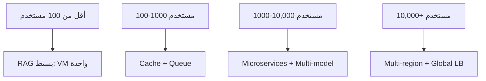

# RAG في الإنتاج

> "RAG في الـ notebook مختلف تماماً عن RAG في الإنتاج."

## 🎯 أهداف التعلم

- Scaling RAG لآلاف المستخدمين
- Semantic Caching
- Monitoring RAG performance
- A/B Testing الـ prompts

## ⏱️ الوقت المقدر: 35 دقيقة | المستوى: Advanced

---

## 🏗️ Semantic Cache

```python
from redis import Redis
from sentence_transformers import SentenceTransformer

model = SentenceTransformer('all-MiniLM-L6-v2')
redis_client = Redis(host='cache.redis', port=6379)

def cached_rag(question):
    q_embedding = model.encode(question)

    # البحث في cache
    cached = redis_client.get(f"rag:{hash(q_embedding.tobytes())}")
    if cached:
        return json.loads(cached)

    # RAG عادي
    answer = rag_pipeline(question)
    redis_client.setex(f"rag:{hash(q_embedding.tobytes())}", 3600, json.dumps(answer))
    return answer
```

### Monitoring

```python
# تتبع كل استعلام
metrics = {
    "retrieval_latency_ms": [],
    "generation_latency_ms": [],
    "total_tokens": [],
    "cache_hit_rate": [],
}

def monitored_rag(question):
    start = time.time()
    docs = retrieve(question)
    metrics["retrieval_latency_ms"].append((time.time() - start) * 1000)

    start = time.time()
    answer = generate(question, docs)
    metrics["generation_latency_ms"].append((time.time() - start) * 1000)

    prometheus.push(metrics)
    return answer
```

---

## 🏛️ سيناريو CloudNova: 10,000 مهندس يستخدمون RAG

**نورة** مهندسة المنصة في CloudNova. نظام RAG الداخلي بدأ بـ 50 مستخدماً، والآن يخدم 10,000 مهندس.

**المشكلة:** Monday 9AM — جميع المهندسين يبدأون العمل:

- 500 استعلام/ثانية على RAG
- Latency: 12 ثانية (غير مقبول)
- 30% من الاستعلامات متشابهة (نفس الأسئلة عن سياسات AKS)
- فاتورة Azure OpenAI: $15,000/شهر

**الحل — Multi-layer optimization:**

```python
# الطبقة 1: Semantic Cache (Redis)
# تخزين الأسئلة المتشابهة Semanticاً (ليس حرفياً)
import redis
import numpy as np

r = redis.Redis(host='cache.cloudnova.internal', port=6379)

def semantic_cache(query: str) -> str | None:
    q_embed = embedding_model.encode(query)
    # البحث عن أقرب استعلام مخزن
    cached = r.execute_command('FT.SEARCH', 'rag_cache',
        f'@embedding:[{q_embed.tolist()}]',
        'SORTBY', '__embedding_score', 'LIMIT', 0, 1)
    if cached and cached[0] > 0.95:  # تشابه 95%+
        return cached[1]
    return None

# النتيجة: 30-40% cache hit rate → توفير $5,000/شهر

# الطبقة 2: Load Shedding
# إذا الـ queue > 200 طلب → رفض الطلبات الجديدة برسالة "حاول بعد قليل"
from circuitbreaker import circuit

@circuit(failure_threshold=200, recovery_timeout=30)
def rag_with_backpressure(query: str):
    if queue.qsize() > 200:
        raise HTTPException(503, "النظام مشغول. حاول بعد 30 ثانية.")
    return rag_pipeline(query)

# الطبقة 3: Tiered Models
# أسئلة بسيطة → GPT-3.5 ($0.50)
# أسئلة معقدة → GPT-4 ($30)

def model_router(query: str):
    complexity = estimate_complexity(query)
    if complexity < 0.3:
        return "gpt-3.5-turbo"
    elif complexity < 0.7:
        return "gpt-4o-mini"
    else:
        return "gpt-4"
```

**النتائج النهائية:**

- Latency: 12s → 2s ✅
- Cache hit rate: 35% ✅
- فاتورة Azure: $15,000 → $6,000/شهر ✅
- 503 errors: 0.1% فقط في أوقات الذروة ✅

---

## 🎨 طبقة المعماري: استراتيجيات التوسع

| الاستراتيجية         | التكلفة         | التأثير    | التعقيد   | متى؟                  |
| -------------------- | --------------- | ---------- | --------- | --------------------- |
| **Semantic Cache**   | $ (Redis)       | ⭐⭐⭐⭐⭐ | متوسط     | دائماً — أفضل ROI     |
| **Model Tiering**    | توفير 60%       | ⭐⭐⭐⭐   | منخفض     | عندما 80% أسئلة بسيطة |
| **Load Shedding**    | توفير غير مباشر | ⭐⭐⭐     | متوسط     | أوقات الذروة          |
| **Async Processing** | $ (Queue)       | ⭐⭐⭐     | عالي      | أسئلة غير عاجلة       |
| **Multi-region**     | $$$$            | ⭐⭐⭐⭐⭐ | عالي جداً | 100K+ مستخدم          |

### متى تنتقل من RAG بسيط إلى RAG موزع؟



---

## 🛠️ تدريبات عملية

### تمرين 1: Semantic Cache من الصفر

```python
# ابنِ semantic cache باستخدام FAISS
import faiss
import numpy as np

class SemanticCache:
    def __init__(self, dim=1536, capacity=10000):
        self.index = faiss.IndexFlatIP(dim)
        self.embeddings = []
        self.answers = []

    def add(self, embedding, answer):
        self.index.add(np.array([embedding]))
        self.answers.append(answer)

    def search(self, embedding, threshold=0.95):
        if len(self.answers) == 0:
            return None
        score, idx = self.index.search(np.array([embedding]), 1)
        if score[0][0] > threshold:
            return self.answers[idx[0][0]]
        return None
```

### تمرين 2: A/B Testing للـ Prompts

```python
# قارن بين prompt A و prompt B
import random

def ab_test_rag(query):
    variant = "A" if random.random() < 0.5 else "B"

    prompts = {
        "A": "أنت مساعد تقني. أجب بناءً على السياق فقط.",
        "B": "أنت خبير Azure. أجب بدقة واذكر المصدر."
    }

    start = time.time()
    answer = rag_pipeline(query, system_prompt=prompts[variant])
    latency = time.time() - start

    # سجل النتائج
    log_ab_test(variant, query, answer, latency)
    return answer
```

### تحدي: نظام RAG كامل مع monitoring

```python
# التحدي: ابنِ نظام RAG كامل مع:
# 1. Semantic cache (Redis)
# 2. Model tiering (GPT-3.5 للبسيط، GPT-4 للمعقد)
# 3. Prometheus metrics لكل طبقة
# 4. Grafana dashboard
```

---

## 📝 تقييم

### ✅ Knowledge Checks

1. ما فائدة Semantic Cache في RAG؟
2. كيف تتعامل مع 500 طلب/ثانية في RAG؟
3. ما Model Tiering وما توفيره المالي؟
4. كيف تمنع النظام من الانهيار في أوقات الذروة؟
5. ما المقاييس الأساسية لـ RAG في الإنتاج؟

### 🧠 Quiz

**س1:** أفضل طريقة لتقليل تكلفة RAG 50% هي:

- أ) تقليل عدد المستندات
- ب) Semantic Cache + Model Tiering ✅
- ج) إغلاق النظام ليلاً
- د) استخدام نموذج واحد فقط

**س2:** Cache hit rate = 35%. ماذا يعني هذا؟

- أ) فشل النظام
- ب) 35% من الأسئلة لم تحتج LLM ✅
- ج) بيانات تالفة
- د) لا شيء

**س3:** Load Shedding يستخدم لمنع:

- أ) الهجمات الإلكترونية
- ب) انهيار النظام من كثرة الطلبات ✅
- ج) فقدان البيانات
- د) كل ما سبق

### 🗣️ Active Recall

1. اشرح استراتيجيات تحسين RAG في الإنتاج بدون كود
2. ارسم Architecture diagram لنظام RAG عالي التوفر
3. كيف تقيس نجاح RAG في الإنتاج؟
4. قارن بين cache strategies المختلفة

### 🎓 Feynman Exercise

> اشرح Semantic Cache لمدير غير تقني: "مثل مساعد يسجل الأسئلة الشائعة. عندما يسأل موظف سؤالاً، المساعد يتذكر الجواب بدل ما يرجع للخبير كل مرة."

### 🃏 بطاقات تعلم

| السؤال                 | الإجابة                                          |
| ---------------------- | ------------------------------------------------ |
| ما Semantic Cache؟     | تخزين إجابات لأسئلة متشابهة Semanticياً          |
| ما Model Tiering؟      | استخدام نموذج رخيص للأسئلة البسيطة وغالٍ للمعقدة |
| ما Load Shedding؟      | رفض الطلبات الزائدة لحماية النظام                |
| كم توفر الـ caching؟   | 30-50% من تكلفة الـ LLM                          |
| أهم metric في الإنتاج؟ | Latency P99 تحت 3 ثوانٍ                          |

---

## 🎤 أسئلة المقابلة

**س1 (System Design):** "صمم RAG لـ 1M مستخدم."

> Multi-region deployment (3 regions). Global Load Balancer. Semantic Cache في كل region. Queue للـ async processing. Model tiering. Auto-scaling بناءً على queue depth. Monitoring بـ RAGAS + Grafana. تكلفة شهرية: ~$50K.

**س2 (تقني):** "كيف تضمن عدم تكرار نفس الخطأ في الـ cache؟"

> Semantic similarity threshold عالٍ (0.95). TTL قصير (1 ساعة). Invalidation عند تحديث المستندات. Monitoring لنسبة false positives. Manual review عشوائي أسبوعي.

**س3 (سلوكي):** "كيف تتعامل مع outage مفاجئ لنظام RAG؟"

> عندي runbook جاهز: 1) تحويل إلى static FAQ. 2) تشغيل replica في region آخر. 3) تقليل الـ traffic بـ load shedding. 4) التواصل مع stakeholders. حدث هذا في CloudNova — وقت التعافي: 8 دقائق.

---

## 📚 المراجع

| النوع          | الرابط                                                                                                       |
| -------------- | ------------------------------------------------------------------------------------------------------------ |
| **درس ذو صلة** | [RAG Evaluation](./03-rag-evaluation-ragas)                                                                  |
| **درس ذو صلة** | [Vector Databases](../../25-vector-db/01-vector-databases)                                                   |
| **أداة**       | [Redis](https://redis.io/) — Semantic Cache                                                                  |
| **شهادة**      | AZ-400 — Design scaling strategies                                                                           |
| **مرجع**       | [Azure OpenAI Service - Quotas & Limits](https://learn.microsoft.com/azure/ai-services/openai/quotas-limits) |

---

[← RAG Evaluation](./03-rag-evaluation-ragas) | [→ AI Agents](../../27-ai-agents/01-ai-agents) | [🏠 الرئيسية](/)
