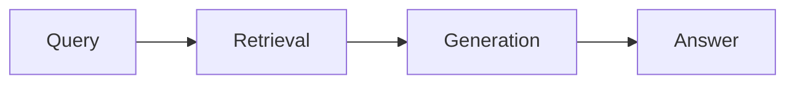

# 🚀 RAG

> Retrieval-Augmented Generation — RAG Architecture، RAGAS، Production Scaling.

## 🎯 أهداف التعلم

بعد إكمال هذه الوحدة، ستكون قادراً على:

- [**معمارية RAG**](01-rag-architecture) — Retrieval + Generation
- [**RAG متقدم**](02-advanced-rag-patterns) — Re-ranking، Hybrid
- [**تقييم RAG**](03-rag-evaluation-ragas) — RAGAS Framework
- [**RAG في الإنتاج**](04-rag-production-scaling) — توسيع النطاق

## 💡 المهارات التي ستكتسبها

RAG • RAGAS • Chunking • Embeddings • Production RAG

## 📊 معلومات الوحدة

| العنصر | القيمة |
| ------ | ------ |
| **المستوى** | متقدم |
| **الوقت المقدر** | 6 ساعات |
| **المتطلبات** | Vector DB |
| **الشهادات** | AI-102 |

## 🏛️ مهمة CloudNova

> RAG assistant لـ CloudNova يجيب على أسئلة المهندسين من 50 ألف وثيقة.

## 🗺️ خريطة الوحدة

## 📖 الدروس

- [**معمارية RAG**](01-rag-architecture) — Retrieval + Generation
- [**RAG متقدم**](02-advanced-rag-patterns) — Re-ranking، Hybrid
- [**تقييم RAG**](03-rag-evaluation-ragas) — RAGAS Framework
- [**RAG في الإنتاج**](04-rag-production-scaling) — توسيع النطاق

## 🚀 ابدأ التعلم

[▶️ ابدأ الدرس الأول](01-rag-architecture)
