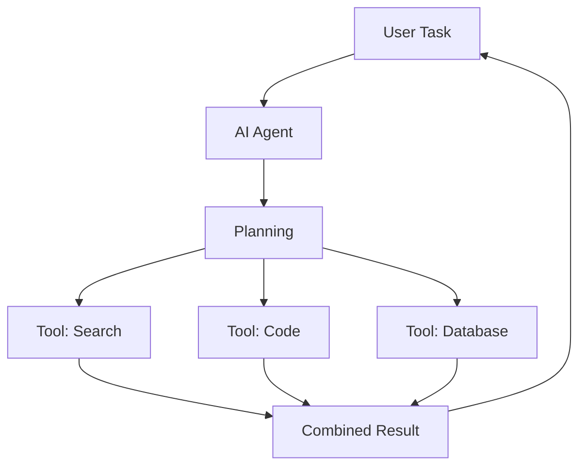

# AI Agents Architecture

Agent architectures, tool use, multi-agent systems, and orchestration frameworks.

## What You Will Learn

This module covers key concepts, patterns, and real-world scenarios to build production-ready skills.

## Agent Architecture

## Frameworks

| Framework       | Language    | Best For           |
| --------------- | ----------- | ------------------ |
| LangChain       | Python/JS   | Flexible pipelines |
| AutoGen         | Python      | Multi-agent        |
| CrewAI          | Python      | Role-based agents  |
| Semantic Kernel | .NET/Python | Enterprise         |

## CloudNova Exercise

Apply what you learned to a real production scenario at CloudNova.

---

[← Back to Module](index.md) | [🏠 Home](/)
