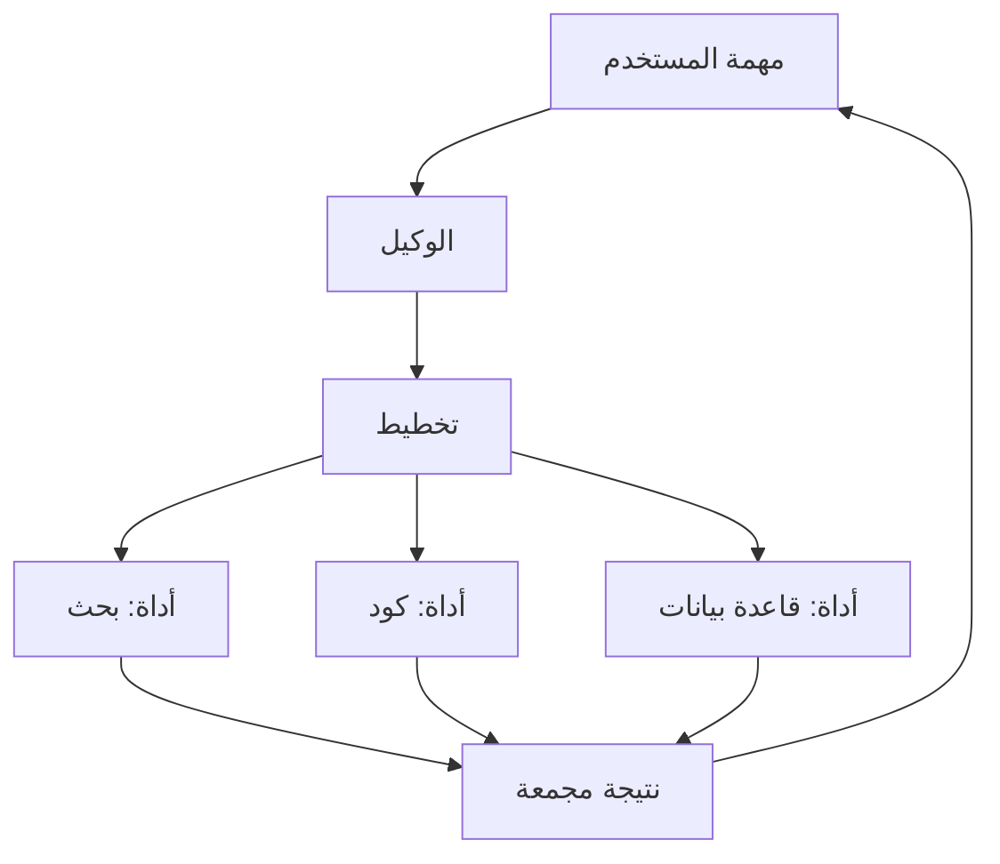

# وكلاء الذكاء الاصطناعي

> **"الوكيل الذكي لا يجيب فقط. إنه يفكر، يخطط، ويستخدم الأدوات."**

## ما هو الوكيل الذكي؟

نموذج لغة + قدرة على استخدام الأدوات + ذاكرة + تخطيط.

## مقارنة أطر العمل

| الإطار | اللغة | الأنسب لـ |
|---|---|---|
| **LangChain** | Python/JS | خطوط أنابيب مرنة |
| **AutoGen** | Python | وكلاء متعددون |
| **CrewAI** | Python | وكلاء بأدوار |
| **Semantic Kernel** | .NET/Python | تطبيقات مؤسسية |

## سيناريو CloudNova: وكيل تشخيص الأعطال

> **الموقف:** نظام يراقب السجلات، وعندما يكتشف خطأ، يقوم الوكيل تلقائياً بـ:

1. قراءة رسالة الخطأ
2. البحث في قاعدة المعرفة عن حلول مشابهة
3. اقتراح تشخيص
4. فتح تذكرة بالمعلومات الكاملة

---

[← العودة للوحدة](index.md) | [🏠 الرئيسية](/)
