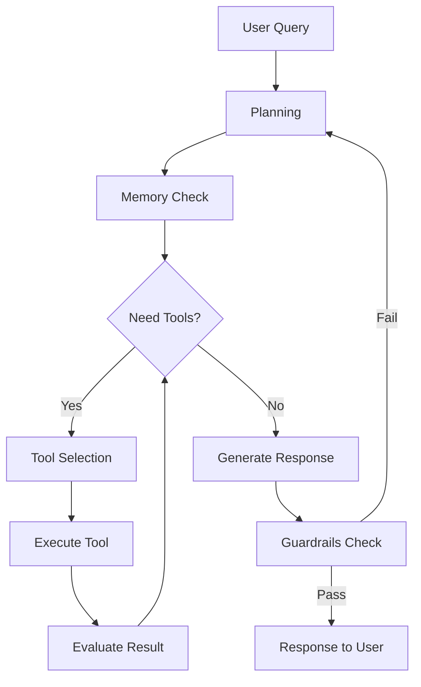

# وكلاء الذكاء الاصطناعي (AI Agents)

> "الـ Agent ليس مجرد chatbot. إنه كيان يفكر، يخطط، ينفذ، ويتعلم من أخطائه."

## 🎯 أهداف التعلم

- فهم معمارية AI Agents (Planning, Memory, Tools, Action)
- بناء Agents آمنة مع Guardrails و Human-in-the-loop
- إتقان Function Calling و Tool Use
- تطبيق Observability على Agents
- إدارة التكاليف في Agents الإنتاجية

---

## 📖 الطبقة الأساسية: معمارية الـ Agent



---

## 🧱 الطبقة المهنية: Guardrails

```python
from guardrails import Guard
from guardrails.hub import (
    CompetitorCheck, ToxicLanguage, SecretsPresent,
    RegexMatch, ValidLength
)

# تعريف guardrails
agent_guard = Guard().use_many(
    ToxicLanguage(on_fail="exception"),        # لا سب ولا شتائم
    SecretsPresent(on_fail="exception"),        # لا مفاتيح API
    CompetitorCheck(competitors=["AWS", "GCP"], # لا تذكر منافسين
                    on_fail="fix"),
    ValidLength(min=5, max=2000,               # طول الإجابة
               on_fail="fix"),
)

@agent_guard
def agent_respond(query: str) -> str:
    """الـ Agent يمر عبر guardrails قبل الإرسال"""
    return agent.run(query)
```

### Human-in-the-Loop

```python
class SafeAgent:
    DANGEROUS_ACTIONS = [
        "delete_resource", "restart_production",
        "modify_firewall", "drop_database"
    ]
    
    def execute(self, action: str, params: dict):
        if action in self.DANGEROUS_ACTIONS:
            # طلب موافقة بشرية
            approval = self.request_approval(action, params)
            if not approval:
                return {"status": "rejected", "reason": "human declined"}
        
        return self._execute_action(action, params)
    
    def request_approval(self, action, params):
        # إرسال لـ Slack/Teams للموافقة
        return slack_approval(
            text=f"Agent wants to `{action}` with {params}",
            channel="#platform-ops"
        )
```

---

## 🏗️ الطبقة الإنتاجية: Observability للـ Agents

```python
from opentelemetry import trace

tracer = trace.get_tracer(__name__)

class ObservableAgent:
    def run(self, query: str):
        with tracer.start_as_current_span("agent.run") as span:
            span.set_attribute("agent.query", query)
            
            # تتبع كل خطوة
            with tracer.start_as_current_span("agent.plan"):
                plan = self.planner.plan(query)
                span.set_attribute("agent.steps", len(plan))
            
            for step in plan:
                with tracer.start_as_current_span(
                    f"agent.step.{step.tool}"
                ) as step_span:
                    step_span.set_attribute("tool.name", step.tool)
                    result = self.execute_step(step)
                    step_span.set_attribute(
                        "tool.success", result.success
                    )
                    step_span.set_attribute(
                        "tool.duration_ms", result.duration_ms
                    )
            
            return self.synthesize()

# Metrics للتتبع
agent_metrics = {
    "runs_total": Counter,
    "steps_per_run": Histogram,
    "tool_success_rate": Gauge,
    "tokens_used": Counter,
    "cost_per_run": Histogram,
    "guardrail_rejections": Counter,
}
```

---

## 🎨 الطبقة المعمارية: Multi-Agent مع AutoGen

```python
import autogen

# فريق Agents لـ CloudNova
planner = autogen.AssistantAgent(
    name="Planner",
    system_message="خطط المهمة، وزع على المتخصصين، اجمع النتائج"
)

azure_expert = autogen.AssistantAgent(
    name="AzureExpert",
    system_message="خبير Azure: صمم حلول Azure، اكتب CLI، اقترح best practices"
)

security_reviewer = autogen.AssistantAgent(
    name="SecurityReviewer",
    system_message="مراجع أمني: راجع الحلول أمنياً، تحقق من الامتثال"
)

user_proxy = autogen.UserProxyAgent(
    name="User",
    human_input_mode="NEVER",
    code_execution_config={"work_dir": "workspace"}
)

# إنشاء المجموعة
groupchat = autogen.GroupChat(
    agents=[planner, azure_expert, security_reviewer, user_proxy],
    messages=[],
    max_round=15
)
manager = autogen.GroupChatManager(groupchat=groupchat)

# تشغيل
user_proxy.initiate_chat(
    manager,
    message="صمم بنية تحتية آمنة لتطبيق ويب مع PostgreSQL"
)

# النتيجة: Planner يوزع → AzureExpert يصمم → SecurityReviewer يراجع
```

### سيناريو: AI Team يحل مشكلة

```
المستخدم: "التكاليف ارتفعت 200%، أحتاج تحليلاً فورياً"

Planner:
├── AzureExpert: فحص الموارد والتكاليف
├── SecurityReviewer: هل هناك اختراق؟
└── أنا: تجميع التقرير النهائي

AzureExpert: 3 VMs GPU غير مستخدمة منذ أسبوعين
SecurityReviewer: لا اختراق، لكن VMs مكشوفة للإنترنت
Planner: التوصية:
  1. إيقاف VMs GPU فوراً (توفير $13,500/شهر)
  2. إضافة NSG rules
  3. تفعيل budget alerts
```

---

## ⚡ الإنتاج وما بعده: إدارة التكاليف

```python
class CostManagedAgent:
    DAILY_BUDGET = 50  # سقف يومي
    
    def __init__(self):
        self.spent_today = 0
        self.model_router = {
            "simple": "gpt-3.5-turbo",   # $0.002/1K tokens
            "complex": "gpt-4",          # $0.03/1K tokens
        }
    
    def route_query(self, query: str) -> str:
        """اختيار النموذج حسب تعقيد السؤال"""
        complexity = self.assess_complexity(query)
        
        if self.spent_today > self.DAILY_BUDGET * 0.8:
            return "gpt-3.5-turbo"  # تجاوزنا 80% من الميزانية
        
        return self.model_router[complexity]
    
    def assess_complexity(self, query: str) -> str:
        # كلمات تدل على تعقيد
        complex_keywords = ["design", "architecture", "migrate", "debug"]
        if any(kw in query.lower() for kw in complex_keywords):
            return "complex"
        return "simple"
```

---

## 🚨 سيناريو CloudNova: DevOps Agent

```python
class CloudNovaDevOpsAgent:
    """Agent يرد على حوادث الإنتاج تلقائياً"""
    
    def respond_to_incident(self, alert: dict):
        alert_type = alert["type"]
        
        if alert_type == "HighCPU":
            return self.handle_high_cpu(alert)
        elif alert_type == "HighErrorRate":
            return self.handle_high_errors(alert)
        elif alert_type == "DiskSpace":
            return self.handle_disk_space(alert)
    
    def handle_high_cpu(self, alert):
        # ١. تشخيص
        metrics = get_cpu_metrics(alert["resource"])
        
        # ٢. إجراء (مع human approval)
        if metrics["avg"] > 90:
            actions = ["Scale replicas +2", "Check recent deploys"]
            
            if confirm_auto_remediation(alert):
                scale_replicas(alert["resource"], "+2")
                notify_slack(f"Auto-scaled {alert['resource']}")
            
            return {
                "diagnosis": "CPU saturation detected",
                "actions_taken": ["scaled_replicas"],
                "recommendation": "Review code for CPU optimization"
            }
```

---

## 🧠 التذكّر النشط

1. ما الفرق بين chatbot و AI Agent؟ (3 فروق)
2. كيف يعمل ReAct pattern؟
3. لماذا human-in-the-loop مهم في Agents الإنتاجية؟
4. كيف تختار بين Single-Agent و Multi-Agent؟
5. كيف تمنع Agent من تجاوز ميزانيته اليومية؟

## ✍️ تمرين Feynman

اشرح AI Agent لمدير: "Agent مثل موظف ذكي. تعطيه مهمة (query)، يفكر في خطة (planning)، يستخدم أدواته (tools)، وينفذ. لكن أحياناً يحتاج توقيع المدير (human-in-the-loop) قبل الإجراءات الخطيرة."

## 🎤 أسئلة المقابلة

1. **"متى تستخدم Agent ومتى تستخدم RAG بسيط؟"**
   - Agent: مهام متعددة الخطوات، تحتاج أدوات وتخطيط
   - RAG: أسئلة وأجوبة، استرجاع معلومات
   - قاعدة: إذا المهمة تحتاج > 2 خطوات → Agent

2. **"كيف تختبر Agent؟"**
   - Unit tests لكل tool على حدة
   - Eval dataset لسيناريوهات متنوعة
   - Human evaluation للجودة
   - Monitoring في الإنتاج (traces + metrics)

3. **"كيف تؤمّن Agent يتعامل مع Production؟"**
   - Human-in-the-loop للإجراءات الخطيرة
   - Guardrails (لا secrets، لا toxic language)
   - Sandbox execution
   - Audit logging لكل قرار
   - Rate limiting + cost caps

---

[← العودة للموديول](./01-ai-agents) | [🏠 الرئيسية](/)
