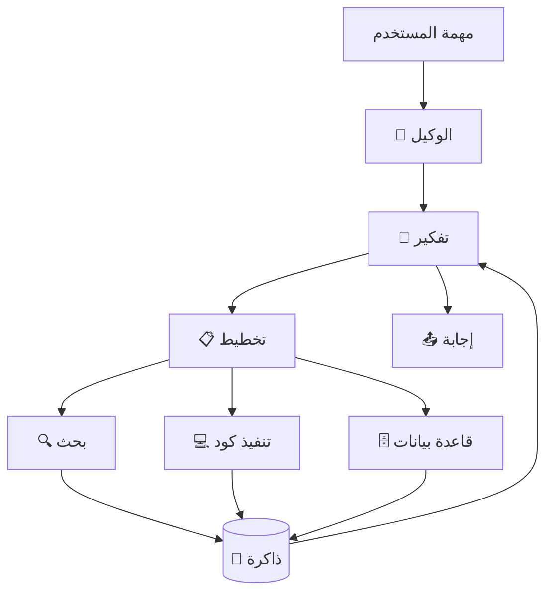

# وكلاء الذكاء الاصطناعي

> **"الوكيل الذكي لا يجيب فقط. إنه يفكر، يخطط، يستخدم الأدوات، ويتذكر."**

## تشريح الوكيل الذكي



## المكونات الأساسية

| المكون | الوظيفة | مثال |
|---|---|---|
| **النموذج (LLM)** | العقل — يفكر ويخطط | GPT-4, Claude |
| **الأدوات (Tools)** | الأيدي — تنفذ | API, Code executor, Search |
| **الذاكرة (Memory)** | تتذكر السياق | Vector DB, Conversation history |
| **التخطيط (Planning)** | تقسم المهمة لخطوات | Chain-of-thought, ReAct |

## نمط ReAct

```python
# الوكيل: "ابحث عن سعر Azure VM وقارنه بـ AWS"
# الخطوة ١: Thought: أحتاج البحث عن أسعار Azure VM
#           Action: search("Azure VM pricing 2024")
#           Observation: Standard_B2s = $0.0416/hour
# الخطوة ٢: Thought: الآن أحتاج سعر AWS المكافئ
#           Action: search("AWS EC2 t3.small pricing")
#           Observation: t3.small = $0.0208/hour
# الخطوة ٣: Thought: لدي المقارنة — أجيب
#           Answer: Azure B2s ($0.0416/hr) أغلى ٢x من AWS t3.small ($0.0208/hr)
```

## أطر العمل

| الإطار | اللغة | القوة |
|---|---|---|
| **LangChain** | Python/JS | مرونة عالية، مجتمع كبير |
| **AutoGen** (Microsoft) | Python | وكلاء متعددون يتحدثون معاً |
| **CrewAI** | Python | وكلاء بأدوار (مدير، باحث، كاتب) |
| **Semantic Kernel** | .NET/Python | تكامل مؤسسي مع Azure |

## سيناريو CloudNova: وكيل تشخيص الأعطال

> **الموقف:** في كل مرة يتعطل فيها API، يستغرق التشخيص ٤٥ دقيقة.

**الحل — وكيل تشخيص آلي:**

1. يتلقى تنبيهاً من Prometheus: "API latency > 2s"
2. يقرأ سجلات آخر ١٥ دقيقة من Loki
3. يبحث في قاعدة المعرفة عن أخطاء مشابهة
4. ينفذ أوامر تشخيص: `kubectl top pods`, `kubectl describe`
5. يكتب تقريراً: "السبب: Node pool memory exhausted. الحل: scale to 5 nodes."
6. يفتح تذكرة Jira بالمعلومات الكاملة

---

[← العودة للوحدة](index.md) | [🏠 الرئيسية](/)
