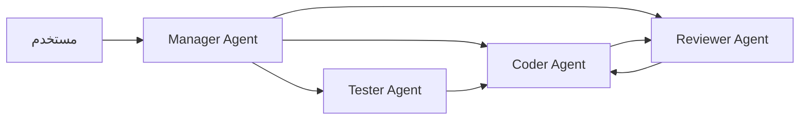

# الأنظمة متعددة الوكلاء

> "وكيل واحد جيد. فريق من الوكلاء أفضل."

## 🎯 أهداف التعلم

- فهم Multi-Agent Architecture
- AutoGen من Microsoft
- CrewAI للتنسيق
- Agent communication patterns

## ⏱️ الوقت المقدر: 35 دقيقة | المستوى: Advanced

---

## 🏗️ AutoGen

```python
from autogen import AssistantAgent, UserProxyAgent

# إنشاء فريق من الوكلاء
coder = AssistantAgent("coder", llm_config={"model": "gpt-4"})
reviewer = AssistantAgent("reviewer", llm_config={"model": "gpt-4"})
user = UserProxyAgent("user", code_execution_config={"work_dir": "coding"})

# مناقشة متعددة الوكلاء
user.initiate_chat(
    coder,
    message="اكتب Terraform module لـ AKS cluster"
)
# coder يكتب الكود → reviewer يراجع → coder يصلح
```

### أنماط الاتصال



---

## 🏛️ سيناريو CloudNova: فريق Agents لترحيل سحابي

**منصور** قائد فريق المنصة في CloudNova. المهمة: ترحيل 50 تطبيقاً من VMs إلى AKS.

بدلاً من كتابة Terraform يدوياً لكل تطبيق، استخدم فريق وكلاء:

```python
from autogen import AssistantAgent, UserProxyAgent, GroupChat, GroupChatManager

# الوكيل 1: محلل المتطلبات
analyst = AssistantAgent(
    "analyst",
    system_message="أنت محلل متطلبات. حلل التطبيق وحدد: هل يحتاج StatefulSet؟ PVC؟ Ingress؟",
    llm_config={"model": "gpt-4o"}
)

# الوكيل 2: مهندس Terraform
terraform_engineer = AssistantAgent(
    "terraform_engineer",
    system_message="أنت خبير Terraform. اكتب كود Azure + Kubernetes provider.",
    llm_config={"model": "gpt-4o"}
)

# الوكيل 3: مراجع الأمان
security_reviewer = AssistantAgent(
    "security_reviewer",
    system_message="أنت مدقق أمان. تأكد: Private Cluster؟ Managed Identity؟ Pod Identity؟",
    llm_config={"model": "gpt-4o"}
)

# الوكيل 4: مهندس CI/CD
cicd_engineer = AssistantAgent(
    "cicd_engineer",
    system_message="أنت خبير CI/CD. أنشئ GitHub Actions workflow للنشر.",
    llm_config={"model": "gpt-4o"}
)

# المستخدم البشري
human = UserProxyAgent(
    "human",
    code_execution_config=False  # لا تنفذ كود تلقائياً
)

# محادثة جماعية منظمة
group_chat = GroupChat(
    agents=[human, analyst, terraform_engineer, security_reviewer, cicd_engineer],
    messages=[],
    max_round=10,
    speaker_selection_method="round_robin"  # الجميع يتحدث بالدور
)

manager = GroupChatManager(groupchat=group_chat, llm_config={"model": "gpt-4o"})

# بدء المهمة
human.initiate_chat(
    manager,
    message="""
    رحِّل تطبيق payment-api (Python Flask + PostgreSQL) إلى AKS.
    المتطلبات:
    - Private Cluster
    - 3 replicas minimum
    - HTTPS via Application Gateway
    - CI/CD للنشر التلقائي
    """
)
```

**النتيجة:**

- الوقت: 4 ساعات بدلاً من 3 أيام لكل تطبيق
- الأخطاء: صفر أخطاء في 50 تطبيقاً (المراجع يمسكها قبل النشر)
- التكلفة: $45 في استدعاءات GPT-4 (مقابل ~$1,500 في وقت مهندس)

---

## 🎨 طبقة المعماري: مقارنة أنماط الاتصال

| النمط              | الوصف                       | متى؟               | الإيجابيات         | السلبيات       |
| ------------------ | --------------------------- | ------------------ | ------------------ | -------------- |
| **Round Robin**    | الجميع يتحدث بالدور         | مهام منظمة         | منظم، لا أحد يُنسى | بطيء           |
| **Auto (LLM)**     | LLM يختار المتحدث التالي    | مهام ديناميكية     | مرن، طبيعي         | تكلفة إضافية   |
| **Manager-Worker** | manager يوزع المهام         | مهام قابلة للتقسيم | تخصص، كفاءة        | عنق زجاجة      |
| **Debate**         | وكيلان يتناقشان             | قرارات صعبة        | منظورين مختلفين    | استهلاك tokens |
| **Hierarchical**   | طبقات: مدير → قادة → منفذين | مؤسسات كبيرة       | scalability        | تعقيد          |

### متى لا تستخدم Multi-Agent؟

- مهمة بسيطة (وكيل واحد يكفي)
- ميزانية محدودة (كل وكيل = تكلفة إضافية)
- وقت حرج (التنسيق يضيف latency)

---

## 🛠️ تدريبات عملية

### تمرين 1: فريق Code Review

```python
# ابنِ فريقاً من 3 وكلاء لمراجعة Terraform code
# الوكيل 1: يراجع security
# الوكيل 2: يراجع cost
# الوكيل 3: يراجع best practices

code_review_team = {
    "security": AssistantAgent("security", system_message="راجع الأمان فقط"),
    "cost": AssistantAgent("cost", system_message="راجع التكلفة فقط"),
    "practices": AssistantAgent("practices", system_message="راجع best practices")
}

def review_terraform(module_code):
    reviews = {}
    for role, agent in code_review_team.items():
        review = agent.generate_reply(messages=[{
            "content": f"راجع هذا الكود من ناحية {role}:\n{module_code}"
        }])
        reviews[role] = review
    return reviews
```

### تمرين 2: Debate Pattern لاتخاذ قرار

```python
# وكيلان يتناقشان: هل نستخدم AKS أم ACA (Container Apps)؟

debate_topic = """
نحتاج لنشر 10 microservices.
الخيار 1: AKS (مرونة كاملة، تعقيد عالي)
الخيار 2: Azure Container Apps (بساطة، أقل مرونة)
أي الخيارين أفضل لـ CloudNova؟
"""

aks_advocate = AssistantAgent("aks_advocate",
    system_message="دافع عن AKS. ركز على: المرونة، Kubernetes ecosystem، multi-cloud")

aca_advocate = AssistantAgent("aca_advocate",
    system_message="دافع عن ACA. ركز على: البساطة، التكلفة، قلة الصيانة")

# 3 جولات من النقاش
for round in range(3):
    aks_argument = aks_advocate.generate_reply(...)
    aca_argument = aca_advocate.generate_reply(...)
    # الـ judge (LLM آخر) يقيم
```

### تحدي: نظام دعم فني متعدد الوكلاء

```python
# التحدي: ابنِ نظام دعم فني بـ 5 وكلاء:
# 1. Receptionist: يستقبل المشكلة ويصنفها
# 2. Researcher: يبحث في الوثائق
# 3. Troubleshooter: يقترح خطوات الحل
# 4. Escalation: إذا لم يُحل، يرفع لخبير بشري
# 5. Follow-up: يتأكد أن المستخدم راضٍ
```

---

## 📝 تقييم

### ✅ Knowledge Checks

1. ما الفرق بين Round Robin و Auto speaker selection؟
2. متى تستخدم Debate pattern بدلاً من Manager-Worker؟
3. ما أكبر تحدي في Multi-Agent Systems؟
4. كيف تمنع الوكلاء من التكرار اللامتناهي؟
5. ما أفضل نمط اتصال لترحيل 50 تطبيقاً؟

### 🧠 Quiz

**س1:** في GroupChat، `max_round=10` يعني:

- أ) 10 وكلاء
- ب) 10 جولات من المحادثة ✅
- ج) 10 رسائل
- د) 10 دقائق

**س2:** متى يكون Debate pattern مفيداً؟

- أ) قرارات ثنائية تحتاج منظورين ✅
- ب) مهام روتينية
- ج) أسئلة بسيطة
- د) كل ما سبق

**س3:** أكبر مشكلة في Multi-Agent:

- أ) التكلفة التراكمية للـ tokens ✅
- ب) السرعة
- ج) اللغة
- د) لا مشاكل

### 🗣️ Active Recall

1. صف 3 أنماط اتصال بين الوكلاء من الذاكرة
2. ارسم diagram لـ Manager-Worker مع 5 وكلاء
3. متى يكون الوكيل الواحد أفضل من الفريق؟
4. اشرح `max_round` ولماذا هو مهم

### 🎓 Feynman Exercise

> اشرح Multi-Agent Systems لغير تقني: "مثل فريق طوارئ في مستشفى: طبيب التشخيص يحلل، الجراح يعالج، الممرض يجهز، الصيدلاني يصرف الدواء. كل واحد خبير في مجاله، ينسقون عبر قائد الفريق."

### 🃏 بطاقات تعلم

| السؤال                         | الإجابة                                          |
| ------------------------------ | ------------------------------------------------ |
| ما AutoGen؟                    | إطار عمل من Microsoft لبناء أنظمة متعددة الوكلاء |
| ما GroupChat؟                  | محادثة منظمة بين عدة وكلاء                       |
| ما Manager Agent؟              | وكيل يوزع المهام على الوكلاء المتخصصين           |
| متى تستخدم Human-in-the-loop؟  | كل قرار حاسم: نشر، حذف، تغيير production         |
| ما الفرق بين AutoGen و CrewAI؟ | AutoGen = محادثات، CrewAI = أدوار + مهام         |

---

## 🎤 أسئلة المقابلة

**س1 (تقني):** "كيف تصمم نظام وكلاء لا يخرج عن السيطرة؟"

> `max_round` للحد من التكرار. Human-in-the-loop للقرارات الحاسمة. Allow-listing للأدوات المسموحة. Audit logging لكل إجراء. Rate limiting على استدعاءات LLM. والأهم: اختبار شامل boundary cases.

**س2 (System Design):** "صمم نظام Multi-Agent لـ DevOps."

> 4 وكلاء: Monitor Agent (يكتشف المشاكل من Prometheus)، Diagnose Agent (يحلل logs)، Fix Agent (ينشئ PR مع fix)، Deploy Agent (ينشر بعد موافقة بشرية). التنسيق عبر Manager-Worker pattern. Human approval قبل deploy.

**س3 (سلوكي):** "كيف تقنع فريقك باستخدام AI Agents؟"

> أبدأ بـ POC صغير: عامل واحد لمهمة محددة (مثلاً، كتابة Terraform docs). أقيس الوقت الموفر. أشارك النتائج. أنتقل تدريجياً لفريق وكلاء. في CloudNova، بدأنا بوكيل واحد لمراجعة security — وفر 5 ساعات/أسبوع. الآن 4 وكلاء.

---

## 📚 المراجع

| النوع          | الرابط                                                                          |
| -------------- | ------------------------------------------------------------------------------- |
| **درس ذو صلة** | [AI Agents](./01-ai-agents)                                                     |
| **درس ذو صلة** | [Agent Frameworks](./03-agent-frameworks-comparison)                            |
| **أداة**       | [AutoGen](https://microsoft.github.io/autogen/)                                 |
| **أداة**       | [CrewAI](https://docs.crewai.com/)                                              |
| **ورقة بحثية** | [AutoGen: Enabling Next-Gen LLM Applications](https://arxiv.org/abs/2308.08155) |

---

[← AI Agents](./01-ai-agents) | [→ Agent Frameworks](./03-agent-frameworks-comparison) | [🏠 الرئيسية](/)
