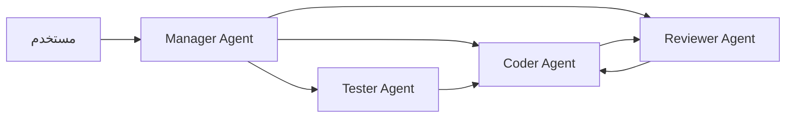

# الأنظمة متعددة الوكلاء

> "وكيل واحد جيد. فريق من الوكلاء أفضل."

## 🎯 أهداف التعلم

- فهم Multi-Agent Architecture
- AutoGen من Microsoft
- CrewAI للتنسيق
- Agent communication patterns

## ⏱️ الوقت المقدر: 35 دقيقة | المستوى: Advanced

---

## 🏗️ AutoGen

```python
from autogen import AssistantAgent, UserProxyAgent

# إنشاء فريق من الوكلاء
coder = AssistantAgent("coder", llm_config={"model": "gpt-4"})
reviewer = AssistantAgent("reviewer", llm_config={"model": "gpt-4"})
user = UserProxyAgent("user", code_execution_config={"work_dir": "coding"})

# مناقشة متعددة الوكلاء
user.initiate_chat(
    coder,
    message="اكتب Terraform module لـ AKS cluster"
)
# coder يكتب الكود → reviewer يراجع → coder يصلح
```

### أنماط الاتصال



---

[← AI Agents](./01-ai-agents) | [→ Agent Frameworks](./03-agent-frameworks-comparison) | [🏠 الرئيسية](/)
