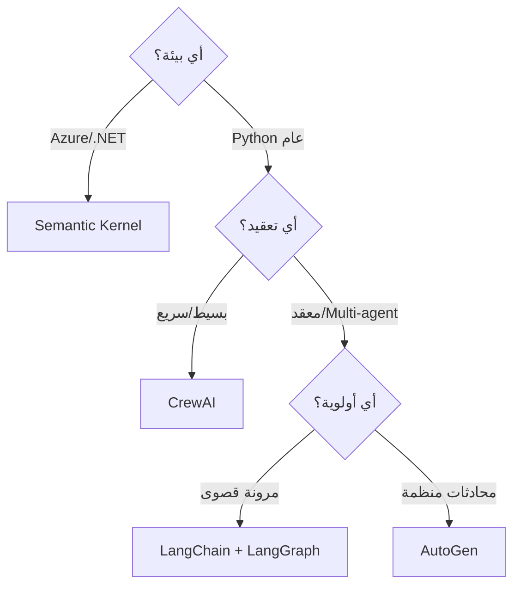

# مقارنة أطر عمل الوكلاء

> "كل إطار عمل له نقاط قوته. اختر ما يناسب مشروعك."

## 🎯 أهداف التعلم

- مقارنة LangChain, AutoGen, CrewAI, Semantic Kernel
- معايير الاختيار
- أمثلة لكل إطار

## ⏱️ الوقت المقدر: 30 دقيقة | المستوى: Intermediate

---

## 🏗️ مقارنة

|             | LangChain       | AutoGen                  | CrewAI            | Semantic Kernel |
| ----------- | --------------- | ------------------------ | ----------------- | --------------- |
| **المنشئ**  | LangChain Inc   | Microsoft                | CrewAI            | Microsoft       |
| **التركيز** | General purpose | Multi-agent conversation | Role-based agents | Enterprise .NET |
| **Python**  | ✅              | ✅                       | ✅                | ✅              |
| **C#/.NET** | ❌              | ❌                       | ❌                | ✅              |
| **التعقيد** | عالي            | متوسط                    | منخفض             | متوسط           |

### متى تختار ماذا؟

- **LangChain**: مرونة قصوى، مجتمع ضخم
- **AutoGen**: محادثات متعددة الوكلاء، بحث أكاديمي
- **CrewAI**: سهل، سريع، role-based
- **Semantic Kernel**: بيئة Microsoft/.NET

---

## 🏛️ سيناريو CloudNova: اختيار الإطار المناسب

**هند** تقود مبادرة AI Agents في CloudNova. المهمة: اختيار framework لبناء نظام دعم فني ذكي.

**تقييمها:**

```python
# معايير التقييم
criteria = {
    "التكلفة": 0.25,       # الميزانية محدودة
    "سهولة التعلم": 0.15,   # الفريق جديد على agents
    "مرونة": 0.20,         # نحتاج تخصيص عالي
    "تكامل Azure": 0.30,   # البنية كلها Azure
    "مجتمع ودعم": 0.10     # نحتاج حلول سريعة للمشاكل
}

# تقييم frameworks
scores = {
    "LangChain": {"التكلفة": 7, "سهولة التعلم": 5, "مرونة": 10, "تكامل Azure": 7, "مجتمع ودعم": 10},
    "AutoGen": {"التكلفة": 6, "سهولة التعلم": 7, "مرونة": 8, "تكامل Azure": 8, "مجتمع ودعم": 6},
    "CrewAI": {"التكلفة": 8, "سهولة التعلم": 9, "مرونة": 5, "تكامل Azure": 5, "مجتمع ودعم": 5},
    "Semantic Kernel": {"التكلفة": 7, "سهولة التعلم": 6, "مرونة": 7, "تكامل Azure": 10, "مجتمع ودعم": 7}
}

# حساب weighted scores
for fw, s in scores.items():
    total = sum(s[k] * criteria[k] for k in criteria)
    print(f"{fw}: {total:.1f}/10")

# النتيجة:
# Semantic Kernel: 7.8/10 ✅ (أفضل تكامل Azure)
# LangChain: 7.6/10
# AutoGen: 7.1/10
# CrewAI: 6.0/10
```

**القرار:** Semantic Kernel للـ backend (تكامل Azure أصلي) + AutoGen للـ multi-agent conversations.

---

## 🎨 طبقة المعماري: تحليل معمق

### مقارنة موسعة

| المعيار                  | LangChain         | AutoGen      | CrewAI          | Semantic Kernel  |
| ------------------------ | ----------------- | ------------ | --------------- | ---------------- |
| **سنة الإطلاق**          | 2022              | 2023         | 2024            | 2023             |
| **GitHub Stars**         | 95K+              | 35K+         | 20K+            | 21K+             |
| **اللغة الأساسية**       | Python, JS        | Python       | Python          | C#, Python, Java |
| **Azure Integration**    | متوسط             | جيد          | أساسي           | ممتاز ✅         |
| **Multi-Agent**          | LangGraph         | ✅ أصلي      | ✅ أصلي         | عبر plugins      |
| **Memory**               | قوي (30+ نوع)     | جيد          | أساسي           | جيد              |
| **Tool Calling**         | 700+ integrations | OpenAI tools | LangChain tools | OpenAI + native  |
| **Observability**        | LangSmith         | Limited      | Limited         | Azure Monitor    |
| **Enterprise Readiness** | جيد               | متوسط        | منخفض           | ممتاز ✅         |
| **Learning Curve**       | حاد 📈            | متوسط        | سهل 📉          | متوسط            |

### مصفوفة القرار



### متى لا تستخدم أي framework؟

- مشروع بسيط (< 3 أدوات): استخدم OpenAI SDK مباشرة
- فريق صغير بدون خبرة LLM: ابدأ بـ CrewAI التجريبي
- MVP خلال أسبوع: لا framework — استخدم الوصف المباشر

---

## 🛠️ تدريبات عملية

### تمرين 1: نفس المهمة، 3 أطر عمل

```python
# المهمة: "ابحث عن آخر أخبار Kubernetes وأرسل ملخصاً"

# LangChain
from langchain.agents import create_openai_functions_agent
agent = create_openai_functions_agent(llm, tools, prompt)
result_lc = agent.invoke({"input": "آخر أخبار Kubernetes"})

# AutoGen
from autogen import AssistantAgent, UserProxyAgent
agent_ag = AssistantAgent("researcher", llm_config=llm_config)
user = UserProxyAgent("user")
user.initiate_chat(agent_ag, message="ابحث عن آخر أخبار Kubernetes")

# CrewAI
from crewai import Agent, Task, Crew
researcher = Agent(role="باحث", goal="البحث عن أخبار", ...)
task = Task(description="آخر أخبار Kubernetes", agent=researcher)
crew = Crew(agents=[researcher], tasks=[task])
result_cr = crew.kickoff()

# قارن: سرعة التطوير، جودة النتيجة، سهولة الـ debug
```

### تمرين 2: ترحيل من LangChain إلى Semantic Kernel

```python
# حوّل هذا الـ LangChain agent إلى Semantic Kernel
# LangChain:
from langchain.agents import AgentExecutor
agent = AgentExecutor(agent=..., tools=[...])

# Semantic Kernel:
import semantic_kernel as sk
kernel = sk.Kernel()
# أضف نفس الأدوات (Azure, Kubernetes, Terraform)
# قارن الكود: أيهما أنظف؟
```

### تحدي: Benchmark حقيقي

```python
# التحدي: ابنِ نفس الـ agent في frameworks الأربعة
# وقارن:
# 1. عدد أسطر الكود
# 2. وقت الاستجابة
# 3. Token consumption
# 4. سهولة إضافة أداة جديدة
# 5. جودة المخرجات (RAGAS score)
```

---

## 📝 تقييم

### ✅ Knowledge Checks

1. ما أفضل framework لتكامل Azure العميق؟
2. متى تختار CrewAI على LangChain؟
3. ما ميزة LangGraph على باقي frameworks؟
4. كيف تقارن بين frameworks بشكل موضوعي؟
5. ما الفرق بين LangChain Expression Language و Semantic Kernel Planner؟

### 🧠 Quiz

**س1:** أفضل framework لمشروع .NET + Azure:

- أ) LangChain
- ب) AutoGen
- ج) CrewAI
- د) Semantic Kernel ✅

**س2:** متى تتجنب LangChain؟

- أ) مشاريع بسيطة جداً (over-engineering) ✅
- ب) دائماً
- ج) أبداً
- د) فقط في Python

**س3:** أكبر نقطة ضعف في CrewAI:

- أ) غير مناسب للـ enterprise (observability, security) ✅
- ب) صعب التعلم
- ج) لا يدعم Python
- د) غالي

### 🗣️ Active Recall

1. قارن بين LangChain و AutoGen من الذاكرة
2. ارسم decision tree لاختيار framework
3. ما أهم 3 معايير لاختيار framework في مؤسستك؟
4. صف تجربة ترحيل بين frameworks

### 🎓 Feynman Exercise

> اشرح frameworks الأربعة كأنها مطاعم: LangChain = بوفيه مفتوح (اختيارات كثيرة، معقد). CrewAI = وجبة سريعة (سريع، محدود). AutoGen = مطعم عائلي (محادثات جماعية). Semantic Kernel = مطعم فندق 5 نجوم (فخم، مخصص لـ Azure).

### 🃏 بطاقات تعلم

| السؤال                          | الإجابة                 |
| ------------------------------- | ----------------------- |
| أفضل framework لـ Azure؟        | Semantic Kernel         |
| أفضل framework لمرونة قصوى؟     | LangChain + LangGraph   |
| أفضل framework لمحادثات متعددة؟ | AutoGen                 |
| أفضل framework لبداية سريعة؟    | CrewAI                  |
| متى لا تستخدم أي framework؟     | مشروع بسيط بـ 1-2 أدوات |

---

## 🎤 أسئلة المقابلة

**س1 (تقني):** "قارن بين LangChain و Semantic Kernel."

> LangChain: مرن، مجتمع ضخم، 700+ integration، لكن معقد وقد يكون over-engineering. Semantic Kernel: تكامل Azure أصلي، enterprise-ready، يدعم C# و Python، ممتاز لمؤسسات Microsoft. اختياري: LangChain للمرونة القصوى، Semantic Kernel للـ Azure enterprise.

**س2 (System Design):** "صمم architecture لـ AI Agents في Azure."

> Semantic Kernel كـ orchestration layer. Azure OpenAI للـ LLM. Azure AI Search للـ RAG. Azure Functions لتنفيذ الأدوات. Application Insights للمراقبة. Key Vault للأسرار. Managed Identity للأمان.

**س3 (سلوكي):** "كيف تختار تقنية جديدة لفريقك؟"

> أعمل POC في كل framework بنفس المهمة. أقيس: وقت التطوير، جودة المخرجات، التكلفة، سهولة الصيانة. أناقش النتائج مع الفريق. في CloudNova، اختبرنا 4 frameworks واخترنا Semantic Kernel بناءً على data وليس hype.

---

## 📚 المراجع

| النوع          | الرابط                                                          |
| -------------- | --------------------------------------------------------------- |
| **درس ذو صلة** | [Multi-Agent Systems](./02-multi-agent-systems)                 |
| **درس ذو صلة** | [Agent Security](./04-agent-security-governance)                |
| **أداة**       | [Semantic Kernel](https://learn.microsoft.com/semantic-kernel/) |
| **أداة**       | [LangGraph](https://langchain-ai.github.io/langgraph/)          |
| **شهادة**      | AI-102 — Choose AI services                                     |

---

[← Multi-Agent Systems](./02-multi-agent-systems) | [→ Agent Security](./04-agent-security-governance) | [🏠 الرئيسية](/)
