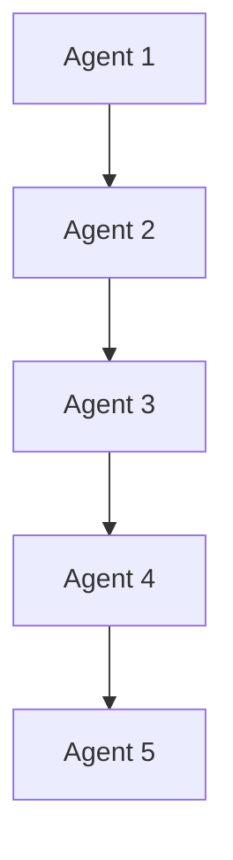

# 🚀 وكلاء AI

> AI Agents، Multi-Agent، LangChain، AutoGen — الجيل القادم من الذكاء الاصطناعي.

## 🎯 أهداف التعلم

بعد إكمال هذه الوحدة، ستكون قادراً على:

- [**AI Agents**](01-ai-agents) — مقدمة
- [**Multi-Agent**](02-multi-agent-systems) — أنظمة متعددة الوكلاء
- [**مقارنة الأطر**](03-agent-frameworks-comparison) — LangChain vs AutoGen
- [**أمن الوكلاء**](04-agent-security-governance) — حوكمة وأمان

## 💡 المهارات التي ستكتسبها

AI Agents • Multi-Agent • LangChain • AutoGen • Agent Security

## 📊 معلومات الوحدة

| العنصر | القيمة |
| ------ | ------ |
| **المستوى** | متقدم |
| **الوقت المقدر** | 6 ساعات |
| **المتطلبات** | RAG |
| **الشهادات** | — |

## 🏛️ مهمة CloudNova

> ابنِ فريق وكلاء AI لأتمتة عمليات CloudNova. 5 وكلاء يعملون معاً.

## 🗺️ خريطة الوحدة

## 📖 الدروس

- [**AI Agents**](01-ai-agents) — مقدمة
- [**Multi-Agent**](02-multi-agent-systems) — أنظمة متعددة الوكلاء
- [**مقارنة الأطر**](03-agent-frameworks-comparison) — LangChain vs AutoGen
- [**أمن الوكلاء**](04-agent-security-governance) — حوكمة وأمان

## 🚀 ابدأ التعلم

[▶️ ابدأ الدرس الأول](01-ai-agents)
