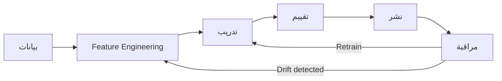

# أساسيات MLOps

> "MLOps هو الزواج بين DevOps و Machine Learning. بدون MLOps، 87% من نماذج ML لا تصل للإنتاج أبداً."

## 🎯 أهداف التعلم

- فهم دورة حياة MLOps كاملة
- بناء Feature Store مركزي
- أتمتة الـ training pipeline
- نشر النماذج مع A/B Testing
- اكتشاف Data Drift و Model Drift

---

## 📖 الطبقة الأساسية: لماذا MLOps؟



| DevOps | MLOps |
|--------|-------|
| Code → Build → Deploy | Data + Code → Train → Deploy |
| الاختبار: Unit + Integration | الاختبار: Accuracy + Fairness + Drift |
| المشكلة: "الـ deployment فشل" | المشكلة: "النموذج accuracy انخفض 5%" |
| الـ artifact: Docker image | الـ artifact: Model + Code + Data version |
| المراقبة: CPU, Memory, Latency | المراقبة: Accuracy, Prediction Distribution, Drift |

### لماذا يفشل 87% من مشاريع ML؟

```
1. الفجوة بين الـ Data Scientist و الـ Engineer:
   الـ DS: "النموذج جاهز في Jupyter Notebook!"
   الـ Engineer: "كيف أنشره في production؟"

2. البيانات تتغير:
   نموذج trained على بيانات 2024
   → في 2026، توزيع البيانات مختلف تماماً
   → Accuracy ينهار بصمت

3. لا versioning للبيانات:
   "ما هي نسخة البيانات التي درّبت عليها هذا النموذج؟"
   "لا أعلم." ← كارثة

4. لا monitoring:
   النموذج يقدم predictions خاطئة لـ 6 أشهر
   ولا أحد يدري لأن لا أحد يراقب
```

---

## 🧱 الطبقة المهنية: Feature Store

### لماذا Feature Store؟

```
المشكلة في CloudNova:
- فريق الـ Fraud Detection يعرّف feature "avg_transaction_7d"
- فريق الـ Recommendations يعيد كتابة نفس الـ feature
- Training يستخدم نسخة مختلفة عن الـ Serving
- لا reproducibility: لا أحد يدري أي نسخة استُخدمت

الحل: Feature Store مركزي — مصدر واحد للحقيقة

الـ Feature Store:
├── Registry: تعريف الـ features + metadata
├── Online Store (Redis): للـ real-time serving (latency < 5ms)
├── Offline Store (Data Lake): للـ training (historical data)
└── Transformation: حسابات الـ features المُعادة استخدامها
```

### تنفيذ Feature Store

```python
from feast import FeatureStore, Entity, FeatureView, Field
from feast.types import Float32, Int64
from datetime import timedelta

# ١. تعريف Entity
user = Entity(
    name="user",
    join_keys=["user_id"],
    description="مستخدم CloudNova"
)

# ٢. تعريف Feature View
user_transactions = FeatureView(
    name="user_transactions_7d",
    entities=[user],
    ttl=timedelta(days=30),
    schema=[
        Field(name="transaction_count_7d", dtype=Int64),
        Field(name="avg_transaction_amount_7d", dtype=Float32),
        Field(name="max_transaction_amount_7d", dtype=Float32),
        Field(name="unique_merchants_7d", dtype=Int64),
    ],
    source=BigQuerySource(
        table="cloudnova_production.user_transactions",
        timestamp_field="event_timestamp"
    ),
    online=True,
    tags={"team": "fraud-detection", "owner": "ml-platform"}
)

# ٣. تطبيق الـ Feature Store
fs = FeatureStore(".")
fs.apply([user, user_transactions])

# ٤. استرجاع features للـ training (offline)
training_data = fs.get_historical_features(
    entity_df=users_df,
    features=[
        "user_transactions_7d:transaction_count_7d",
        "user_transactions_7d:avg_transaction_amount_7d",
    ]
).to_df()

# ٥. استرجاع features للـ real-time serving (online)
online_features = fs.get_online_features(
    entity_rows=[{"user_id": "user_12345"}],
    features=[
        "user_transactions_7d:transaction_count_7d",
        "user_transactions_7d:avg_transaction_amount_7d",
    ]
).to_dict()
# latency: 2-5ms من Redis ✅
```

---

## 🏗️ الطبقة الإنتاجية: Training Pipeline

```python
# Azure ML Pipeline — أتمتة كاملة
from azure.ai.ml import MLClient, command, Input, Output
from azure.ai.ml.dsl import pipeline
from azure.ai.ml.entities import Environment, BuildContext

ml_client = MLClient.from_config()

# بيئة التدريب
training_env = Environment(
    name="fraud-detection-training",
    image="mcr.microsoft.com/azureml/openmpi4.1.0-ubuntu20.04",
    conda_file="conda.yaml"
)

@pipeline(
    name="fraud-detection-training-pipeline",
    description="Training + Evaluation + Registration pipeline"
)
def fraud_training_pipeline(
    training_data: Input,
    test_data: Input,
    learning_rate: float = 0.01
):
    
    # ١. خطوة التدريب
    train_step = command(
        name="train",
        display_name="Train XGBoost Model",
        code="./src",
        command="python train.py --data ${{inputs.data}} --lr ${{inputs.lr}} --output ${{outputs.model}}",
        environment=training_env,
        inputs={
            "data": training_data,
            "lr": learning_rate
        },
        outputs={"model": Output(type="uri_folder", mode="rw_mount")},
        compute="gpu-cluster",
        instance_count=1
    )
    
    # ٢. خطوة التقييم
    evaluate_step = command(
        name="evaluate",
        display_name="Evaluate Model",
        code="./src",
        command="python evaluate.py --model ${{inputs.model}} --test ${{inputs.test}} --output ${{outputs.metrics}}",
        environment=training_env,
        inputs={
            "model": train_step.outputs.model,
            "test": test_data
        },
        outputs={"metrics": Output(type="uri_folder")},
        compute="cpu-cluster"
    )
    
    return {
        "model": train_step.outputs.model,
        "metrics": evaluate_step.outputs.metrics
    }

# تشغيل الـ pipeline
pipeline_job = fraud_training_pipeline(
    training_data=Input(type="uri_folder", path="azureml:fraud-training-data@latest"),
    test_data=Input(type="uri_folder", path="azureml:fraud-test-data@latest"),
    learning_rate=0.01
)

# جدولة أسبوعية
from azure.ai.ml.entities import RecurrenceTrigger, JobSchedule

schedule = JobSchedule(
    name="weekly-fraud-model-retraining",
    trigger=RecurrenceTrigger(
        frequency="week",
        interval=1,
        schedule={"hours": [2], "minutes": [0], "week_days": ["monday"]}
    ),
    create_job=pipeline_job
)

ml_client.schedules.begin_create_or_update(schedule)
```

---

## 🎨 الطبقة الإنتاجية: A/B Testing

```python
# نشر نموذجين: current (A) و challenger (B)
# 90% traffic → A، 10% traffic → B

from azure.ai.ml.entities import (
    ManagedOnlineEndpoint,
    ManagedOnlineDeployment,
    DataCollector
)

endpoint = ManagedOnlineEndpoint(
    name="fraud-detection-prod",
    auth_mode="key",
    description="Production fraud detection endpoint"
)

# Deployment A: النموذج الحالي (90% traffic)
deployment_a = ManagedOnlineDeployment(
    name="fraud-model-v2-green",
    endpoint_name="fraud-detection-prod",
    model="azureml:fraud-detection-v2:3",
    instance_type="Standard_DS3_v2",
    instance_count=2,
    traffic_allocation={"v2-green": 90}
)

# Deployment B: النموذج الجديد (10% traffic)
deployment_b = ManagedOnlineDeployment(
    name="fraud-model-v3-blue",
    endpoint_name="fraud-detection-prod",
    model="azureml:fraud-detection-v3:1",
    instance_type="Standard_DS3_v2",
    instance_count=1,
    traffic_allocation={"v3-blue": 10}
)

# بعد أسبوع: مقارنة النتائج
# إذا v3 أفضل ← traffic 90% → v3، v2 تبقى للـ rollback
# إذا v3 أسوأ ← traffic 100% → v2، حذف v3
```

---

## 🔬 الطبقة المعمارية: Drift Detection

### Data Drift vs Model Drift

```python
from azure.ai.ml import MLClient
from azure.ai.ml.entities import (
    DataDriftDetector,
    FeatureAttributionDrift,
    MonitorSchedule
)

ml_client = MLClient.from_config()

# Data Drift Monitor: هل تغير توزيع البيانات؟
data_drift_monitor = DataDriftDetector(
    name="fraud-detection-data-drift",
    target_data="azureml:fraud-inference-logs:latest",
    baseline_data="azureml:fraud-training-data:v2",
    features=[
        "transaction_amount",
        "transaction_count_7d",
        "user_age",
        "device_type"
    ],
    compute="serverless-spark",
    frequency="day",
    alert_config={
        "alert_name": "data-drift-alert",
        "threshold": 0.1,  # alert at 10% drift
        "email": ["ml-platform@cloudnova.com"]
    }
)

# Model Performance Monitor: هل accuracy انخفض؟
# (يحتاج ground truth labels من feedback loop)
def check_model_performance(model_id: str, inference_data: pd.DataFrame):
    """
    مقارنة predictions مع actual outcomes
    """
    model = ml_client.models.get(model_id)
    
    # آخر 7 أيام من predictions
    recent_predictions = get_inference_logs(days=7)
    
    # إذا توفرت ground truth (مثلاً: هل كانت المعاملة fraud حقاً؟)
    ground_truth = get_ground_truth(days=7)
    
    metrics = {
        "accuracy": accuracy_score(ground_truth, recent_predictions),
        "precision": precision_score(ground_truth, recent_predictions),
        "recall": recall_score(ground_truth, recent_predictions),
        "f1": f1_score(ground_truth, recent_predictions)
    }
    
    # Alert if accuracy dropped > 5%
    baseline_accuracy = model.tags.get("production_accuracy", 0.95)
    if metrics["accuracy"] < baseline_accuracy - 0.05:
        send_alert(f"⚠️ Model accuracy dropped: {metrics['accuracy']:.2%}")
        trigger_retraining()
    
    return metrics
```

### Population Stability Index (PSI)

```python
def calculate_psi(expected: np.ndarray, actual: np.ndarray, 
                  bins: int = 10) -> float:
    """
    PSI = Population Stability Index
    < 0.1: No drift
    0.1 - 0.2: Mild drift — monitor closely
    > 0.2: Significant drift — retrain!
    """
    # تقسيم البيانات إلى bins
    breakpoints = np.percentile(expected, np.linspace(0, 100, bins + 1))
    
    expected_percents = np.histogram(expected, breakpoints)[0] / len(expected)
    actual_percents = np.histogram(actual, breakpoints)[0] / len(actual)
    
    # تجنب log(0)
    expected_percents = np.clip(expected_percents, 0.0001, None)
    actual_percents = np.clip(actual_percents, 0.0001, None)
    
    psi_values = (actual_percents - expected_percents) * np.log(
        actual_percents / expected_percents
    )
    
    return float(np.sum(psi_values))

# استخدام PSI
training_data = load_feature("transaction_amount", version="training")
inference_data = load_feature("transaction_amount", version="inference")

psi = calculate_psi(training_data, inference_data)
print(f"PSI: {psi:.4f}")

if psi > 0.2:
    print("🚨 Significant drift detected — triggering retraining!")
    trigger_retraining()
elif psi > 0.1:
    print("⚠️ Mild drift — monitor closely")
else:
    print("✅ No significant drift")
```

---

## 🚨 سيناريو CloudNova: نموذج ينهار بصمت

> **الموقف:** فريق الـ Fraud Detection لاحظ شيئاً غريباً

```
اكتشاف المشكلة:

شهر 1: نموذج fraud detection دقيق (F1=0.94)
شهر 2: دقيق (F1=0.93)
شهر 3: مازال يبدو دقيقاً... لكن شيئاً ما خطأ!
        ↓
        تدقيق يدوي: النموذج فاته 3 حالات fraud كبيرة
        بسبب: تغير سلوك المحتالين — يستخدمون Apple Pay الآن
        والنموذج دُرِّب على بيانات لا تحتوي Apple Pay

لماذا لم نكتشف مبكراً؟
├── لا Data Drift monitoring
├── لا Model Performance monitoring
├── لا ground truth feedback loop
└── "Accuracy" الإجمالي بدا طبيعياً لكنه خادع!

الإصلاح:
١. أضف Drift Detection لكل feature
٢. راقب Precision و Recall للتقسيمات المختلفة (device_type)
٣. أضف Human-in-the-loop review للـ high-value transactions
٤. Retrain شهرياً بدلاً من ربع سنوي

الدرس: Accuracy الإجمالي وحده لا يكفي.
راقب Drift لكل segment ولكل feature.
```

---

## 🧠 التذكّر النشط

1. ما هي مكونات MLOps الأساسية الخمسة؟
2. لماذا Feature Store ضروري؟ اشرح الفرق بين Online و Offline store
3. كيف تبني Training Pipeline آلي؟
4. كيف تنفذ A/B Testing لنموذجين؟
5. ما الفرق بين Data Drift و Model Drift؟
6. كيف تحسب PSI ومتى تعيد التدريب؟
7. لماذا يفشل 87% من مشاريع ML في الوصول للإنتاج؟
8. كيف تصمم feedback loop لجمع ground truth؟

## ✍️ تمرين Feynman

"MLOps مثل مطبخ مطعم. الـ Data Scientist يخترع وصفة (النموذج)، و MLOps يبني المطبخ (الـ pipeline) الذي يطبخ الوصفة كل يوم بنفس الجودة، ويكتشف فوراً إذا تغيرت جودة المكونات (data drift)."

## 🎤 أسئلة المقابلة

1. **"كيف تكتشف أن نموذج ML في الإنتاج بدأ يفشل؟"**
   - Data Drift (PSI, KL divergence)
   - Model Performance (accuracy, precision, recall vs ground truth)
   - Prediction Distribution (هل تغير توزيع الـ predictions؟)
   - Business Metrics (هل ارتفعت fraud losses؟)

2. **"كيف تصمم نظام recommendations يخدم 10M مستخدم؟"**
   - Feature Store (Redis) للـ real-time features
   - Batch inference للـ nightly recommendations
   - Real-time re-ranking للـ top-N
   - Embeddings cache للـ items المشهورة

3. **"Model Registry: لماذا هو مهم؟"**
   - تتبع كل نموذج: من درّبه، بأي بيانات، بأي hyperparameters
   - Rollback سريع: إصدار سابق بنقرة واحدة
   - Audit trail: من وافق على نشر هذا النموذج؟
   - Compliance: إثبات أن النموذج اجتاز fairness checks

---

[🏠 العودة للرئيسية](/) | [📚 جميع الدروس](/docs/lessons)
