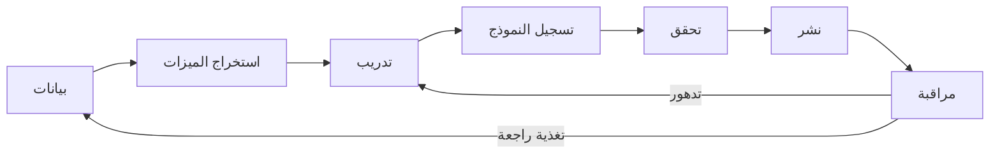

# MLOps — تشغيل تعلم الآلة

> **"MLOps هو DevOps لتعلّم الآلة. نفس المبادئ — تحديات مختلفة."**

## خط أنابيب MLOps الكامل



## تحديات MLOps

| التحدي                   | الوصف                              | الحل                               |
| ------------------------ | ---------------------------------- | ---------------------------------- |
| **تدهور النموذج**        | دقة النموذج تقل مع الوقت           | مراقبة مستمرة + إعادة تدريب تلقائي |
| **إصدار البيانات**       | البيانات تتغير — أي نسخة دربت؟     | DVC (Data Version Control)         |
| **قابلية إعادة الإنتاج** | هل يمكنك إعادة التدريب بعد ٦ أشهر؟ | Docker + ثبت المتطلبات             |
| **الامتثال**             | من درب؟ متى؟ بأي بيانات؟           | سجل تدقيق كامل                     |

## خدمات Azure لـ MLOps

```python
from azure.ai.ml import MLClient
from azure.ai.ml.entities import Model

ml_client = MLClient(credential, subscription_id, workspace)

# تسجيل نموذج
model = Model(
    path="./model",
    name="cloudnova-churn-predictor",
    version="3",
    description="يتنبأ باحتمالية ترك العميل"
)
ml_client.models.create_or_update(model)

# نشر النموذج
from azure.ai.ml.entities import ManagedOnlineEndpoint
endpoint = ManagedOnlineEndpoint(name="churn-api")
ml_client.online_endpoints.begin_create_or_update(endpoint)
```

---

[← العودة للوحدة](index.md) | [🏠 الرئيسية](/)
