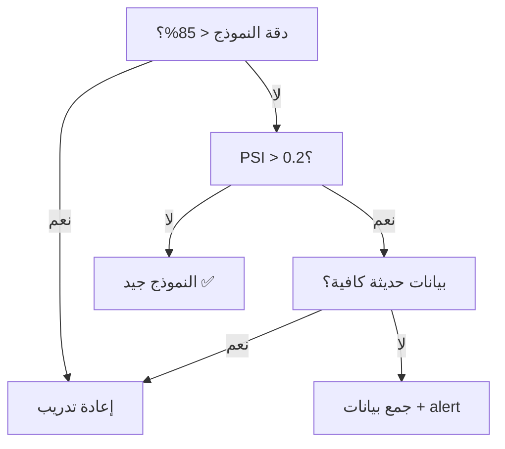

# مراقبة النماذج في الإنتاج

> "النموذج الذي لا يُراقب سيفشل. إنها مسألة وقت فقط."

## 🎯 أهداف التعلم

- Data Drift vs Concept Drift
- PSI (Population Stability Index)
- Model Decay detection
- إعادة التدريب التلقائي

## ⏱️ الوقت المقدر: 35 دقيقة | المستوى: Advanced

---

## 🏗️ Data Drift Detection

```python
from scipy.stats import ks_2samp

def detect_drift(reference, current, threshold=0.05):
    stat, p_value = ks_2samp(reference, current)
    if p_value < threshold:
        print(f"DRIFT DETECTED! P-value: {p_value:.4f}")
    return p_value
```

### PSI

```python
def calculate_psi(expected, actual, bins=10):
    psi = 0
    for i in range(bins):
        if actual[i] == 0 or expected[i] == 0:
            continue
        psi += (actual[i] - expected[i]) * np.log(actual[i] / expected[i])
    # PSI < 0.1: لا drift
    # 0.1 < PSI < 0.2: drift متوسط
    # PSI > 0.2: drift كبير
    return psi
```

---

## 🏛️ سيناريو CloudNova: نموذج يتدهور بهدوء

**لمى** مهندسة MLOps في CloudNova. نموذج توقع أعطال الخوادم كان دقيقاً (95%) عند النشر.

بعد 6 أشهر، لاحظت:

- تنبيهات أعطال زادت بنسبة 300%
- لكن الأعطال الفعلية لم تتغير!
- النموذج أصبح "شكّاكاً" — يتوقع أعطالاً لا تحدث

**التحقيق:**

```python
import numpy as np
from scipy.stats import ks_2samp, entropy

# بيانات التدريب (قبل 6 أشهر)
training_data = load_training_data()  # 100K samples from 2025

# بيانات اليوم
current_data = load_production_data()  # 50K samples from July 2026

# 1. Data Drift Detection
for feature in ['cpu_usage', 'memory_usage', 'disk_io', 'network_latency']:
    ref = training_data[feature]
    cur = current_data[feature]
    stat, p_value = ks_2samp(ref, cur)

    if p_value < 0.05:
        print(f"⚠️ Drift detected in {feature}: p={p_value:.4f}")
    else:
        print(f"✅ No drift in {feature}: p={p_value:.4f}")

# النتيجة:
# ⚠️ Drift detected in cpu_usage: p=0.0012
# ⚠️ Drift detected in disk_io: p=0.008
# ✅ No drift in memory_usage: p=0.45

# 2. PSI Analysis
psi = calculate_psi(expected_dist, actual_dist)
print(f"PSI: {psi:.3f}")
# PSI: 0.28 → Drift كبير! (> 0.2)

# 3. السبب الجذري
# بعد الترحيل من VMs إلى AKS:
# - cpu_usage أصبح أكثر توزعاً
# - disk_io تغير نمطه بسبب ephemeral storage
# النموذج القديم لم يعد يفهم الأنماط الجديدة
```

**الحل — Automated Retraining Pipeline:**

```python
from azureml.core import Workspace, Dataset, Model

def auto_retraining_pipeline():
    # 1. فحص drift أسبوعياً
    psi = calculate_psi(reference_data, current_week_data)

    if psi > 0.2:
        alert_team(f"🚨 PSI={psi:.2f} — بدء إعادة التدريب")

        # 2. تدريب مع بيانات حديثة
        new_model = train_model(current_week_data)

        # 3. مقارنة مع النموذج الحالي
        if new_model.accuracy > current_model.accuracy * 1.02:  # تحسن 2%
            # 4. A/B testing
            deploy_shadow(new_model, traffic_percent=10)

            # 5. إذا نجح لمدة أسبوع → replace
            if shadow_evaluation_passes(new_model):
                promote_to_production(new_model)
                log_retraining_event(psi, new_model.accuracy)
```

**النتيجة:**

- وقت اكتشاف drift: 3 أشهر → 3 أيام ✅
- وقت إعادة التدريب: أسبوعين → 4 ساعات ✅
- False alerts: انخفضت 300% ✅

---

## 🎨 طبقة المعماري: أنواع الانحراف

| النوع             | الوصف                  | مثال                         | الحل              |
| ----------------- | ---------------------- | ---------------------------- | ----------------- |
| **Data Drift**    | تغير توزيع المدخلات    | CPU usage تغير بعد ترحيل AKS | إعادة تدريب       |
| **Concept Drift** | تغير العلاقة بين X و Y | ما كان يعتبر "طبيعي" تغير    | هندسة ميزات جديدة |
| **Label Drift**   | تغير توزيع المخرجات    | تصنيفات جديدة من work items  | تحديث labels      |
| **Model Decay**   | تدهور طبيعي عبر الزمن  | دقة 95% → 87% في سنة         | إعادة تدريب دوري  |
| **Feature Drift** | ميزات جديدة أو محذوفة  | إضافة `container_id` بعد AKS | Schema validation |

### مصفوفة قرار: متى تعيد التدريب؟



---

## 🛠️ تدريبات عملية

### تمرين 1: Drift Detection Dashboard

```python
# ابنِ dashboard بـ Python يظهر:
# 1. PSI لكل feature
# 2. KS-test p-values
# 3. دقة النموذج عبر الزمن
# 4. تنبيهات drift تلقائية

import matplotlib.pyplot as plt

def drift_dashboard(features, psi_values, p_values, accuracy_history):
    fig, axes = plt.subplots(2, 2, figsize=(14, 10))

    # PSI bar chart
    colors = ['red' if psi > 0.2 else 'orange' if psi > 0.1 else 'green'
              for psi in psi_values]
    axes[0, 0].bar(features, psi_values, color=colors)
    axes[0, 0].axhline(y=0.2, color='red', linestyle='--', label='Critical')
    axes[0, 0].axhline(y=0.1, color='orange', linestyle='--', label='Warning')
    axes[0, 0].set_title('PSI per Feature')

    # Accuracy over time
    axes[1, 0].plot(accuracy_history, marker='o')
    axes[1, 0].axhline(y=0.85, color='red', linestyle='--', label='Threshold')
    axes[1, 0].set_title('Model Accuracy Trend')

    plt.tight_layout()
    return fig
```

### تمرين 2: A/B Testing Framework للنماذج

```python
class ModelABTester:
    def __init__(self, model_a, model_b):
        self.model_a = model_a
        self.model_b = model_b
        self.results = {"A": [], "B": []}

    def predict(self, user_id, features):
        model = "A" if hash(user_id) % 2 == 0 else "B"
        prediction = self.model_a if model == "A" else self.model_b
        result = prediction.predict(features)
        self.results[model].append(result)
        return result

    def evaluate(self):
        a_accuracy = np.mean(self.results["A"])
        b_accuracy = np.mean(self.results["B"])
        return {"model_A_accuracy": a_accuracy, "model_B_accuracy": b_accuracy}
```

### تحدي: نظام مراقبة متكامل

```python
# التحدي: ابنِ نظاماً كاملاً لمراقبة النماذج:
# 1. Data drift detection (PSI + KS-test)
# 2. Concept drift detection
# 3. Automated retraining trigger
# 4. Slack alerts
# 5. Prometheus metrics
# 6. Grafana dashboard
```

---

## 📝 تقييم

### ✅ Knowledge Checks

1. ما الفرق بين Data Drift و Concept Drift؟
2. كم يجب أن تكون قيمة PSI لاعتبار drift كبيراً؟
3. كيف تكتشف تدهور النموذج مبكراً؟
4. ما الفرق بين PSI و KS-test؟
5. متى توقف النموذج بدلاً من إعادة تدريبه؟

### 🧠 Quiz

**س1:** PSI = 0.15 يعني:

- أ) لا drift
- ب) Drift متوسط ✅
- ج) Drift كبير
- د) النموذج فشل

**س2:** Data Drift هو تغير في:

- أ) المخرجات
- ب) المدخلات ✅
- ج) الكود
- د) البنية التحتية

**س3:** أفضل استجابة لـ PSI > 0.2:

- أ) تجاهل
- ب) إعادة تدريب مع بيانات حديثة ✅
- ج) إيقاف النموذج
- د) إعادة تشغيل الخادم

### 🗣️ Active Recall

1. اشرح 5 أنواع drift من الذاكرة
2. ارسم flowchart لاتخاذ قرار إعادة التدريب
3. كيف تصمم نظام مراقبة لنموذج production؟
4. ما الفرق بين monitoring النموذج و monitoring البنية التحتية؟

### 🎓 Feynman Exercise

> اشرح Data Drift لمدير: "مثل وصفة طبخ من 1950. المكونات تغيرت (دقيق مختلف، فرن حديث). الوصفة القديمة لن تعطي نفس الطعم."

### 🃏 بطاقات تعلم

| السؤال             | الإجابة                                 |
| ------------------ | --------------------------------------- |
| ما Data Drift؟     | تغير توزيع المدخلات عبر الزمن           |
| ما PSI؟            | Population Stability Index — يقيس drift |
| PSI > 0.2 يعني؟    | Drift كبير — يحتاج إعادة تدريب          |
| ما Concept Drift؟  | تغير العلاقة بين المدخلات والمخرجات     |
| كم مرة تفحص drift؟ | أسبوعياً على الأقل في production        |

---

## 🎤 أسئلة المقابلة

**س1 (تقني):** "كيف تكتشف أن نموذج ML في production بدأ يفشل؟"

> 3 مؤشرات رئيسية: 1) Data Drift — PSI > 0.2 أو KS-test p < 0.05. 2) Accuracy degradation — مراقبة metrics الحية إن أمكن (ground truth labels). 3) Business metrics — زيادة false alerts أو انخفاض conversion rate. Dashboard أسبوعية + alerts تلقائية عند تجاوز thresholds.

**س2 (System Design):** "صمم MLOps pipeline مع retraining تلقائي."

> Azure ML Pipeline: data ingestion → validation → drift check → train → evaluate → register model → A/B deploy. Trigger: PSI > 0.2 أو schedule أسبوعي. Human approval قبل production deployment.

**س3 (سلوكي):** "كيف تتعامل مع فشل نموذج production؟"

> 1. Rollback فوري إلى آخر نموذج جيد. 2) تحليل drift لتحديد السبب. 3) إعادة تدريب مع بيانات حديثة. 4) A/B test قبل النشر الكامل. 5) Post-mortem لتحديث عملية المراقبة.

---

## 📚 المراجع

| النوع          | الرابط                                                                                            |
| -------------- | ------------------------------------------------------------------------------------------------- |
| **درس ذو صلة** | [Experiment Tracking](./03-ml-experiment-tracking)                                                |
| **أداة**       | [Evidently AI](https://www.evidentlyai.com/) — Drift detection                                    |
| **أداة**       | [Azure ML Monitoring](https://learn.microsoft.com/azure/machine-learning/how-to-monitor-datasets) |
| **شهادة**      | AI-102 — Monitor AI solutions                                                                     |

---

[← MLOps Fundamentals](./01-mlops-fundamentals) | [→ Experiment Tracking](./03-ml-experiment-tracking) | [🏠 الرئيسية](/)
