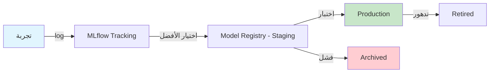

# تتبع التجارب

> "بدون experiment tracking، أنت تعيد نفس التجارب مراراً وتكراراً."

## 🎯 أهداف التعلم

- MLflow لتتبع التجارب
- تسجيل المعاملات والمقاييس
- Model Registry
- مقارنة التجارب

## ⏱️ الوقت المقدر: 30 دقيقة | المستوى: Intermediate

---

## 🏗️ MLflow

```python
import mlflow

mlflow.set_experiment("customer-churn-prediction")

with mlflow.start_run():
    # تسجيل المعاملات
    mlflow.log_param("learning_rate", 0.01)
    mlflow.log_param("epochs", 50)
    mlflow.log_param("batch_size", 32)
    
    # تدريب النموذج
    model = train_model(lr=0.01, epochs=50)
    accuracy = evaluate(model)
    
    # تسجيل المقاييس
    mlflow.log_metric("accuracy", accuracy)
    
    # حفظ النموذج
    mlflow.sklearn.log_model(model, "model")
```

### Model Registry

```bash
# تسجيل أفضل نموذج في registry
mlflow models register-model \
  --model-uri "runs:/abc123/model" \
  --name "churn-predictor"

# ترقية إلى staging
mlflow models transition-stage \
  --name "churn-predictor" \
  --version 3 \
  --stage "Staging"
```

---

## 🏛️ سيناريو CloudNova: لغز التجربة المفقودة

**راكان** عالم بيانات في CloudNova. قبل 3 أشهر، درّب نموذجاً ممتازاً لتوقع استهلاك السحابة. اليوم، المدير يطلب نفس النموذج. المشكلة: راكان لا يتذكر أي hyperparameters استخدم!

**بدون MLflow:**
- ❌ أي learning rate؟ "0.01... أو 0.001؟"
- ❌ أي dataset version؟ "Training-2026-Q1... أو Q2؟"
- ❌ كم epoch؟ "50؟ 100؟ نسيت"
- ❌ أين الـ model artifacts؟ "في مجلد temporary تم حذفه!"

**مع MLflow:**

```python
import mlflow
import mlflow.sklearn
from sklearn.ensemble import RandomForestRegressor

mlflow.set_tracking_uri("https://mlflow.cloudnova.internal")
mlflow.set_experiment("cloud-cost-prediction")

with mlflow.start_run(run_name="rf-v3-august-2026"):
    # تسجيل كل شيء
    mlflow.log_params({
        "n_estimators": 200,
        "max_depth": 15,
        "min_samples_split": 5,
        "random_state": 42
    })
    
    mlflow.log_metrics({
        "rmse": 124.5,
        "mae": 89.3,
        "r2": 0.92
    })
    
    mlflow.set_tags({
        "dataset_version": "2026-Q2",
        "feature_engineering": "added_container_metrics",
        "deployment_status": "staging"
    })
    
    # حفظ dataset hash للـ reproducibility
    mlflow.log_artifact("dataset_hash.txt")
    mlflow.log_artifact("feature_importance.png")
    
    # حفظ النموذج
    mlflow.sklearn.log_model(model, "cost_predictor")
    
    run_id = mlflow.active_run().info.run_id
    print(f"✅ Run ID: {run_id}")
```

**بعد 3 أشهر:**
```python
# راكان يبحث في MLflow UI
# 1. يفتح experiment "cloud-cost-prediction"
# 2. يرى كل الـ runs مع metrics
# 3. يجد run "rf-v3-august-2026" (r2=0.92 ⭐)
# 4. يستعرض كل الـ params والـ artifacts
# 5. يعيد تحميل النموذج بنقرة واحدة

model = mlflow.sklearn.load_model(f"runs:/{run_id}/cost_predictor")
# 10 ثوانٍ بدلاً من 3 ساعات!
```

---

## 🎨 طبقة المعماري: مقارنة منصات تتبع التجارب

| المعيار | MLflow | Weights & Biases | Azure ML | Neptune |
|---------|--------|------------------|----------|---------|
| **Open Source** | ✅ | ❌ (SaaS) | ❌ | ❌ |
| **Self-hosted** | ✅ | ❌ | ❌ | ❌ |
| **Azure Integration** | جيد | جيد | ممتاز | متوسط |
| **UI/UX** | متوسط | ممتاز | جيد | جيد جداً |
| **Collaboration** | أساسي | ممتاز | جيد | جيد جداً |
| **التكلفة** | مجاني | $$ | $$ | $$ |
| **Scalability** | جيد | ممتاز | ممتاز | جيد |

### Model Registry Workflow



---

## 🛠️ تدريبات عملية

### تمرين 1: إعداد MLflow Server
```bash
# نشر MLflow Tracking Server على Azure
az webapp up \
  --name cloudnova-mlflow \
  --resource-group cloudnova-ml \
  --sku B1 \
  --runtime "PYTHON:3.11"

# إعداد backend store (Azure SQL)
mlflow server \
  --backend-store-uri "mssql+pyodbc://..." \
  --default-artifact-root "wasbs://mlflow@cloudnovaml.blob.core.windows.net/" \
  --host 0.0.0.0 \
  --port 5000
```

### تمرين 2: Auto-logging مع MLflow
```python
# ميزة auto-logging تسجل كل شيء تلقائياً
mlflow.sklearn.autolog()
mlflow.pytorch.autolog()
mlflow.tensorflow.autolog()

# الآن أي تدريب يُسجل تلقائياً
from sklearn.ensemble import GradientBoostingRegressor

model = GradientBoostingRegressor(n_estimators=100)
model.fit(X_train, y_train)
# ✅ MLflow سجل تلقائياً: params, metrics, model, artifacts
```

### تحدي: Experiment Comparison Dashboard
```python
# التحدي: أنشئ dashboard تقارن بين 5 تجارب:
# 1. استخدم MLflow API لجلب البيانات
# 2. ارسم comparison charts بـ matplotlib
# 3. صنف التجارب حسب r2 score
# 4. أوصِ بأفضل نموذج للنشر

import mlflow
from mlflow.tracking import MlflowClient

client = MlflowClient()
experiment = client.get_experiment_by_name("cloud-cost-prediction")
runs = client.search_runs(experiment.experiment_id, order_by=["metrics.r2 DESC"])

for i, run in enumerate(runs[:5]):
    print(f"#{i+1}: {run.data.tags.get('mlflow.runName', 'unnamed')}")
    print(f"   R²: {run.data.metrics['r2']:.3f}")
    print(f"   RMSE: {run.data.metrics['rmse']:.1f}")
    print(f"   Params: {run.data.params}")
```

---

## 📝 تقييم

### ✅ Knowledge Checks
1. لماذا تتبع التجارب مهم في ML؟
2. ما الفرق بين MLflow Tracking و Model Registry؟
3. كيف تضمن reproducibility في ML؟
4. ما ميزة auto-logging في MLflow؟
5. متى تختار W&B على MLflow؟

### 🧠 Quiz
**س1:** MLflow Tracking يسجل:
- أ) فقط accuracy
- ب) Params + Metrics + Artifacts + Models ✅
- ج) فقط الكود
- د) فقط البيانات

**س2:** Model Registry يستخدم لـ:
- أ) تدريب النماذج
- ب) إدارة دورة حياة النموذج (Staging → Production → Archived) ✅
- ج) تنظيف البيانات
- د) مراقبة production

**س3:** reproducibility تعني:
- أ) النموذج سريع
- ب) يمكن إعادة إنتاج نفس النتائج بنفس المدخلات ✅
- ج) النموذج دقيق
- د) كل ما سبق

### 🗣️ Active Recall
1. ارسم lifecycle كاملة لنموذج من التجربة إلى production
2. اشرح Model Registry staging workflow
3. كيف تختار بين MLflow self-hosted و W&B SaaS؟
4. صف نظام تتبع تجارب مثالي لمؤسسة

### 🎓 Feynman Exercise
> اشرح Experiment Tracking للطاهي: "مثل دفتر وصفات. تكتب كل مكون وكل خطوة. عندما تكتشف وصفة رائعة، تعرف بالضبط كيف تصنعها مرة أخرى. ولو فشلت، تعرف أين أخطأت."

### 🃏 بطاقات تعلم
| السؤال | الإجابة |
|--------|---------|
| ما MLflow؟ | منصة مفتوحة المصدر لتتبع تجارب ML |
| ما componentsه؟ | Tracking, Projects, Models, Registry |
| ما Model Registry؟ | إدارة دورة حياة النموذج |
| ما reproducibility؟ | القدرة على إعادة إنتاج نفس النتائج |
| ما auto-logging؟ | تسجيل تلقائي لكل params/metrics |

---

## 🎤 أسئلة المقابلة

**س1 (تقني):** "كيف تدير دورة حياة نموذج ML؟"
> MLflow: Tracking لتسجيل التجارب، Model Registry لإدارة المراحل (Staging → Production → Archived). أضيف CI/CD: GitHub Actions تشغل tests عند كل commit، ترفض deployment إذا الدقة أقل من threshold. Azure ML للـ automated retraining.

**س2 (System Design):** "صمم Experiment Tracking لمؤسسة فيها 50 عالم بيانات."
> MLflow server مركزي على Azure App Service. backend: Azure SQL. artifacts: Blob Storage. لكل فريق experiment منفصل مع RBAC. Auto-logging إجباري عبر shared library. Dashboard موحد للمديرين.

**س3 (سلوكي):** "كيف تقنع فريقاً غير منظم باستخدام experiment tracking؟"
> أبدأ بقصة فشل (مشروع تأخر أسبوعين لإعادة اكتشاف hyperparameters). أعرض مقارنة: 10 ثوانٍ مع MLflow vs 3 ساعات بدونه. أساعد الفريق في إعداد auto-logging — لا يغير طريقة عملهم.

---

## 📚 المراجع
| النوع | الرابط |
|--------|--------|
| **درس ذو صلة** | [Model Monitoring](./02-model-monitoring-production) |
| **أداة** | [MLflow Documentation](https://mlflow.org/docs/latest/) |
| **أداة** | [Weights & Biases](https://wandb.ai/) |
| **شهادة** | AI-102 — Manage ML models |

---

[← Model Monitoring](./02-model-monitoring-production) | [→ LLMOps](../../29-llmops/01-llmops-fundamentals) | [🏠 الرئيسية](/)
