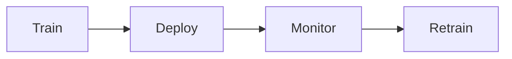

# 🚀 MLOps

> MLOps — Model Monitoring، Experiment Tracking — تشغيل ML في الإنتاج.

## 🎯 أهداف التعلم

بعد إكمال هذه الوحدة، ستكون قادراً على:

- [**أساسيات MLOps**](01-mlops-fundamentals) — دورة حياة ML
- [**مراقبة النماذج**](02-model-monitoring-production) — Data Drift
- [**تتبع التجارب**](03-ml-experiment-tracking) — MLflow

## 💡 المهارات التي ستكتسبها

MLOps • Model Monitoring • Experiment Tracking • MLflow

## 📊 معلومات الوحدة

| العنصر | القيمة |
| ------ | ------ |
| **المستوى** | متقدم |
| **الوقت المقدر** | 4 ساعات |
| **المتطلبات** | Azure AI |
| **الشهادات** | — |

## 🏛️ مهمة CloudNova

> نموذج CloudNova للتنبؤ بالطلب ينحرف. اكتشف Data Drift قبل أن يؤثر على الأعمال.

## 🗺️ خريطة الوحدة

## 📖 الدروس

- [**أساسيات MLOps**](01-mlops-fundamentals) — دورة حياة ML
- [**مراقبة النماذج**](02-model-monitoring-production) — Data Drift
- [**تتبع التجارب**](03-ml-experiment-tracking) — MLflow

## 🚀 ابدأ التعلم

[▶️ ابدأ الدرس الأول](01-mlops-fundamentals)
