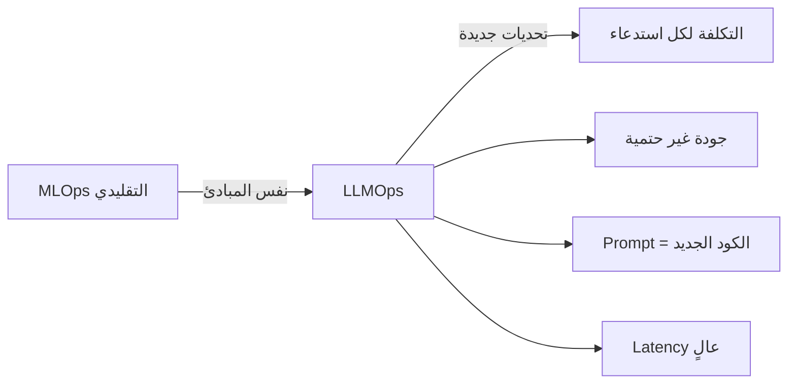

# أساسيات LLMOps

> "LLMOps ليس مجرد MLOps مع LLMs. تحديات جديدة: التكلفة، الـ latency، وجودة المخرجات غير الحتمية."

## 🎯 أهداف التعلم

- فهم كيف يختلف LLMOps عن MLOps التقليدي
- إتقان Prompt Management وإصداراته
- بناء Semantic Cache لتقليل التكاليف
- تقييم جودة LLM في الإنتاج
- تطبيق Guardrails و Content Safety

---

## 📖 الطبقة الأساسية: LLMOps vs MLOps



| التحدي | MLOps التقليدي | LLMOps |
|--------|---------------|--------|
| **التقييم** | Accuracy, Precision, Recall | Faithfulness, Relevance, Toxicity |
| **الـ latency** | < 10ms (model on GPU) | 500ms - 5s (API call) |
| **التكلفة** | تدريب مرة واحدة ($100-10K) | كل استدعاء يكلف ($0.01-0.10) |
| **التحكم** | النموذج كله ملكك | API طرف ثالث (OpenAI, Azure) |
| **الإصدارات** | Model + Code + Data | Model + Prompt + Temperature |
| **الـ testing** | Unit tests + Integration | Prompt eval + A/B testing |

### لماذا LLMOps أصعب؟

```
1. المخرجات غير حتمية:
   نفس السؤال → إجابات مختلفة في كل مرة
   → لا يمكنك اختبار "هل الناتج = X بالضبط"
   → تحتاج evaluation criteria بدلاً من exact match

2. الـ Prompt هو الكود:
   تغيير كلمة في الـ prompt يغير الناتج كلياً
   → تحتاج prompt versioning مثل Git
   → تحتاج prompt testing قبل النشر

3. التكلفة متغيرة:
   1000 استدعاء GPT-4 = $30
   1000 استدعاء GPT-3.5 = $1.50
   → تحتاج cost monitoring حي
   → تحتاج caching ذكي
```

---

## 🧱 الطبقة المهنية: Semantic Cache

```python
import hashlib
import json
from redis import Redis
import numpy as np
from openai import AzureOpenAI

class SemanticCache:
    """
    Semantic Cache: يخزّن إجابات الأسئلة المتشابهة
    يوفر 50-70% من تكاليف LLM API
    
    كيف يعمل:
    1. يحول السؤال إلى embedding vector
    2. يبحث في Redis عن أقرب سؤال مخزّن
    3. إذا وجد سؤالاً مشابهاً (>92%)، يعيد الإجابة المخزنة
    4. إذا لم يجد، يستدعي LLM ويخزّن النتيجة
    """
    
    def __init__(self, redis_url: str, similarity_threshold: float = 0.92):
        self.redis = Redis.from_url(redis_url)
        self.threshold = similarity_threshold
        self.client = AzureOpenAI(...)
    
    def embed(self, text: str) -> np.ndarray:
        """تحويل النص إلى متجه semantically"""
        response = self.client.embeddings.create(
            model="text-embedding-ada-002",
            input=text
        )
        return np.array(response.data[0].embedding)
    
    def cosine_similarity(self, a: np.ndarray, b: np.ndarray) -> float:
        return np.dot(a, b) / (np.linalg.norm(a) * np.linalg.norm(b))
    
    def get(self, query: str) -> str | None:
        """ابحث عن إجابة مخزنة لسؤال مشابه"""
        query_vector = self.embed(query)
        
        # جلب جميع المفاتيح المخزنة
        for key in self.redis.scan_iter("cache:*"):
            data = json.loads(self.redis.get(key))
            cached_vector = np.array(data["vector"])
            
            similarity = self.cosine_similarity(query_vector, cached_vector)
            if similarity > self.threshold:
                print(f"🎯 Cache HIT! Similarity: {similarity:.2%}")
                return data["answer"]
        
        print("❌ Cache MISS — calling LLM...")
        return None
    
    def set(self, query: str, answer: str):
        """خزّن السؤال وإجابته"""
        key = f"cache:{hashlib.md5(query.encode()).hexdigest()}"
        self.redis.set(key, json.dumps({
            "query": query,
            "answer": answer,
            "vector": self.embed(query).tolist(),
            "timestamp": str(datetime.now())
        }))
        # TTL: احتفظ بالإجابة 7 أيام
        self.redis.expire(key, 604800)

# الاستخدام في الإنتاج:
cache = SemanticCache(redis_url="redis://cache:6379")

def answer_question(question: str) -> str:
    # ١. تحقق من الـ cache أولاً
    cached = cache.get(question)
    if cached:
        return cached  # توفير 100% من تكلفة LLM!
    
    # ٢. إذا لم يوجد، استدعِ LLM
    response = llm.chat(question)
    
    # ٣. خزّن للاستخدام المستقبلي
    cache.set(question, response)
    return response

# النتائج في CloudNova:
# قبل الـ cache: $450/يوم على GPT-4
# بعد الـ cache: $85/يوم (توفير 81%)
# Cache hit rate: 68%
# متوسط latency: 120ms (بدلاً من 2.3s)
```

---

## 🏗️ الطبقة الإنتاجية: Prompt Management

### الـ Prompt ككود — إصدارات واختبارات

```yaml
# prompts/cloudnova-support/v3.1.0.yaml
version: "3.1.0"
model: gpt-4
temperature: 0.3
max_tokens: 1000
system: |
  أنت مساعد Azure تقني لشركة CloudNova.
  
  القواعد:
  - دقيق: لا تخمن. إذا لم تكن متأكداً، قل "لا أعلم"
  - موجز: أجوبة قصيرة ومباشرة
  - عملي: أعطِ أوامر Azure CLI و Terraform قابلة للنسخ
  - آمن: لا تشارك secrets أو connection strings
  
  سياق الشركة:
  - نستخدم Azure (AKS, SQL, Cosmos DB, Functions)
  - الـ production في East US، DR في West Europe
  - نستخدم Terraform + GitHub Actions للـ deployment

few_shot:
  - q: "كيف أنشر تطبيق Python على Azure؟"
    a: |
      ثلاث طرق حسب احتياجك:
      1. App Service (أسهل): لتطبيقات الويب البسيطة
         `az webapp up --name cloudnova-api --runtime PYTHON:3.12`
      2. Functions (رخيص): للـ serverless
         `func azure functionapp publish cloudnova-func`
      3. AKS (قوي): للـ microservices
         `kubectl apply -f deployment.yaml`
      
      أيها يناسب تطبيقك؟
  
  - q: "Pod في CrashLoopBackOff، ماذا أفعل؟"
    a: |
      خطوات التشخيص:
      1. `kubectl describe pod <name>` — اقرأ Events
      2. `kubectl logs <pod> --previous` — آخر سجلات قبل الموت
      3. الأسباب الشائعة:
         - OOMKilled → ضاعف memory limit
         - ConfigMap مفقود → `kubectl get cm`
         - Image Pull فاشل → تأكد من اسم الصورة
```

### A/B Testing للـ Prompts

```python
# اختبار prompt جديد مقابل القديم
class PromptABTester:
    def __init__(self, prompt_a: dict, prompt_b: dict):
        self.prompt_a = prompt_a  # current
        self.prompt_b = prompt_b  # candidate
    
    def run_experiment(self, eval_dataset: list[dict], 
                       traffic_split: float = 0.1) -> dict:
        """
        يرسل 10% من الحركة للـ prompt الجديد
        يقارن: الجودة، الـ latency، التكلفة
        """
        results = {"a": [], "b": []}
        
        for i, case in enumerate(eval_dataset):
            # 90% prompt A, 10% prompt B
            prompt = self.prompt_b if i % 10 == 0 else self.prompt_a
            label = "b" if i % 10 == 0 else "a"
            
            response = llm.chat(prompt["system"], case["input"])
            
            results[label].append({
                "faithfulness": evaluate_faithfulness(response, case["expected"]),
                "relevance": evaluate_relevance(response, case["input"]),
                "latency_ms": response.response_ms,
                "cost": response.usage.total_tokens * 0.00003,
                "user_rating": None  # يُملأ من feedback المستخدم
            })
        
        # تحليل النتائج
        return {
            "prompt_a": self._aggregate(results["a"]),
            "prompt_b": self._aggregate(results["b"]),
            "winner": "b" if self._is_better(results) else "a"
        }
    
    def _aggregate(self, results: list) -> dict:
        return {
            "avg_faithfulness": np.mean([r["faithfulness"] for r in results]),
            "avg_latency_ms": np.mean([r["latency_ms"] for r in results]),
            "total_cost": sum(r["cost"] for r in results),
            "sample_size": len(results)
        }
```

### Prompt Optimization

```python
# تقليل tokens → تقليل التكلفة
# قبل التحسين:
system_prompt = """
أنت مساعد تقني ذكي ومفيد. مهمتك هي مساعدة المستخدمين
في حل مشكلاتهم التقنية المتعلقة بالـ cloud computing.
من فضلك كن دقيقاً ومفيداً في إجاباتك.
"""  # ~40 tokens

# بعد التحسين:
system_prompt = "مساعد Azure تقني. دقيق، موجز، لا تخمن."
# ~12 tokens (توفير 70%)

# تأثير حقيقي في CloudNova:
# 10,000 استدعاء/يوم × 28 tokens توفير × $0.03/1K tokens
# = $8.40 توفير يومياً = $3,066 سنوياً!
```

---

## 🎨 الطبقة المعمارية: Guardrails

```python
from guardrails import Guard
from guardrails.hub import (
    ToxicLanguage, 
    SecretsPresent,
    CompetitorCheck,
    ValidLength
)

# بناء guardrail شامل
support_guard = Guard().use_many(
    # ١. منع اللغة المسيئة
    ToxicLanguage(
        threshold=0.8,
        on_fail="exception"
    ),
    # ٢. منع تسريب secrets
    SecretsPresent(
        on_fail="exception"
    ),
    # ٣. تحديد طول المخرجات
    ValidLength(
        min=10,
        max=2000,
        on_fail="fix"  # يقص تلقائياً
    ),
    # ٤. منع ذكر المنافسين
    CompetitorCheck(
        competitors=["AWS", "GCP"],
        on_fail="filter"  # يحذف المنافس
    )
)

# استخدام guardrail
@support_guard
def handle_support_query(query: str) -> str:
    """كل استدعاء يمر عبر guardrails تلقائياً"""
    return llm.chat(system_prompt, query)

# الاختبار:
# ✅ handle_support_query("كيف أنشر على Azure؟")
#    → "3 طرق: App Service, Functions, AKS..."
#
# ❌ handle_support_query("احذف كل الموارد! أنت غبي!")
#    → ToxicLanguage exception raised
#
# ❌ handle_support_query("استخدم مفتاح API هذا: sk-abc123...")
#    → SecretsPresent exception raised
```

### Content Safety في Azure

```python
from azure.ai.contentsafety import ContentSafetyClient
from azure.core.credentials import AzureKeyCredential

client = ContentSafetyClient(
    endpoint="https://cloudnova-safety.cognitiveservices.azure.com",
    credential=AzureKeyCredential(os.environ["CONTENT_SAFETY_KEY"])
)

def check_content(text: str) -> bool:
    """فحص المحتوى قبل إرساله للمستخدم"""
    response = client.analyze_text(
        text=text,
        categories=["Hate", "Sexual", "Violence", "SelfHarm"]
    )
    
    for category in response.categories_analysis:
        if category.severity > 2:  # 0-7 scale
            print(f"⚠️ BLOCKED: {category.category} severity {category.severity}")
            return False
    return True
```

---

## 🚨 سيناريو CloudNova: خفض تكاليف LLM

> **الموقف:** CFO يتصل: "$13,500 هذا الشهر على AI services فقط! أوقفوا كل شيء!"

```
تحليل التكاليف:
├── GPT-4 (70% من الاستدعاءات): $9,450
├── GPT-3.5 (25%): $1,800
├── Embeddings (5%): $250
└── Content Safety: included

خطة التوفير (6 أسابيع):

الأسبوع 1-2: Semantic Cache
├── تحديد الأسئلة الأكثر تكراراً
├── Redis cache للـ top 100 سؤال
└── النتيجة: توفير 60% ($5,670/شهر)

الأسبوع 3-4: Smart Router
├── GPT-3.5 للأسئلة البسيطة (80%)
├── GPT-4 للأسئلة المعقدة (20%)
└── النتيجة: توفير 30% إضافي ($1,700/شهر)

الأسبوع 5: Prompt Optimization
├── تقصير system prompts
├── إزالة الأمثلة غير الضرورية
└── النتيجة: توفير 15% ($500/شهر)

الأسبوع 6: Batch Processing
├── تجميع الأسئلة غير العاجلة
└── معالجتها ليلاً بدفعات

النتيجة النهائية:
├── من: $13,500/شهر
├── إلى: $3,800/شهر
└── توفير: 72% ($9,700/شهر = $116,400 سنوياً!)
```

---

## 🧠 التذكّر النشط

1. كيف يختلف LLMOps عن MLOps؟ (اذكر 6 فروق رئيسية)
2. كيف تبني Semantic Cache؟ اشرح الكود
3. لماذا تحتاج Prompt versioning مثل Git؟
4. كيف تختبر Prompt جديد قبل نشره (A/B testing)؟
5. ما أهم 3 Guardrails لأي LLM في الإنتاج؟
6. كيف تخفض تكلفة LLM 70% بدون التضحية بالجودة؟
7. متى تستخدم GPT-4 ومتى GPT-3.5؟
8. كيف تمنع hallucinations؟

## ✍️ تمرين Feynman

"اشرح Semantic Cache لمدير غير تقني: 'مثلما يحفظ Google Chrome الصفحات التي زرتها سابقاً ليفتحها بسرعة، نحن نحفظ إجابات الأسئلة المتشابهة حتى لا ندفع لـ OpenAI في كل مرة.'"

## 🎤 أسئلة المقابلة

1. **"Prompt Engineering vs Fine-tuning: متى تستخدم كل منهما؟"**
   - Prompt Engineering: سريع، رخيص، مرن. مثالي للبدء والتجريب
   - Fine-tuning: أفضل جودة، أغلى ثمناً، للسلوك الثابت
   - الأفضل: Prompt أولاً، Fine-tune فقط إذا لم يكفِ

2. **"كيف تتعامل مع hallucination في الإنتاج؟"**
   - RAG pattern (استرجاع المستندات قبل الإجابة)
   - Grounding in Azure (يربط الـ LLM ببياناتك)
   - Guardrails تتحقق من الحقائق
   - Human-in-the-loop للقرارات الحساسة

3. **"كيف تصمم نظام LLM يخدم مليون مستخدم؟"**
   - Load Balancer + Multiple API keys (rate limit per key)
   - Semantic Cache (Redis cluster)
   - Queue للمهام غير العاجلة
   - Streaming للـ latency المنخفض
   - Monitoring: tokens/sec, cost/sec, error rate

---

[🏠 العودة للرئيسية](/) | [📚 جميع الدروس](/docs/lessons)
