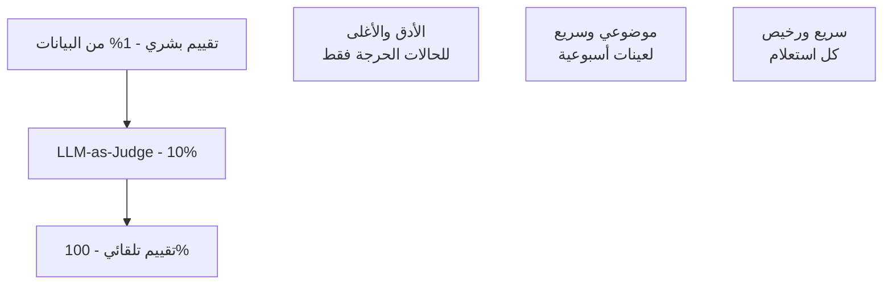

# تقييم نماذج اللغة

> "كيف تعرف أن نموذجك أفضل؟ بالتقييم المنهجي."

## 🎯 أهداف التعلم

- BLEU و ROUGE للتقييم التلقائي
- RLHF (Human Feedback)
- LLM-as-Judge
- A/B Testing للنماذج

## ⏱️ الوقت المقدر: 30 دقيقة | المستوى: Advanced

---

## 🏗️ BLEU Score

```python
from nltk.translate.bleu_score import sentence_bleu

reference = [["Kubernetes", "هو", "منصة", "تنسيق", "حاويات"]]
candidate = ["Kubernetes", "هو", "نظام", "إدارة", "حاويات"]
score = sentence_bleu(reference, candidate)
print(f"BLEU: {score:.2f}")
```

### LLM-as-Judge

```python
def evaluate_with_llm(response, reference, criteria):
    prompt = f"""
    قيّم هذه الإجابة حسب المعايير: {criteria}
    الإجابة: {response}
    الإجابة المرجعية: {reference}
    أعطِ تقييماً من 1-10 مع تبرير.
    """
    return llm_judge(prompt)
```

### A/B Testing

```python
# 50% من الزوار → النموذج A، 50% → النموذج B
model = "A" if random.random() < 0.5 else "B"
response = get_response(model, query)
track_metric(model, user_satisfaction(response))
```

---

## 🏛️ سيناريو CloudNova: أزمة تقييم LLM

**ريم** مهندسة LLMOps. RAG assistant قيد التطوير. الآراء متضاربة:

- المطور: "الإجابات ممتازة!"
- مدير المنتج: "الإجابات سطحية"
- المهندسون: "أحياناً معلومات خاطئة"

**المشكلة:** لا تقييم موضوعي. الحل: إطار تقييم متعدد الطبقات.

```python
# الطبقة 1: تقييم تلقائي (سريع، موضوعي)
from ragas.metrics import faithfulness, answer_relevancy

# الطبقة 2: LLM-as-Judge (للمعايير النوعية)
def llm_judge(response, reference, criteria):
    judge_prompt = f"""
    قيّم الإجابة حسب هذه المعايير: {criteria}

    الإجابة: {response}
    الإجابة المرجعية: {reference}

    أعطِ تقييماً من 1-10 مع تبرير لكل معيار.
    لا تتأثر بطول الإجابة أو أسلوبها.
    """
    return judge_llm(judge_prompt)

# الطبقة 3: تقييم بشري (للعينات الحرجة)
human_eval_samples = sample(test_set, n=100)

# الطبقة 4: A/B Testing (مقارنة prompts/models)
def ab_test_llm(query, model_a="gpt-4", model_b="gpt-4o-mini"):
    model = "A" if random.random() < 0.5 else "B"
    response = get_response(model, query)
    track_metric(model, user_satisfaction(response))
    return response

# نتائج CloudNova:
# - Faithfulness: 72% → 91% بعد تحسين prompt
# - A/B test: GPT-4o-mini يوفر 70% تكلفة مع نفس الجودة لـ 80% من الأسئلة
```

---

## 🎨 طبقة المعماري: استراتيجيات التقييم

### هرم التقييم



| الطبقة                          | التكلفة | الدقة | التكرار        |
| ------------------------------- | ------- | ----- | -------------- |
| **تلقائي (BLEU, ROUGE, RAGAS)** | $       | 70%   | كل استعلام     |
| **LLM-as-Judge**                | $$      | 85%   | أسبوعياً (10%) |
| **بشري**                        | $$$$    | 95%   | شهرياً (1%)    |
| **A/B Testing**                 | $$      | 90%   | مستمر          |

### متى لا تستخدم LLM-as-Judge؟

- بيانات شديدة التخصص (القاضي لا يفهم المجال)
- تكلفة مرتفعة جداً (GPT-4 للحكم على GPT-3.5 = تكلفة مضاعفة)
- تحيز معروف (يفضل الإجابات الطويلة)

---

## 🛠️ تدريبات عملية

### تمرين 1: بناء LLM-as-Judge

````python
# ابنِ نظام تقييم آلي للـ code generation
from openai import OpenAI

def evaluate_code(question, generated_code, reference_solution):
    judge = OpenAI()

    prompt = f"""
    قيّم كود Terraform هذا حسب المعايير التالية (1-10):

    1. Correctness: هل يحقق المطلوب؟
    2. Security: هل يتبع best practices؟
    3. Efficiency: هل يستخدم الموارد بكفاءة؟
    4. Readability: هل هو واضح ومنظم؟

    السؤال: {question}
    الكود المُولَّد:
    ```hcl
    {generated_code}
    ```
    الكود المرجعي:
    ```hcl
    {reference_solution}
    ```

    أعطِ تقييمك مع تبرير لكل معيار.
    """

    evaluation = judge.chat.completions.create(
        model="gpt-4",
        messages=[{"role": "user", "content": prompt}]
    )
    return evaluation.choices[0].message.content
````

### تمرين 2: A/B Testing Framework

```python
class LLMABTester:
    def __init__(self, variant_a, variant_b, split=0.5):
        self.variant_a = variant_a
        self.variant_b = variant_b
        self.split = split
        self.metrics = {"A": {}, "B": {}}

    def query(self, user_id, prompt):
        variant = "A" if hash(user_id) % 100 < self.split * 100 else "B"
        model_config = self.variant_a if variant == "A" else self.variant_b

        start = time.time()
        response = call_llm(model_config, prompt)
        latency = time.time() - start

        self.metrics[variant]["count"] = self.metrics[variant].get("count", 0) + 1
        self.metrics[variant]["total_latency"] = self.metrics[variant].get("total_latency", 0) + latency
        self.metrics[variant]["total_tokens"] = self.metrics[variant].get("total_tokens", 0) + len(response)

        return response

    def report(self):
        for v in ["A", "B"]:
            m = self.metrics[v]
            print(f"Variant {v}:")
            print(f"  Queries: {m['count']}")
            print(f"  Avg Latency: {m['total_latency']/m['count']:.2f}s")
            print(f"  Avg Tokens: {m['total_tokens']/m['count']:.0f}")
```

### تحدي: نظام تقييم شامل

```python
# التحدي: نظام تقييم من 3 طبقات لـ AI assistant
# 1. تلقائي: RAGAS + BLEU لكل استعلام
# 2. LLM-as-Judge: أسبوعي لعينة 500 سؤال
# 3. بشري: شهري لعينة 50 سؤال
# مع Dashboard في Grafana
```

---

## 📝 تقييم

### ✅ Knowledge Checks

1. لماذا BLEU غير كافٍ لتقييم LLM؟
2. ما ميزة LLM-as-Judge على التقييم التلقائي؟
3. كيف تصمم A/B test لنموذجين؟
4. ما الفرق بين Faithfulness و Answer Correctness؟
5. متى يكون التقييم البشري ضرورياً؟

### 🧠 Quiz

**س1:** LLM-as-Judge هو:

- أ) قاضٍ بشري
- ب) استخدام LLM آخر لتقييم المخرجات ✅
- ج) أداة برمجية
- د) اختبار آلي

**س2:** أفضل طريقة لمقارنة نموذجين في production:

- أ) سؤال مدير
- ب) A/B Testing مع metrics حقيقية ✅
- ج) اختبار في notebook
- د) BLEU score

**س3:** تحيز LLM-as-Judge:

- أ) يفضل الإجابات الطويلة ✅
- ب) لا يوجد تحيز
- ج) يفضل العربية
- د) لا يعمل

### 🗣️ Active Recall

1. صف 4 طبقات تقييم LLM
2. ارسم هرم التقييم من الذاكرة
3. متى يكون BLEU كافياً؟
4. كيف تكتشف تحيز LLM-as-Judge؟

### 🎓 Feynman Exercise

> اشرح A/B Testing لمدير مطعم: "تقدم وصفتين مختلفتين لنصف الزبائن لكل منهما. تقيس أي وصفة طلبوها أكثر. هكذا نعرف أي نموذج أفضل — بالتجربة لا بالتخمين."

### 🃏 بطاقات تعلم

| السؤال                  | الإجابة                                  |
| ----------------------- | ---------------------------------------- |
| ما LLM-as-Judge؟        | استخدام LLM لتقييم مخرجات LLM آخر        |
| ما A/B Testing للنماذج؟ | مقارنة نموذجين حيين على مستخدمين حقيقيين |
| ما BLEU؟                | مقياس تشابه النصوص (n-gram overlap)      |
| ما أفضل طبقة تقييم؟     | الثلاثة معاً: تلقائي + LLM + بشري        |
| كم عينة للتقييم البشري؟ | 50-100 عينة شهرياً كافية                 |

---

## 🎤 أسئلة المقابلة

**س1 (تقني):** "كيف تقيم جودة LLM في production؟"

> 3 طبقات: 1) تلقائي — RAGAS (Faithfulness, Relevancy) لكل استعلام. 2) LLM-as-Judge — أسبوعياً لعينة 500 سؤال، يقيم clarity, correctness, safety. 3) بشري — شهرياً للعينات الحرجة. بالإضافة: user satisfaction score و task completion rate.

**س2 (System Design):** "صمم نظام تقييم مستمر لـ AI assistant."

> Sampling service يختار 1% من الاستعلامات. طبقة تلقائية (RAGAS) فورية. إذا انخفضت metrics: alert تلقائي. أسبوعياً: LLM-as-Judge على 500 عينة. شهرياً: human review. كل الـ metrics في Azure Monitor + Grafana.

**س3 (سلوكي):** "كيف تتعامل مع فريق يرفض التقييم الموضوعي؟"

> أعرض case study: نظام ظنوا أنه جيد، لكن Faithfulness كان 60%. أبدأ بتقييم تلقائي (مجاني، سريع). عندما يرى الفريق الأرقام، يقتنع. في CloudNova، بعد شهر من RAGAS، تحسنت Faithfulness من 72% إلى 91%.

---

## 📚 المراجع

| النوع          | الرابط                                                     |
| -------------- | ---------------------------------------------------------- |
| **درس ذو صلة** | [LLMOps Fundamentals](./01-llmops-fundamentals)            |
| **درس ذو صلة** | [RAG Evaluation](../../26-rag/03-rag-evaluation-ragas)     |
| **مكتبة**      | [RAGAS](https://docs.ragas.io/)                            |
| **ورقة**       | [Judging LLM-as-a-Judge](https://arxiv.org/abs/2306.05685) |

---

[← LLMOps Fundamentals](./01-llmops-fundamentals) | [→ Cost Optimization](./03-llm-cost-optimization-advanced) | [🏠 الرئيسية](/)
