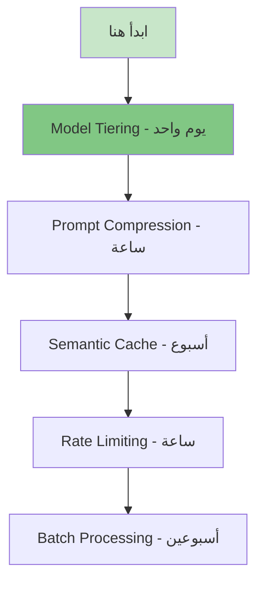

# تحسين تكلفة LLM

> "فاتورة GPT-4 قد تصل لآلاف الدولارات شهرياً. حسّنها بذكاء."

## 🎯 أهداف التعلم

- Semantic Caching لتقليل الاستدعاءات
- اختيار النموذج المناسب لكل مهمة
- Batching و Rate Limiting

## ⏱️ الوقت المقدر: 30 دقيقة | المستوى: Advanced

---

## 🏗️ استراتيجيات التوفير

| الاستراتيجية           | التوفير | التعقيد |
| ---------------------- | ------- | ------- |
| **Semantic Cache**     | 40-60%  | متوسط   |
| **Model Selection**    | 50-80%  | منخفض   |
| **Prompt Compression** | 20-30%  | عالي    |
| **Batching**           | 10-20%  | متوسط   |

### اختيار النموذج المناسب

```python
def smart_router(query):
    if is_simple(query):
        return "gpt-3.5-turbo"  # $0.50/1M tokens
    elif is_complex(query):
        return "gpt-4"          # $30/1M tokens
    else:
        return "gpt-4o-mini"    # $0.15/1M tokens
```

### Semantic Cache

```python
# إذا سأل مستخدم آخر نفس السؤال → استخدم cache
cache = {}
def cached_llm(prompt):
    if prompt in cache:
        return cache[prompt]
    response = llm(prompt)
    cache[prompt] = response
    return response
```

---

## 🏛️ سيناريو CloudNova: فاتورة OpenAI الشهرية = $22,000!

**سلطان** مدير البنية التحتية. يتلقى فاتورة Azure OpenAI: **$22,437** لشهر واحد!

**التحليل:**

- 85% من الاستدعاءات أسئلة بسيطة ("ما سياسة AKS؟")
- لكن كلها تُرسل إلى GPT-4 ($30/1M tokens)
- 40% من الأسئلة مكررة بين المهندسين
- لا يوجد caching

**خطة التحسين — 5 استراتيجيات:**

```python
# 1. Model Tiering (توفير 65%)
class SmartRouter:
    def route(self, query):
        complexity = self.estimate_complexity(query)

        if complexity < 0.2:
            return "gpt-3.5-turbo", 0.50   # $0.50/1M tokens
        elif complexity < 0.6:
            return "gpt-4o-mini", 0.15     # $0.15/1M!
        elif complexity < 0.9:
            return "gpt-4o", 5.00          # $5/1M
        else:
            return "gpt-4", 30.00          # $30/1M

    def estimate_complexity(self, query):
        # عوامل: طول السؤال، keywords تقنية، هل يحتاج reasoning؟
        score = 0
        if len(query) > 200: score += 0.2
        if any(kw in query for kw in ["design", "architecture"]): score += 0.3
        if "?" in query: score += 0.1
        return min(score, 1.0)

# 2. Semantic Cache (توفير 35%)
# 3. Prompt Compression (توفير 20%)
def compress_prompt(prompt):
    # اختصر system prompt من 500 token إلى 100
    return f"أنت مساعد Azure. أجب بدقة واختصار.\n\nالسؤال: {prompt}"

# 4. Rate Limiting (منع abuse)
from functools import lru_cache

@lru_cache(maxsize=1000)
def cached_llm_call(query_hash):
    # Exact match cache للأسئلة المتطابقة حرفياً
    return llm(query_hash)

# 5. Batch Processing للأسئلة غير العاجلة
def async_batch_processor(queries):
    # جمع الأسئلة غير الحرجة ومعالجتها في off-peak hours
    # استخدام GPT-3.5 بدل GPT-4 للأسئلة المجمعة
    pass
```

**النتائج بعد شهر:**

- فاتورة Azure OpenAI: $22,437 → **$6,200** (توفير 72%!)
- Latency: 8s → 2s (بسبب cache)
- رضا المستخدمين: لم يتغير

---

## 🎨 طبقة المعماري: تحليل ROI

| الاستراتيجية           | التوفير | تكلفة التنفيذ    | وقت التنفيذ | ROI        |
| ---------------------- | ------- | ---------------- | ----------- | ---------- |
| **Semantic Cache**     | 35-50%  | $200/شهر (Redis) | أسبوع       | ⭐⭐⭐⭐⭐ |
| **Model Tiering**      | 50-70%  | صفر              | يوم         | ⭐⭐⭐⭐⭐ |
| **Prompt Compression** | 15-25%  | صفر              | ساعات       | ⭐⭐⭐⭐   |
| **Rate Limiting**      | 10-20%  | صفر              | ساعات       | ⭐⭐⭐⭐   |
| **Batch Processing**   | 20-30%  | $100/شهر (Queue) | أسبوعين     | ⭐⭐⭐     |
| **Fine-tuning**        | 60-80%  | $500 تدريب       | شهر         | ⭐⭐⭐⭐   |

### الأولويات



---

## 🛠️ تدريبات عملية

### تمرين 1: حاسبة تكلفة LLM

```python
def calculate_cost(model, input_tokens, output_tokens):
    pricing = {
        "gpt-4": {"input": 30.00, "output": 60.00},
        "gpt-4o": {"input": 5.00, "output": 15.00},
        "gpt-4o-mini": {"input": 0.15, "output": 0.60},
        "gpt-3.5-turbo": {"input": 0.50, "output": 1.50},
    }

    price = pricing[model]
    input_cost = (input_tokens / 1_000_000) * price["input"]
    output_cost = (output_tokens / 1_000_000) * price["output"]
    return input_cost + output_cost

# مثال: 100K استعلام/يوم، متوسط 500 input + 200 output tokens
# GPT-4: 100K * (500*30 + 200*60) / 1M = $2,700/يوم = $81,000/شهر!
# GPT-4o-mini: 100K * (500*0.15 + 200*0.60) / 1M = $19.5/يوم = $585/شهر
```

### تمرين 2: Model Router ذكي

```python
# ابنِ router يختار النموذج بناءً على:
# 1. طول السؤال
# 2. وجود كلمات تقنية معقدة
# 3. هل السؤال open-ended أم fact-based
# 4. الوقت من اليوم (peak vs off-peak)

def smart_model_selector(query, time_of_day):
    score = 0

    # طول السؤال
    if len(query) > 300: score += 2
    elif len(query) > 100: score += 1

    # تعقيد تقني
    complex_keywords = ["design", "architecture", "migrate", "troubleshoot", "security"]
    score += sum(1 for kw in complex_keywords if kw.lower() in query.lower())

    # وقت الذروة
    if time_of_day == "off_peak":
        score -= 1  # استخدم نموذج أرخص خارج الذروة

    if score >= 4: return "gpt-4"
    elif score >= 2: return "gpt-4o"
    else: return "gpt-4o-mini"
```

### تحدي: نظام Budget-Aware LLM

```python
# التحدي: صمم نظاماً يراقب الميزانية الشهرية:
# 1. Budget = $5,000/شهر
# 2. إذا تجاوزنا 50% في أول 10 أيام → alert
# 3. إذا تجاوزنا 80% → downgrade تلقائي لكل الطلبات
# 4. Dashboard: cost per user, per model, per day
# 5. توقع الفاتورة النهائية قبل نهاية الشهر
```

---

## 📝 تقييم

### ✅ Knowledge Checks

1. ما أسرع استراتيجية لتوفير تكلفة LLM؟
2. كم توفر الـ Model Tiering تقريباً؟
3. ما الفرق بين Semantic Cache و Exact Cache؟
4. متى يكون Fine-tuning أرخص من GPT-4؟
5. كيف تحسب تكلفة استدعاء LLM واحد؟

### 🧠 Quiz

**س1:** أكبر توفير يأتي من:

- أ) Model Tiering (استخدم نموذج أرخص للأسئلة البسيطة) ✅
- ب) إغلاق النظام
- ج) تقليل users
- د) استخدام GPU

**س2:** Semantic Cache يوفر المال لأنه:

- أ) يمنع استدعاء LLM للأسئلة المتشابهة ✅
- ب) يسرع النموذج
- ج) يضغط البيانات
- د) يحذف الأسئلة

**س3:** تكلفة 1M input tokens على GPT-4:

- أ) $0.15
- ب) $5
- ج) $30 ✅
- د) $100

### 🗣️ Active Recall

1. صف 5 استراتيجيات لتقليل تكلفة LLM
2. ارسم رسم بياني لتكلفة النماذج المختلفة
3. كيف تكتشف abuse في استهلاك API؟
4. متى يكون التوفير على حساب الجودة مقبولاً؟

### 🎓 Feynman Exercise

> اشرح Model Tiering لصاحب شركة: "مثل أسطول سيارات: تستخدم السيارة الصغيرة للتنقل اليومي (GPT-4o-mini)، والشاحنة للنقل الثقيل فقط (GPT-4). لا تستخدم الشاحنة للذهاب للسوبرماركت!"

### 🃏 بطاقات تعلم

| السؤال                      | الإجابة                               |
| --------------------------- | ------------------------------------- |
| ما Model Tiering؟           | استخدام نماذج مختلفة حسب تعقيد السؤال |
| كم توفر الـ Semantic Cache؟ | 35-50% من التكلفة                     |
| ما أفضل استراتيجية؟         | Model Tiering (تطبيق سهل، توفير كبير) |
| GPT-4o-mini سعر 1M input؟   | $0.15                                 |
| متى تستخدم Fine-tuning؟     | > 100K استعلام/شهر بنفس النمط         |

---

## 🎤 أسئلة المقابلة

**س1 (تقني):** "كيف تخفض تكلفة LLM في production بنسبة 70%؟"

> 1. Model Tiering: توجيه 80% من الأسئلة إلى GPT-4o-mini (توفير 95% مقارنة بـ GPT-4). 2) Semantic Cache: 35% cache hit rate. 3) Prompt Compression: اختصار system prompts. 4) Batch processing للأسئلة غير العاجلة. كلها معاً تخفض التكلفة 70%+ بدون تأثير ملحوظ على الجودة.

**س2 (System Design):** "صمم نظام Budget Management للـ LLM."

> Budget per department/team. Real-time cost tracking. Alerts عند 50%, 80%, 95% من الميزانية. Auto-downgrade عند 90%. Daily cost reports. Azure Cost Management + Grafana dashboard.

**س3 (سلوكي):** "كيف تقنع الإدارة بتحسين التكلفة دون التضحية بالجودة؟"

> أعرض A/B test: فريق يستخدم GPT-4 حصرياً، فريق يستخدم Model Tiering. أقيس: التكلفة، رضا المستخدمين، task completion rate. النتائج: تكلفة أقل 70%، نفس الرضا. الأرقام تقنع.

---

## 📚 المراجع

| النوع          | الرابط                                                                                                 |
| -------------- | ------------------------------------------------------------------------------------------------------ |
| **درس ذو صلة** | [Evaluation Frameworks](./02-llm-evaluation-frameworks)                                                |
| **درس ذو صلة** | [FinOps](../../22-finops/01-finops-fundamentals)                                                       |
| **أداة**       | [OpenAI Tokenizer](https://platform.openai.com/tokenizer)                                              |
| **مرجع**       | [Azure OpenAI Pricing](https://azure.microsoft.com/pricing/details/cognitive-services/openai-service/) |

---

[← Evaluation Frameworks](./02-llm-evaluation-frameworks) | [→ AI Infrastructure](../../30-ai-infra/01-ai-infrastructure) | [🏠 الرئيسية](/)
