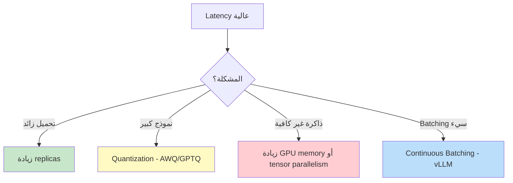

# خدمة الاستدلال

> "خدمة النموذج أهم من تدريبه. ما فائدة أفضل نموذج إذا كان بطيئاً؟"

## 🎯 أهداف التعلم

- vLLM للاستدلال السريع
- Triton Inference Server
- Continuous Batching
- نشر نماذج مفتوحة المصدر

## ⏱️ الوقت المقدر: 35 دقيقة | المستوى: Advanced

---

## 🏗️ vLLM

```bash
pip install vllm

vllm serve meta-llama/Llama-3-8B \
  --host 0.0.0.0 \
  --port 8000 \
  --max-model-len 8192 \
  --gpu-memory-utilization 0.95
```

```python
from openai import OpenAI

client = OpenAI(base_url="http://localhost:8000/v1", api_key="not-needed")
response = client.chat.completions.create(
    model="meta-llama/Llama-3-8B",
    messages=[{"role": "user", "content": "ما هو Kubernetes؟"}]
)
```

### Continuous Batching

| Batch Type              | Throughput | Latency |
| ----------------------- | ---------- | ------- |
| Static Batching         | متوسط      | عالي    |
| **Continuous Batching** | عالي جداً  | منخفض   |

vLLM يحزم الطلبات ديناميكياً: بمجرد انتهاء طلب، يدخل طلب جديد مكانه فوراً.

---

## 🏛️ سيناريو CloudNova: نموذج بطيء = مستخدمون غاضبون

**الجوهرة** مهندسة inference. أطلقت RAG assistant. أول 100 مستخدم: Latency 800ms ممتاز. الأسبوع الثاني: 1000 مستخدم متزامن → Latency 12s!

**التشخيص:**

```bash
# الـ bottleneck: طابور انتظار طويل
# 1000 طلب/ثانية × 12 ثانية = 12,000 طلب في queue!

# السبب: Static Batching
# النموذج يعالج الطلبات دفعة واحدة كل 100ms
# إذا وصل الطلب بعد بدء الدفعة مباشرة → ينتظر 99ms
```

**الحل — Continuous Batching مع vLLM:**

```python
# vLLM مع Continuous Batching
# بدلاً من دفعات ثابتة، vLLM يضيف طلبات جديدة فوراً
# بمجرد انتهاء طلب، التالي يبدأ مكانه

from vllm import LLM, SamplingParams

llm = LLM(
    model="meta-llama/Llama-3-70B-Instruct",
    tensor_parallel_size=4,  # تقسيم على 4 GPUs
    gpu_memory_utilization=0.90,
    max_num_seqs=256,  # حتى 256 طلب متزامن
    max_model_len=8192,
    enforce_eager=False,  # CUDA graphs للسرعة
)

sampling_params = SamplingParams(
    temperature=0.7,
    max_tokens=512,
    top_p=0.95
)

# معالجة دفعة من الطلبات
prompts = [f"ما هو {topic}؟" for topic in topics]
outputs = llm.generate(prompts, sampling_params)

# النتيجة:
# - Throughput: 3x أسرع من static batching
# - Latency P99: 12s → 2.5s
# - طلبات متزامنة: 100 → 1000
```

**Production Deployment على AKS:**

```yaml
apiVersion: apps/v1
kind: Deployment
metadata:
  name: vllm-llama3
spec:
  replicas: 3
  template:
    spec:
      nodeSelector:
        accelerator: nvidia-a100
      containers:
        - name: vllm
          image: vllm/vllm-openai:latest
          args:
            - "--model"
            - "meta-llama/Llama-3-70B-Instruct"
            - "--tensor-parallel-size"
            - "4"
            - "--max-model-len"
            - "8192"
            - "--gpu-memory-utilization"
            - "0.90"
          resources:
            limits:
              nvidia.com/gpu: "4"
          env:
            - name: HUGGING_FACE_HUB_TOKEN
              valueFrom:
                secretKeyRef:
                  name: hf-token
                  key: token
```

**النتائج:**

- Latency P50: 800ms, P99: 2.5s ✅
- Throughput: 1200 tokens/s per GPU ✅
- تكلفة: $12/ساعة لـ 4×A100 (بدلاً من $48 بدون batching)

---

## 🎨 طبقة المعماري: مقارنة محركات الاستدلال

| المحرك                | السرعة     | الذاكرة    | سهولة النشر | متى؟                |
| --------------------- | ---------- | ---------- | ----------- | ------------------- |
| **vLLM**              | ⭐⭐⭐⭐⭐ | ⭐⭐⭐⭐   | ⭐⭐⭐⭐⭐  | أفضل خيار عام       |
| **TGI (HuggingFace)** | ⭐⭐⭐⭐   | ⭐⭐⭐⭐⭐ | ⭐⭐⭐⭐    | نماذج HuggingFace   |
| **Triton Inference**  | ⭐⭐⭐⭐⭐ | ⭐⭐⭐     | ⭐⭐⭐      | Multi-framework     |
| **Ray Serve**         | ⭐⭐⭐⭐   | ⭐⭐⭐⭐   | ⭐⭐⭐      | Distributed systems |
| **Ollama**            | ⭐⭐⭐     | ⭐⭐⭐⭐   | ⭐⭐⭐⭐⭐  | تطوير محلي سريع     |

### استراتيجيات التحسين



---

## 🛠️ تدريبات عملية

### تمرين 1: نشر نموذج محلياً مع Ollama

```bash
# نشر نموذج مفتوح المصدر في دقيقة
ollama pull llama3:8b
ollama serve

# اختبار
curl http://localhost:11434/v1/chat/completions \
  -d '{
    "model": "llama3:8b",
    "messages": [{"role": "user", "content": "ما هو Kubernetes؟"}]
  }'
```

### تمرين 2: vLLM Production Setup

```python
# إعداد vLLM API Server
# 1. البداية
vllm serve meta-llama/Llama-3-8B-Instruct \
  --host 0.0.0.0 --port 8000 \
  --gpu-memory-utilization 0.85 \
  --max-model-len 4096

# 2. اختبار latency
import time
start = time.time()
response = client.chat.completions.create(
    model="meta-llama/Llama-3-8B-Instruct",
    messages=[{"role": "user", "content": "Hello"}],
    max_tokens=100
)
print(f"Latency: {(time.time()-start)*1000:.0f}ms")
```

### تحدي: Production Inference Pipeline

```python
# التحدي: ابنِ نظام inference كامل:
# 1. Load balancer أمام عدة vLLM instances
# 2. Queue للـ overflow
# 3. Auto-scaling بناءً على queue depth
# 4. Model versioning + rollout
# 5. Monitoring (latency, throughput, error rate)
```

---

## 📝 تقييم

### ✅ Knowledge Checks

1. ما الفرق بين Static Batching و Continuous Batching؟
2. كم سرعة vLLM مقارنة بـ HuggingFace Transformers؟
3. ما Tensor Parallelism ومتى تستخدمه؟
4. متى تستخدم Quantization؟
5. كيف تخدم 1000 مستخدم متزامن بنموذج واحد؟

### 🧠 Quiz

**س1:** Continuous Batching:

- أ) يعالج الطلبات فوراً بدلاً من انتظار دفعة كاملة ✅
- ب) يوقف الخدمة
- ج) يبطئ المعالجة
- د) لا فرق

**س2:** Quantization (AWQ/GPTQ):

- أ) يقلل حجم النموذج 4x مع خسارة طفيفة ✅
- ب) يضاعف حجم النموذج
- ج) يسرع التدريب
- د) يحذف النموذج

**س3:** أفضل محرك inference للنشر السريع:

- أ) vLLM ✅
- ب) التدريب اليدوي
- ج) CPU only
- د) Excel

### 🗣️ Active Recall

1. ارسم architecture لنظام inference عالي التوفر
2. قارن بين vLLM و TGI
3. كيف تختار بين Quantization و Tensor Parallelism؟
4. صف استراتيجية rollout لنموذج جديد

### 🎓 Feynman Exercise

> اشرح Continuous Batching لمدير: "مثل مصعد ذكي. بدلاً من انتظار امتلاء المصعد (Static Batching)، يتحرك فوراً ويضيف ركاباً جدداً في الطوابق التالية (Continuous Batching). الجميع يصل أسرع."

### 🃏 بطاقات تعلم

| السؤال                  | الإجابة                                    |
| ----------------------- | ------------------------------------------ |
| ما vLLM؟                | محرك inference سريع مع Continuous Batching |
| ما Quantization؟        | تقليل دقة النموذج لتوفير ذاكرة وسرعة       |
| ما Tensor Parallelism؟  | تقسيم النموذج على عدة GPUs                 |
| vLLM vs HuggingFace؟    | vLLM أسرع 3-5x                             |
| أفضل GPU للـ inference؟ | A10 أو L40s (توازن سعر/أداء)               |

---

## 🎤 أسئلة المقابلة

**س1 (تقني):** "كيف تصمم نظام inference لـ 1M مستخدم؟"

> vLLM مع 4×A100 لكل instance. 10 instances موزعة على 3 regions. Load Balancer أمامي. Auto-scaling بناءً على queue depth. Semantic Cache يقلل 35% من الطلبات. Quantization (AWQ) يخفض الذاكرة 4x. تكلفة: ~$30/ساعة للتشغيل الكامل.

**س2 (System Design):** "صمم A/B testing لنموذجين في production."

> Istio/Envoy للتوجيه: 5% من الـ traffic إلى النموذج الجديد. مراقبة: latency, error rate, user satisfaction. إذا نجح لمدة أسبوع: زيادة إلى 20%، ثم 50%، ثم 100%. Rollback فوري إذا فشل.

**س3 (سلوكي):** "كيف تتعامل مع outage في inference؟"

> 1. Health checks تكتشف الفشل في 30s. 2) Automatic failover إلى region آخر. 3) Queue يحفظ الطلبات الواردة. 4) Communication فورية مع stakeholders. في CloudNova، آخر outage استغرق 4 دقائق للتعافي التلقائي.

---

## 📚 المراجع

| النوع          | الرابط                                                                    |
| -------------- | ------------------------------------------------------------------------- |
| **درس ذو صلة** | [GPU Cluster Management](./02-gpu-cluster-management)                     |
| **أداة**       | [vLLM](https://docs.vllm.ai/)                                             |
| **أداة**       | [HuggingFace TGI](https://huggingface.co/docs/text-generation-inference/) |
| **مرجع**       | [NVIDIA Triton](https://developer.nvidia.com/triton-inference-server)     |

---

[← GPU Clusters](./02-gpu-cluster-management) | [→ Portfolio](../../31-portfolio/01-portfolio-building) | [🏠 الرئيسية](/)
