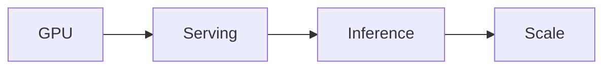

# 🚀 البنية التحتية للـ AI

> GPU Clusters، Model Serving، Inference Optimization — البنية التحتية للذكاء.

## 🎯 أهداف التعلم

بعد إكمال هذه الوحدة، ستكون قادراً على:

- [**AI Infrastructure**](01-ai-infrastructure) — مقدمة
- [**GPU Clusters**](02-gpu-cluster-management) — إدارة مجموعات GPU
- [**Model Serving**](03-model-serving-inference) — استدلال النماذج

## 💡 المهارات التي ستكتسبها

GPU • Model Serving • Inference • vLLM • Triton

## 📊 معلومات الوحدة

| العنصر           | القيمة     |
| ---------------- | ---------- |
| **المستوى**      | متقدم      |
| **الوقت المقدر** | 5 ساعات    |
| **المتطلبات**    | Kubernetes |
| **الشهادات**     | —          |

## 🏛️ مهمة CloudNova

> انشر مجموعة GPU لـ CloudNova. 50 طلب استدلال في الثانية.

## 🗺️ خريطة الوحدة

## 📖 الدروس

- [**AI Infrastructure**](01-ai-infrastructure) — مقدمة
- [**GPU Clusters**](02-gpu-cluster-management) — إدارة مجموعات GPU
- [**Model Serving**](03-model-serving-inference) — استدلال النماذج

## 🚀 ابدأ التعلم

[▶️ ابدأ الدرس الأول](01-ai-infrastructure)
